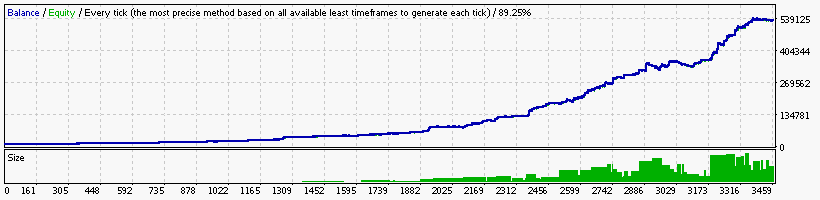

### Report: EURUSD 10000USD 2011year 10spread M30 DS test

    Symbol                            EURUSD (Euro vs US Dollar)
    Period                            30 Minutes (M30) 2011.01.05 03:00 - 2011.12.30 21:30 (2011.01.01 - 2011.12.31)
    Model                             Every tick (the most precise method based on all available least timeframes)
    Parameters                        Alligator5_SignalMethod=18; Alligator15_SignalMethod=12; Alligator30_SignalMethod=9; __Bands_Parameters__="-
    Bars in test                11960 Ticks modelled                        3438420 Modelling quality                                              89.25%
    Mismatched charts errors        0
    Initial deposit          10000.00                                               Spread                                                             10
    Total net profit         88482.04 Gross profit                        154905.48 Gross loss                                                  -66423.44
    Profit factor                2.33 Expected payoff                         58.06
    Absolute drawdown          741.36 Maximal drawdown             9225.87 (14.96%) Relative drawdown                                    14.96% (9225.87)
    Total trades                 1524 Short positions (won %)         1168 (39.64%) Long positions (won %)                                   356 (41.57%)
