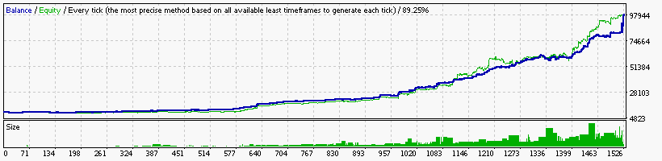

### Report: EURUSD 10000USD 2011year 10spread M30 DS test

    Symbol                             EURUSD (Euro vs US Dollar)
    Period                             30 Minutes (M30) 2011.01.05 03:00 - 2011.12.30 21:30 (2011.01.01 - 2011.12.31)
    Model                              Every tick (the most precise method based on all available least timeframes)
    Parameters                         0.21; Alligator1_SignalMethod=21; Alligator5_SignalMethod=18; Alligator15_SignalMethod=12;
    Bars in test                 11960 Ticks modelled                        3438420 Modelling quality                                              89.25%
    Mismatched charts errors         0
    Initial deposit           10000.00                                               Spread                                                             10
    Total net profit         522595.04 Gross profit                        996558.99 Gross loss                                                 -473963.94
    Profit factor                 2.10 Expected payoff                        151.26
    Absolute drawdown            59.22 Maximal drawdown             31103.41 (8.79%) Relative drawdown                                    8.79% (31103.41)
    Total trades                  3455 Short positions (won %)         1558 (38.77%) Long positions (won %)                                  1897 (39.11%)
