### Report: Strategy Alligator Alligator15_EURUSD_10000USD_10spread_5digits_2012 M15 DS test

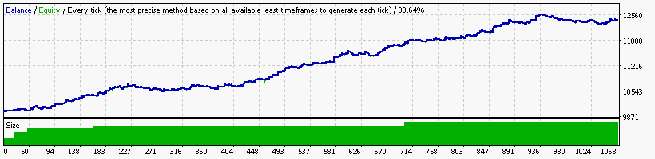

### Report: Strategy Alligator Alligator1_EURUSD_10000USD_10spread_5digits_2012 M1 DS test

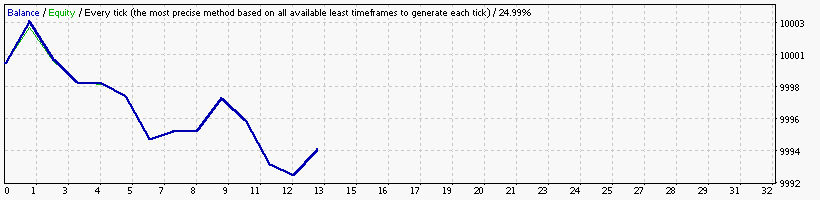

### Report: Strategy Alligator Alligator30_EURUSD_10000USD_10spread_5digits_2012 M30 DS test

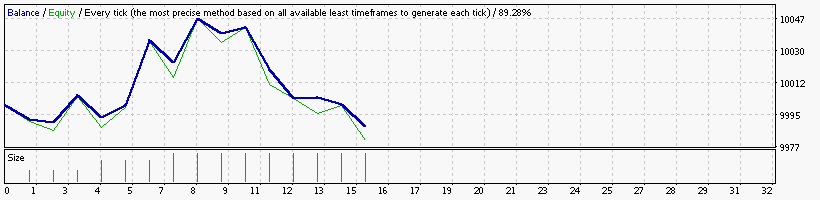

### Report: Strategy Alligator Alligator5_EURUSD_10000USD_10spread_5digits_2012 M5 DS test

### Report: Strategy Alligator Alligator_EURUSD_10000USD_10spread_5digits_2012 DS test

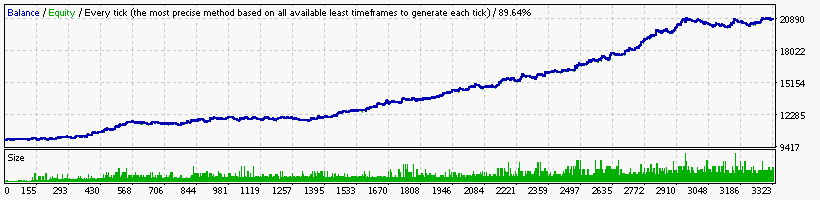

### Report: Strategy Bands Bands15_EURUSD_10000USD_10spread_5digits_2012 M15 DS test

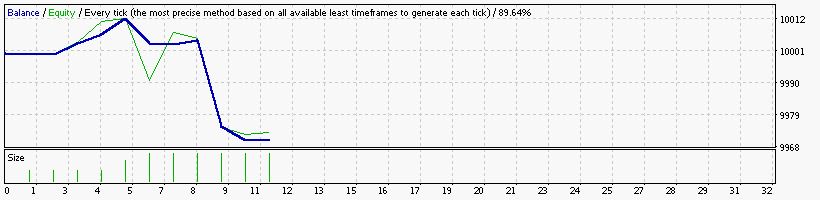

### Report: Strategy Bands Bands1_EURUSD_10000USD_10spread_5digits_2012 M1 DS test

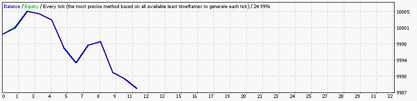

### Report: Strategy Bands Bands30_EURUSD_10000USD_10spread_5digits_2012 M30 DS test

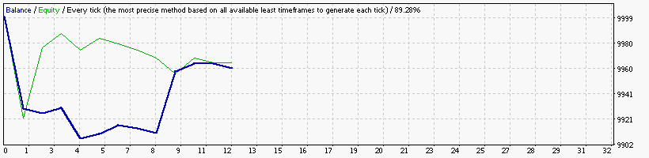

### Report: Strategy Bands Bands_EURUSD_10000USD_10spread_5digits_2012 DS test

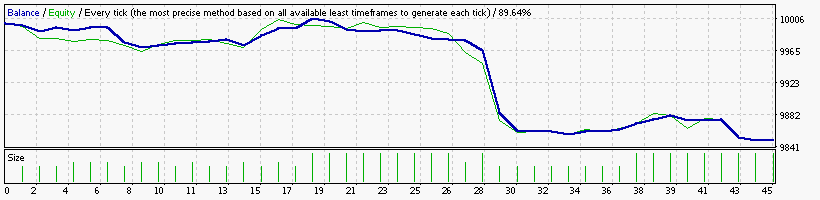

### Report: Strategy DeMarker DeMarker15_EURUSD_10000USD_10spread_5digits_2012 M15 DS test

### Report: Strategy DeMarker DeMarker1_EURUSD_10000USD_10spread_5digits_2012 M1 DS test

### Report: Strategy DeMarker DeMarker30_EURUSD_10000USD_10spread_5digits_2012 M30 DS test

### Report: Strategy DeMarker DeMarker_EURUSD_10000USD_10spread_5digits_2012 DS test

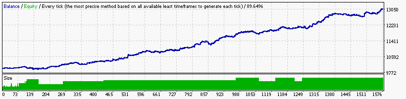

### Report: Strategy Envelopes Envelopes15_EURUSD_10000USD_10spread_5digits_2012 M15 DS test

### Report: Strategy Envelopes Envelopes30_EURUSD_10000USD_10spread_5digits_2012 M30 DS test

    Symbol                            EURUSD (Euro vs US Dollar)
    Period                            30 Minutes (M30) 2012.01.04 00:00 - 2012.12.28 21:30 (2012.01.01 - 2012.12.30)
    Model                             Every tick (the most precise method based on all available least timeframes)
    Parameters                        Alligator15_SignalMethod=15; Alligator30_SignalMethod=63; __Bands_Parameters__="-- Settings for the Bollinger Bands
    Bars in test                12479 Ticks modelled                         3389220 Modelling quality                                              89.28%
    Mismatched charts errors        0
    Initial deposit          10000.00                                                Spread                                                             10
    Total net profit         -3605.23 Gross profit                           1506.07 Gross loss                                                   -5111.30
    Profit factor                0.29 Expected payoff                        -200.29
    Absolute drawdown         4271.93 Maximal drawdown             11049.97 (65.86%) Relative drawdown                                   65.86% (11049.97)
    Total trades                   18 Short positions (won %)            13 (23.08%) Long positions (won %)                                    5 (100.00%)

### Report: Strategy Envelopes Envelopes5_EURUSD_10000USD_10spread_5digits_2012 M5 DS test

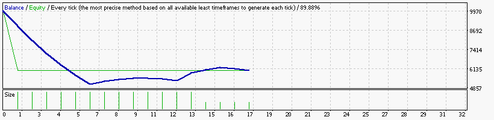

    Symbol                            EURUSD (Euro vs US Dollar)
    Period                            5 Minutes (M5) 2012.01.02 06:20 - 2012.12.28 21:55 (2012.01.01 - 2012.12.30)
    Model                             Every tick (the most precise method based on all available least timeframes)
    Parameters                        Alligator15_SignalMethod=15; Alligator30_SignalMethod=63; __Bands_Parameters__="-- Settings for the Bollinger Bands
    Bars in test                74862 Ticks modelled                        17976238 Modelling quality                                              89.88%
    Mismatched charts errors        0
    Initial deposit          10000.00                                                Spread                                                             10
    Total net profit         -3971.53 Gross profit                           1315.09 Gross loss                                                   -5286.62
    Profit factor                0.25 Expected payoff                        -233.62
    Absolute drawdown         4809.29 Maximal drawdown             12613.55 (70.85%) Relative drawdown                                   70.85% (12613.55)
    Total trades                   17 Short positions (won %)            14 (28.57%) Long positions (won %)                                    3 (100.00%)

### Report: Strategy Envelopes Envelopes_EURUSD_10000USD_10spread_5digits_2012 DS test

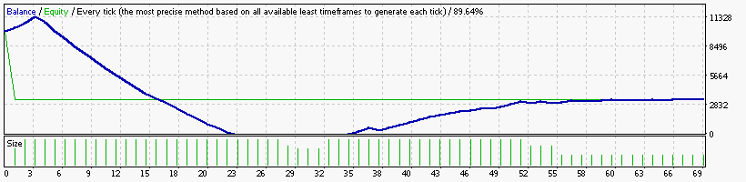

    Symbol                            EURUSD (Euro vs US Dollar)
    Period                            15 Minutes (M15) 2012.01.02 23:00 - 2012.12.28 21:45 (2012.01.01 - 2012.12.30)
    Model                             Every tick (the most precise method based on all available least timeframes)
    Parameters                        Alligator15_SignalMethod=15; Alligator30_SignalMethod=63; __Bands_Parameters__="-- Settings for the Bollinger Bands
    Bars in test                24957 Ticks modelled                         6384541 Modelling quality                                              89.64%
    Mismatched charts errors        0
    Initial deposit          10000.00                                                Spread                                                             10
    Total net profit         -6682.34 Gross profit                           7094.84 Gross loss                                                  -13777.18
    Profit factor                0.51 Expected payoff                         -96.85
    Absolute drawdown         6682.34 Maximal drawdown             27052.31 (89.08%) Relative drawdown                                   89.08% (27052.31)
    Total trades                   69 Short positions (won %)            50 (42.00%) Long positions (won %)                                    19 (73.68%)

### Report: Strategy Fractals Fractals15_EURUSD_10000USD_10spread_5digits_2012 M15 DS test

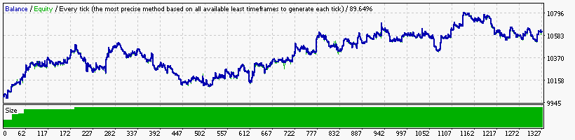

### Report: Strategy Fractals Fractals1_EURUSD_10000USD_10spread_5digits_2012 M1 DS test

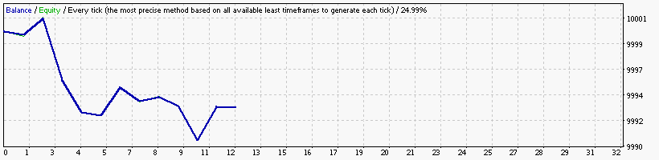

### Report: Strategy Fractals Fractals30_EURUSD_10000USD_10spread_5digits_2012 M30 DS test

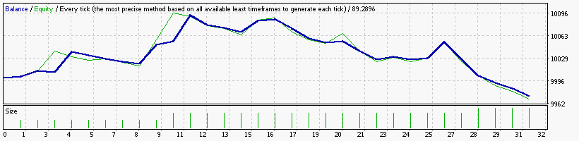

### Report: Strategy Fractals Fractals5_EURUSD_10000USD_10spread_5digits_2012 M5 DS test

### Report: Strategy Fractals Fractals_EURUSD_10000USD_10spread_5digits_2012 DS test

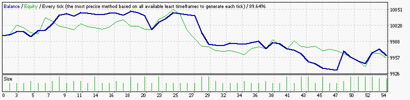

### Report: Strategy MA MA15_EURUSD_10000USD_10spread_5digits_2012 M15 DS test

### Report: Strategy MA MA1_EURUSD_10000USD_10spread_5digits_2012 DS test

### Report: Strategy MA MA30_EURUSD_10000USD_10spread_5digits_2012 M30 DS test

### Report: Strategy MA MA5_EURUSD_10000USD_10spread_5digits_2012 DS test

### Report: Strategy MA MA_EURUSD_10000USD_10spread_5digits_2012 DS test

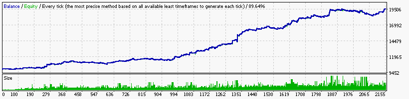

### Report: Strategy MACD MACD15_EURUSD_10000USD_10spread_5digits_2012 M15 DS test

### Report: Strategy MACD MACD1_EURUSD_10000USD_10spread_5digits_2012 DS test

### Report: Strategy MACD MACD30_EURUSD_10000USD_10spread_5digits_2012 M30 DS test

### Report: Strategy MACD MACD5_EURUSD_10000USD_10spread_5digits_2012 DS test

### Report: Strategy MACD MACD_EURUSD_10000USD_10spread_5digits_2012 DS test

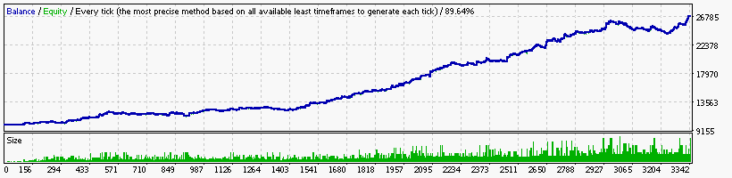

### Report: Strategy RSI RSI15_EURUSD_10000USD_10spread_5digits_2012 M15 DS test

### Report: Strategy RSI RSI1_EURUSD_10000USD_10spread_5digits_2012 DS test

### Report: Strategy RSI RSI30_EURUSD_10000USD_10spread_5digits_2012 M30 DS test

### Report: Strategy RSI RSI5_EURUSD_10000USD_10spread_5digits_2012 DS test

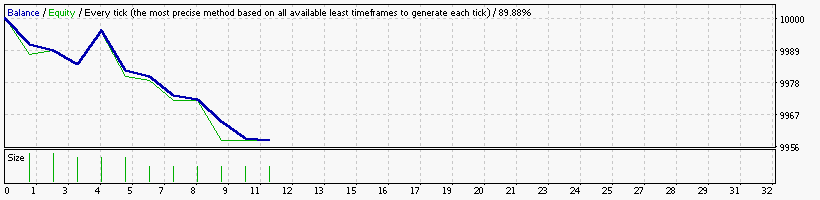

### Report: Strategy RSI RSI_EURUSD_10000USD_10spread_5digits_2012 DS test

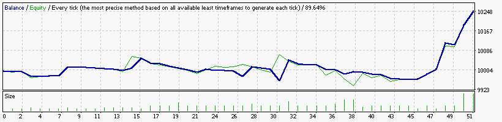

### Report: Strategy SAR SAR15_EURUSD_10000USD_10spread_5digits_2012 M15 DS test

### Report: Strategy SAR SAR1_EURUSD_10000USD_10spread_5digits_2012 DS test

### Report: Strategy SAR SAR30_EURUSD_10000USD_10spread_5digits_2012 M30 DS test

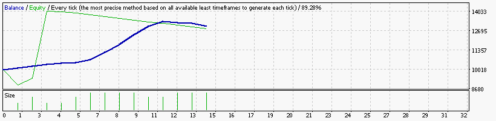

### Report: Strategy SAR SAR5_EURUSD_10000USD_10spread_5digits_2012 DS test

### Report: Strategy SAR SAR_EURUSD_10000USD_10spread_5digits_2012 DS test

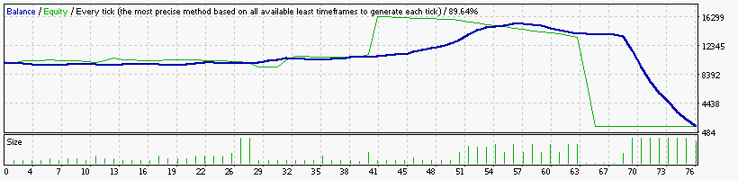

    Symbol                            EURUSD (Euro vs US Dollar)
    Period                            15 Minutes (M15) 2012.01.02 23:00 - 2012.12.28 21:45 (2012.01.01 - 2012.12.30)
    Model                             Every tick (the most precise method based on all available least timeframes)
    Parameters                        Alligator15_SignalMethod=15; Alligator30_SignalMethod=63; __Bands_Parameters__="-- Settings for the Bollinger Bands
    Bars in test                24957 Ticks modelled                         6384541 Modelling quality                                              89.64%
    Mismatched charts errors        0
    Initial deposit          10000.00                                                Spread                                                             10
    Total net profit         -8758.22 Gross profit                           6358.96 Gross loss                                                  -15117.18
    Profit factor                0.42 Expected payoff                        -115.24
    Absolute drawdown         8758.22 Maximal drawdown             19353.88 (93.97%) Relative drawdown                                   93.97% (19353.88)
    Total trades                   76 Short positions (won %)            57 (45.61%) Long positions (won %)                                    19 (47.37%)

### Report: Strategy WPR WPR15_EURUSD_10000USD_10spread_5digits_2012 M15 DS test

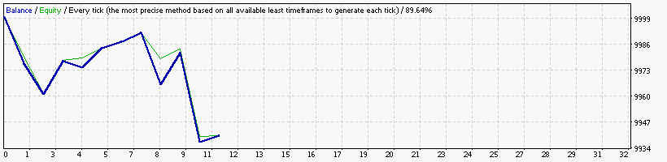

### Report: Strategy WPR WPR1_EURUSD_10000USD_10spread_5digits_2012 DS test

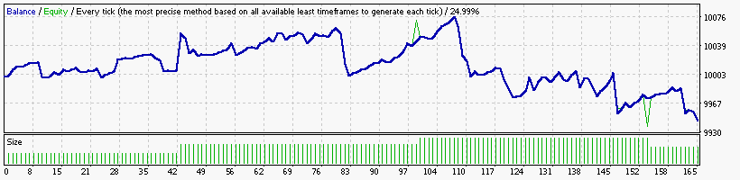

### Report: Strategy WPR WPR30_EURUSD_10000USD_10spread_5digits_2012 M30 DS test

### Report: Strategy WPR WPR5_EURUSD_10000USD_10spread_5digits_2012 DS test

### Report: Strategy WPR WPR_EURUSD_10000USD_10spread_5digits_2012 DS test

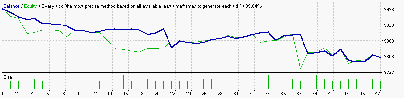

