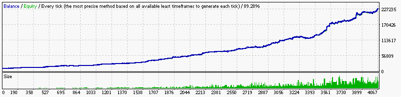

### Report: EURUSD 10000USD 2012year 10spread M30 DS test

    Symbol                             EURUSD (Euro vs US Dollar)
    Period                             30 Minutes (M30) 2012.01.04 00:00 - 2012.12.30 23:30 (2012.01.01 - 2012.12.31)
    Model                              Every tick (the most precise method based on all available least timeframes)
    Parameters                         Alligator_SignalLevel=-0.21; Alligator1_SignalMethod=21; Alligator5_SignalMethod=18; Alligator15_SignalMethod=12;
    Bars in test                 12484 Ticks modelled                       3389530 Modelling quality                                              89.28%
    Mismatched charts errors         0
    Initial deposit           10000.00                                              Spread                                                             10
    Total net profit         217600.70 Gross profit                       500552.21 Gross loss                                                 -282951.51
    Profit factor                 1.77 Expected payoff                        53.57
    Absolute drawdown             2.00 Maximal drawdown             9871.93 (4.61%) Relative drawdown                                     7.18% (9177.44)
    Total trades                  4062 Short positions (won %)        3282 (40.49%) Long positions (won %)                                   780 (39.49%)
