### Report: Strategy Alligator Alligator15_EURUSD_10000USD_10spread_5digits_2013 M15 DS test

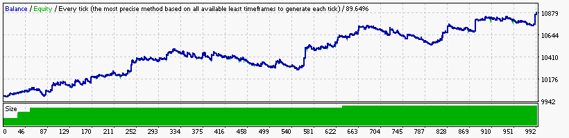

### Report: Strategy Alligator Alligator1_EURUSD_10000USD_10spread_5digits_2013 M1 DS test

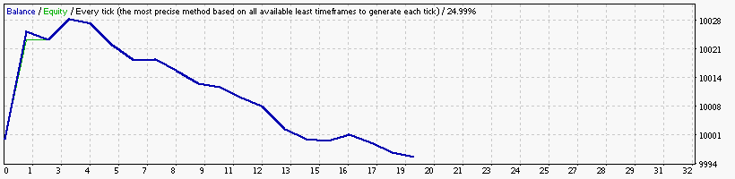

### Report: Strategy Alligator Alligator30_EURUSD_10000USD_10spread_5digits_2013 M30 DS test

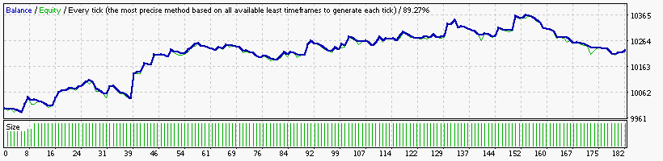

### Report: Strategy Alligator Alligator5_EURUSD_10000USD_10spread_5digits_2013 M5 DS test

### Report: Strategy Alligator Alligator_EURUSD_10000USD_10spread_5digits_2013 DS test

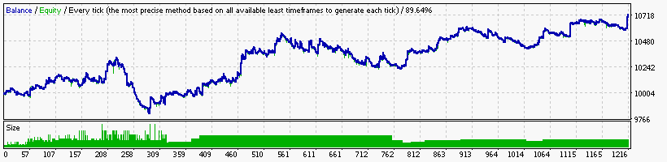

### Report: Strategy Bands Bands15_EURUSD_10000USD_10spread_5digits_2013 M15 DS test

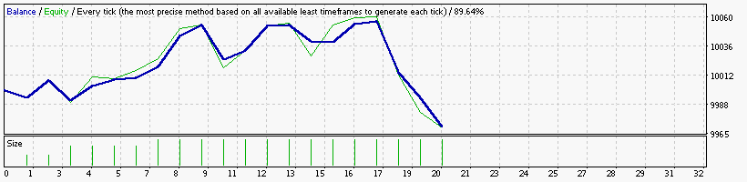

### Report: Strategy Bands Bands1_EURUSD_10000USD_10spread_5digits_2013 M1 DS test

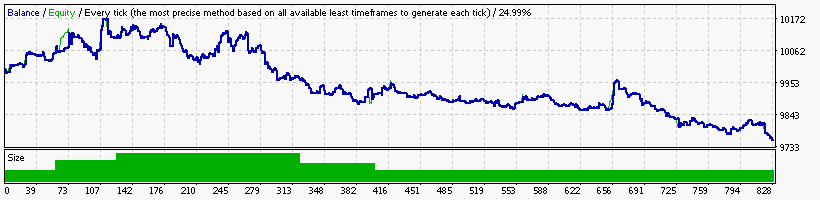

### Report: Strategy Bands Bands30_EURUSD_10000USD_10spread_5digits_2013 M30 DS test

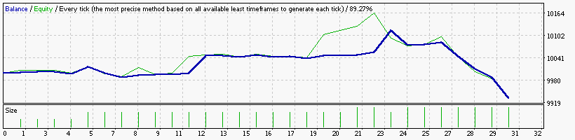

### Report: Strategy Bands Bands5_EURUSD_10000USD_10spread_5digits_2013 M5 DS test

### Report: Strategy Bands Bands_EURUSD_10000USD_10spread_5digits_2013 DS test

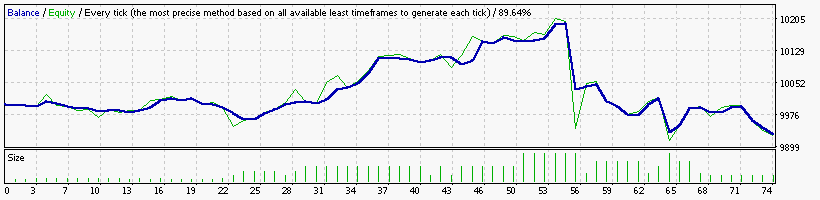

### Report: Strategy DeMarker DeMarker15_EURUSD_10000USD_10spread_5digits_2013 M15 DS test

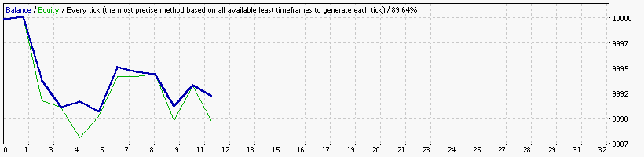

### Report: Strategy DeMarker DeMarker1_EURUSD_10000USD_10spread_5digits_2013 M1 DS test

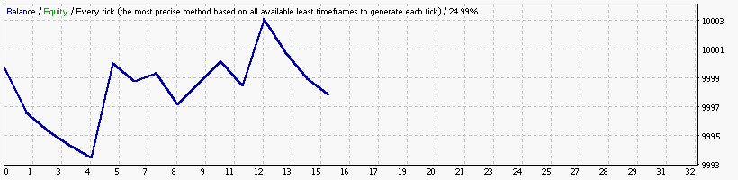

### Report: Strategy DeMarker DeMarker30_EURUSD_10000USD_10spread_5digits_2013 M30 DS test

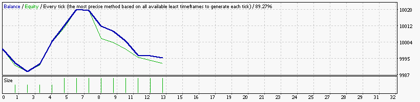

### Report: Strategy DeMarker DeMarker5_EURUSD_10000USD_10spread_5digits_2013 M5 DS test

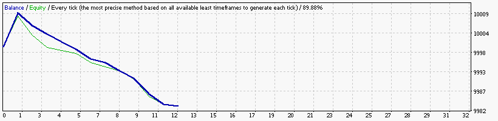

### Report: Strategy DeMarker DeMarker_EURUSD_10000USD_10spread_5digits_2013 DS test

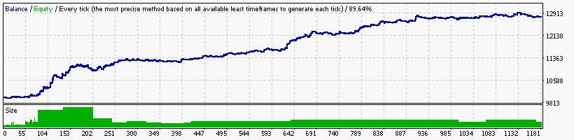

### Report: Strategy Envelopes Envelopes15_EURUSD_10000USD_10spread_5digits_2013 M15 DS test

### Report: Strategy Envelopes Envelopes1_EURUSD_10000USD_10spread_5digits_2013 M1 DS test

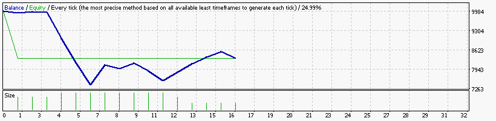

    Symbol                            EURUSD (Euro vs US Dollar)
    Period                            1 Minute (M1) 2013.01.01 23:40 - 2013.12.29 23:59 (2013.01.01 - 2013.12.30)
    Model                             Every tick (the most precise method based on all available least timeframes)
    Parameters                        Alligator5_SignalMethod=18; Alligator15_SignalMethod=15; Alligator30_SignalMethod=63; __Bands_Parameters__="-
    Bars in test               369765 Ticks modelled                       83626545 Modelling quality                                              24.99%
    Mismatched charts errors        0
    Initial deposit          10000.00                                               Spread                                                             10
    Total net profit         -1654.59 Gross profit                          1984.47 Gross loss                                                   -3639.06
    Profit factor                0.55 Expected payoff                       -103.41
    Absolute drawdown         1702.59 Maximal drawdown             2335.53 (21.97%) Relative drawdown                                    21.97% (2335.53)
    Total trades                   16 Short positions (won %)             7 (0.00%) Long positions (won %)                                     9 (77.78%)

### Report: Strategy Envelopes Envelopes30_EURUSD_10000USD_10spread_5digits_2013 M30 DS test

### Report: Strategy Envelopes Envelopes5_EURUSD_10000USD_10spread_5digits_2013 M5 DS test

### Report: Strategy Envelopes Envelopes_EURUSD_10000USD_10spread_5digits_2013 DS test

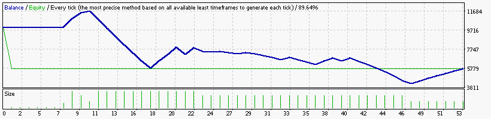

    Symbol                            EURUSD (Euro vs US Dollar)
    Period                            15 Minutes (M15) 2013.01.02 22:45 - 2013.12.29 23:45 (2013.01.01 - 2013.12.30)
    Model                             Every tick (the most precise method based on all available least timeframes)
    Parameters                        Alligator5_SignalMethod=18; Alligator15_SignalMethod=15; Alligator30_SignalMethod=63; __Bands_Parameters__="-
    Bars in test                24720 Ticks modelled                        6476958 Modelling quality                                              89.64%
    Mismatched charts errors        0
    Initial deposit          10000.00                                               Spread                                                             10
    Total net profit         -4265.08 Gross profit                          7537.51 Gross loss                                                  -11802.59
    Profit factor                0.64 Expected payoff                        -80.47
    Absolute drawdown         5190.62 Maximal drawdown             9691.33 (66.83%) Relative drawdown                                    66.83% (9691.33)
    Total trades                   53 Short positions (won %)            30 (6.67%) Long positions (won %)                                    23 (91.30%)

### Report: Strategy Fractals Fractals15_EURUSD_10000USD_10spread_5digits_2013 M15 DS test

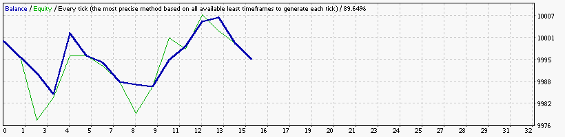

### Report: Strategy Fractals Fractals1_EURUSD_10000USD_10spread_5digits_2013 M1 DS test

### Report: Strategy Fractals Fractals30_EURUSD_10000USD_10spread_5digits_2013 M30 DS test

### Report: Strategy Fractals Fractals5_EURUSD_10000USD_10spread_5digits_2013 M5 DS test

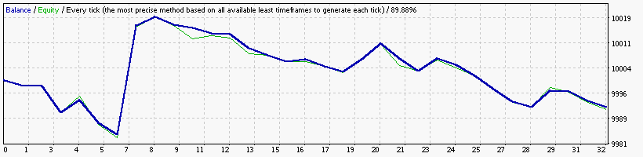

### Report: Strategy Fractals Fractals_EURUSD_10000USD_10spread_5digits_2013 DS test

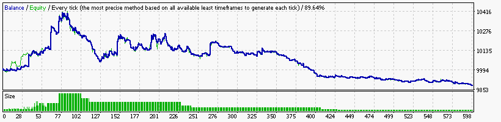

### Report: Strategy MA MA15_EURUSD_10000USD_10spread_5digits_2013 M15 DS test

### Report: Strategy MA MA1_EURUSD_10000USD_10spread_5digits_2013 DS test

### Report: Strategy MA MA30_EURUSD_10000USD_10spread_5digits_2013 M30 DS test

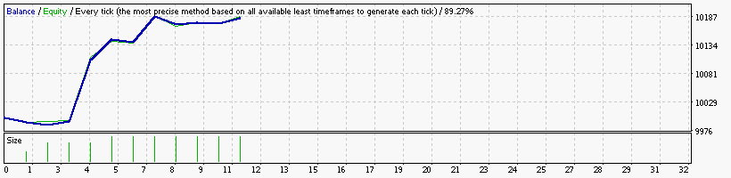

### Report: Strategy MA MA5_EURUSD_10000USD_10spread_5digits_2013 DS test

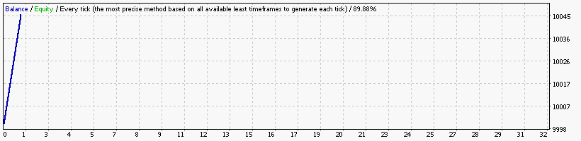

### Report: Strategy MA MA_EURUSD_10000USD_10spread_5digits_2013 DS test

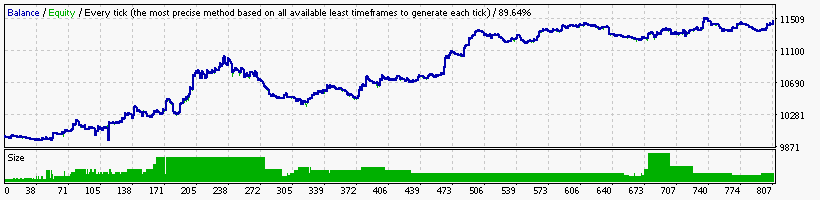

### Report: Strategy MACD MACD15_EURUSD_10000USD_10spread_5digits_2013 M15 DS test

### Report: Strategy MACD MACD1_EURUSD_10000USD_10spread_5digits_2013 DS test

### Report: Strategy MACD MACD30_EURUSD_10000USD_10spread_5digits_2013 M30 DS test

### Report: Strategy MACD MACD5_EURUSD_10000USD_10spread_5digits_2013 DS test

### Report: Strategy MACD MACD_EURUSD_10000USD_10spread_5digits_2013 DS test

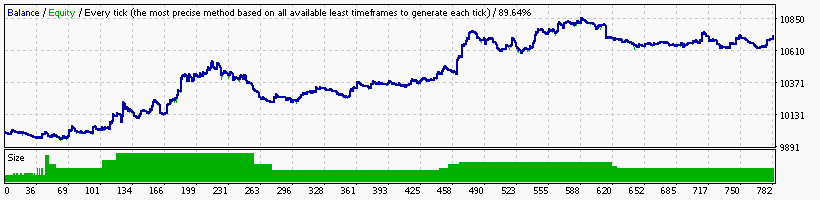

### Report: Strategy RSI RSI15_EURUSD_10000USD_10spread_5digits_2013 M15 DS test

### Report: Strategy RSI RSI1_EURUSD_10000USD_10spread_5digits_2013 DS test

### Report: Strategy RSI RSI30_EURUSD_10000USD_10spread_5digits_2013 M30 DS test

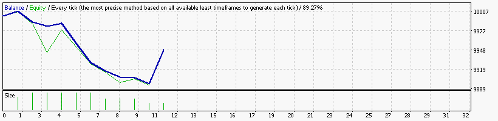

### Report: Strategy RSI RSI5_EURUSD_10000USD_10spread_5digits_2013 DS test

### Report: Strategy RSI RSI_EURUSD_10000USD_10spread_5digits_2013 DS test

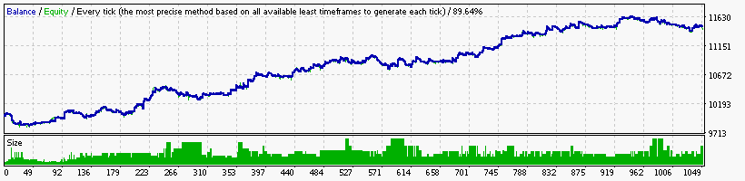

### Report: Strategy SAR SAR15_EURUSD_10000USD_10spread_5digits_2013 M15 DS test

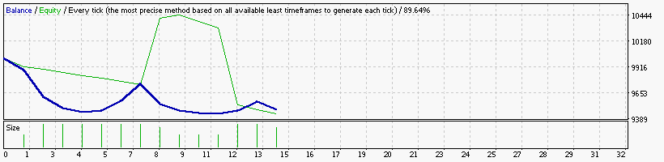

### Report: Strategy SAR SAR1_EURUSD_10000USD_10spread_5digits_2013 DS test

### Report: Strategy SAR SAR30_EURUSD_10000USD_10spread_5digits_2013 M30 DS test

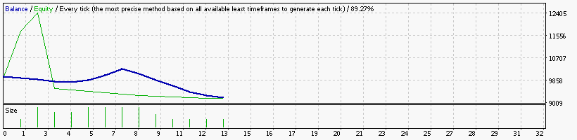

### Report: Strategy SAR SAR5_EURUSD_10000USD_10spread_5digits_2013 DS test

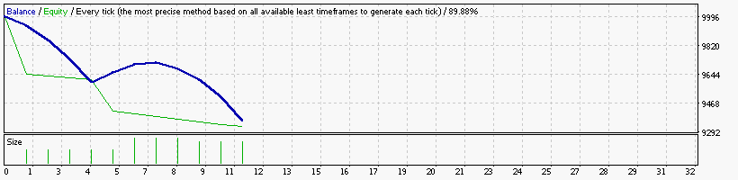

### Report: Strategy SAR SAR_EURUSD_10000USD_10spread_5digits_2013 DS test

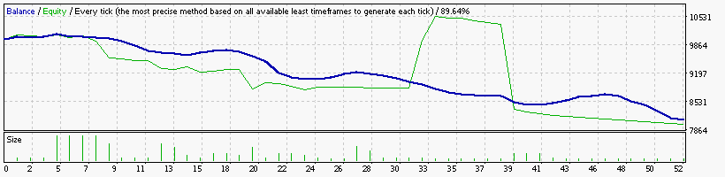

### Report: Strategy WPR WPR15_EURUSD_10000USD_10spread_5digits_2013 M15 DS test

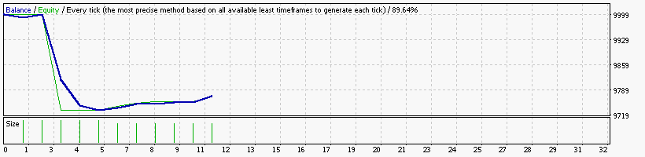

### Report: Strategy WPR WPR1_EURUSD_10000USD_10spread_5digits_2013 DS test

### Report: Strategy WPR WPR30_EURUSD_10000USD_10spread_5digits_2013 M30 DS test

### Report: Strategy WPR WPR5_EURUSD_10000USD_10spread_5digits_2013 DS test

### Report: Strategy WPR WPR_EURUSD_10000USD_10spread_5digits_2013 DS test

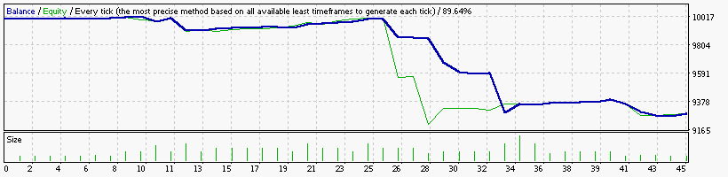

