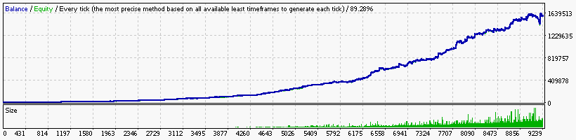

### Report: EURUSD 10000USD 2013year 10spread M30 DS test

    Symbol                             EURUSD (Euro vs US Dollar)
    Period                             30 Minutes (M30) 2013.01.03 23:30 - 2013.12.30 23:30 (2013.01.01 - 2013.12.31)
    Model                              Every tick (the most precise method based on all available least timeframes)
    Parameters                         0.21; Alligator1_SignalMethod=21; Alligator5_SignalMethod=18; Alligator15_SignalMethod=12;
    Bars in test                 12410 Ticks modelled                        3559790 Modelling quality                                              89.28%
    Mismatched charts errors         0
    Initial deposit           10000.00                                               Spread                                                             10
    Total net profit         780534.80 Gross profit                       2016517.33 Gross loss                                                -1235982.53
    Profit factor                 1.63 Expected payoff                         67.07
    Absolute drawdown            61.29 Maximal drawdown             48942.93 (7.23%) Relative drawdown                                    7.23% (48942.93)
    Total trades                 11638 Short positions (won %)         5689 (42.64%) Long positions (won %)                                  5949 (43.44%)
