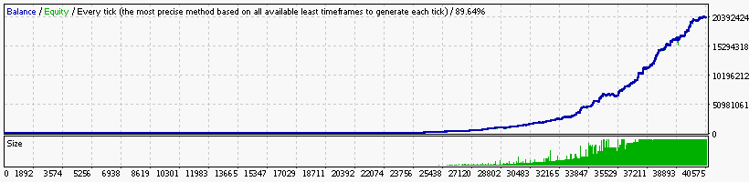

### Report: EURUSD 10000USD 2014 2015year 10spread M30 DS test

    Symbol                                 EURUSD (Euro vs US Dollar)
    Period                                 30 Minutes (M30) 2014.01.06 00:00 - 2015.12.30 23:30 (2014.01.01 - 2015.12.31)
    Model                                  Every tick (the most precise method based on all available least timeframes)
    Parameters                             Alligator5_SignalMethod=18; Alligator15_SignalMethod=12; Alligator30_SignalMethod=9; __Bands_Parameters__="-
    Bars in test                     24856 Ticks modelled                           6311040 Modelling quality                                       89.64%
    Mismatched charts errors             0
    Initial deposit               10000.00                                                  Spread                                                      10
    Total net profit         2035376394.39 Gross profit                       4425221781.39 Gross loss                                      -2389845387.00
    Profit factor                     1.85 Expected payoff                         50228.92
    Absolute drawdown                50.19 Maximal drawdown             59190000.00 (5.33%) Relative drawdown                         12.39% (13250918.17)
    Total trades                     40522 Short positions (won %)           25419 (41.13%) Long positions (won %)                          15103 (41.35%)
