### Report: Strategy Alligator Alligator15_EURUSD_10000USD_10spread_5digits_2014 DS test

### Report: Strategy Alligator Alligator1_EURUSD_10000USD_10spread_5digits_2014 DS test

### Report: Strategy Alligator Alligator30_EURUSD_10000USD_10spread_5digits_2014 DS test

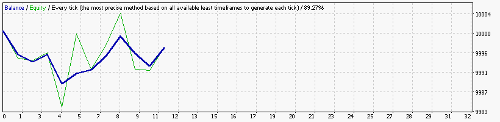

### Report: Strategy Alligator Alligator5_EURUSD_10000USD_10spread_5digits_2014 DS test

### Report: Strategy Alligator Alligator_EURUSD_10000USD_10spread_5digits_2014 DS test

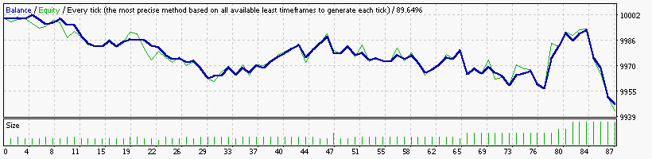

### Report: Strategy Bands Bands15_EURUSD_10000USD_10spread_5digits_2014 DS test

### Report: Strategy Bands Bands1_EURUSD_10000USD_10spread_5digits_2014 DS test

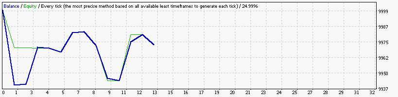

### Report: Strategy Bands Bands30_EURUSD_10000USD_10spread_5digits_2014 DS test

### Report: Strategy Bands Bands5_EURUSD_10000USD_10spread_5digits_2014 DS test

### Report: Strategy Bands Bands_EURUSD_10000USD_10spread_5digits_2014 DS test

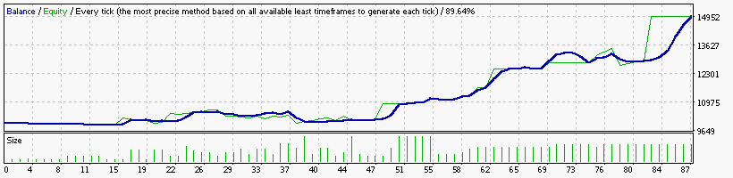

    Symbol                            EURUSD (Euro vs US Dollar)
    Period                            15 Minutes (M15) 2014.01.02 23:00 - 2014.12.29 23:45 (2014.01.01 - 2014.12.30)
    Model                             Every tick (the most precise method based on all available least timeframes)
    Parameters                        Alligator5_SignalMethod=18; Alligator15_SignalMethod=15; Alligator30_SignalMethod=63; __Bands_Parameters__="-
    Bars in test                24716 Ticks modelled                        5596310 Modelling quality                                              89.64%
    Mismatched charts errors        0
    Initial deposit          10000.00                                               Spread                                                             10
    Total net profit          4983.09 Gross profit                          7101.42 Gross loss                                                   -2118.33
    Profit factor                3.35 Expected payoff                         57.28
    Absolute drawdown          425.19 Maximal drawdown             3607.08 (24.38%) Relative drawdown                                    24.38% (3607.08)
    Total trades                   87 Short positions (won %)           68 (64.71%) Long positions (won %)                                    19 (63.16%)

### Report: Strategy DeMarker DeMarker15_EURUSD_10000USD_10spread_5digits_2014 DS test

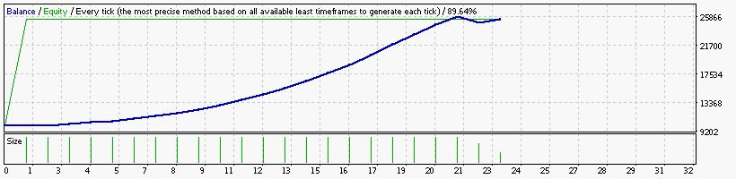

### Report: Strategy DeMarker DeMarker1_EURUSD_10000USD_10spread_5digits_2014 DS test

### Report: Strategy DeMarker DeMarker30_EURUSD_10000USD_10spread_5digits_2014 DS test

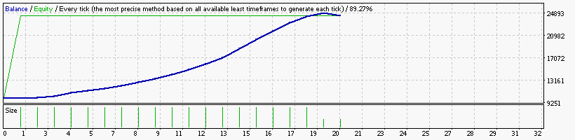

### Report: Strategy DeMarker DeMarker5_EURUSD_10000USD_10spread_5digits_2014 DS test

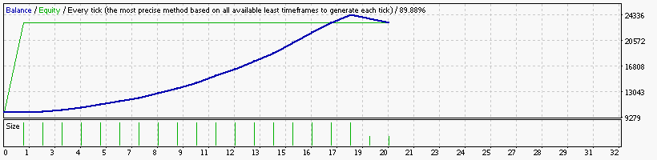

### Report: Strategy DeMarker DeMarker_EURUSD_10000USD_10spread_5digits_2014 DS test

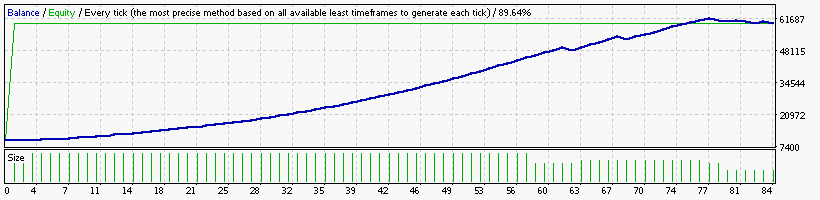

    Symbol                            EURUSD (Euro vs US Dollar)
    Period                            15 Minutes (M15) 2014.01.02 23:00 - 2014.12.29 23:45 (2014.01.01 - 2014.12.30)
    Model                             Every tick (the most precise method based on all available least timeframes)
    Parameters                        Alligator15_SignalMethod=15; Alligator30_SignalMethod=63; __Bands_Parameters__="-- Settings for the Bollinger Bands
    Bars in test                24716 Ticks modelled                         5596310 Modelling quality                                              89.64%
    Mismatched charts errors        0
    Initial deposit          10000.00                                                Spread                                                             10
    Total net profit         49949.30 Gross profit                          55353.60 Gross loss                                                   -5404.30
    Profit factor               10.24 Expected payoff                         594.63
    Absolute drawdown         2329.95 Maximal drawdown             18350.75 (33.79%) Relative drawdown                                   42.20% (17067.39)
    Total trades                   84 Short positions (won %)           77 (100.00%) Long positions (won %)                                      7 (0.00%)

### Report: Strategy Envelopes Envelopes15_EURUSD_10000USD_10spread_5digits_2014 DS test

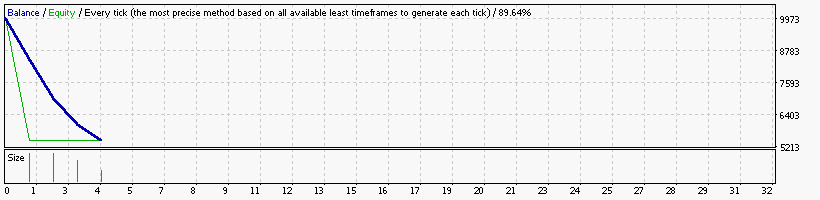

### Report: Strategy Envelopes Envelopes1_EURUSD_10000USD_10spread_5digits_2014 DS test

    Symbol                            EURUSD (Euro vs US Dollar)
    Period                            1 Minute (M1) 2014.01.01 23:41 - 2014.12.29 23:59 (2014.01.01 - 2014.12.30)
    Model                             Every tick (the most precise method based on all available least timeframes)
    Parameters                        Alligator5_SignalMethod=18; Alligator15_SignalMethod=15; Alligator30_SignalMethod=63; __Bands_Parameters__="-
    Bars in test               368714 Ticks modelled                       72707628 Modelling quality                                              24.99%
    Mismatched charts errors        0
    Initial deposit          10000.00                                               Spread                                                             10
    Total net profit         17719.71 Gross profit                         18321.69 Gross loss                                                    -601.98
    Profit factor               30.44 Expected payoff                        708.79
    Absolute drawdown          945.01 Maximal drawdown             6233.41 (24.05%) Relative drawdown                                    28.05% (6076.81)
    Total trades                   25 Short positions (won %)          24 (100.00%) Long positions (won %)                                      1 (0.00%)

### Report: Strategy Envelopes Envelopes30_EURUSD_10000USD_10spread_5digits_2014 DS test

### Report: Strategy Envelopes Envelopes5_EURUSD_10000USD_10spread_5digits_2014 DS test

### Report: Strategy Envelopes Envelopes_EURUSD_10000USD_10spread_5digits_2014 DS test

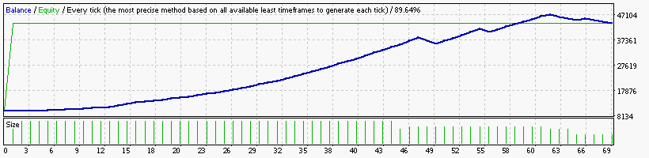

    Symbol                            EURUSD (Euro vs US Dollar)
    Period                            15 Minutes (M15) 2014.01.02 23:00 - 2014.12.29 23:45 (2014.01.01 - 2014.12.30)
    Model                             Every tick (the most precise method based on all available least timeframes)
    Parameters                        Alligator15_SignalMethod=15; Alligator30_SignalMethod=63; __Bands_Parameters__="-- Settings for the Bollinger Bands
    Bars in test                24716 Ticks modelled                         5596310 Modelling quality                                              89.64%
    Mismatched charts errors        0
    Initial deposit          10000.00                                                Spread                                                             10
    Total net profit         33849.80 Gross profit                          41422.47 Gross loss                                                   -7572.66
    Profit factor                5.47 Expected payoff                         490.58
    Absolute drawdown         1351.01 Maximal drawdown             12866.10 (32.35%) Relative drawdown                                   36.98% (10915.36)
    Total trades                   69 Short positions (won %)           60 (100.00%) Long positions (won %)                                      9 (0.00%)

### Report: Strategy Fractals Fractals15_EURUSD_10000USD_10spread_5digits_2014 DS test

### Report: Strategy Fractals Fractals1_EURUSD_10000USD_10spread_5digits_2014 DS test

### Report: Strategy Fractals Fractals30_EURUSD_10000USD_10spread_5digits_2014 DS test

### Report: Strategy Fractals Fractals5_EURUSD_10000USD_10spread_5digits_2014 DS test

### Report: Strategy Fractals Fractals_EURUSD_10000USD_10spread_5digits_2014 DS test

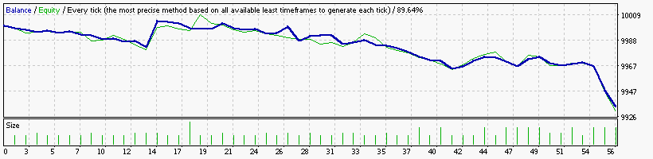

### Report: Strategy MA MA15_EURUSD_10000USD_10spread_5digits_2014 DS test

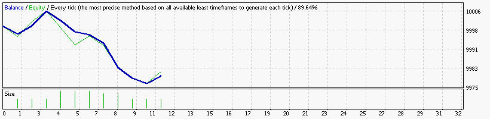

### Report: Strategy MA MA1_EURUSD_10000USD_10spread_5digits_2014 DS test

### Report: Strategy MA MA30_EURUSD_10000USD_10spread_5digits_2014 DS test

### Report: Strategy MA MA5_EURUSD_10000USD_10spread_5digits_2014 DS test

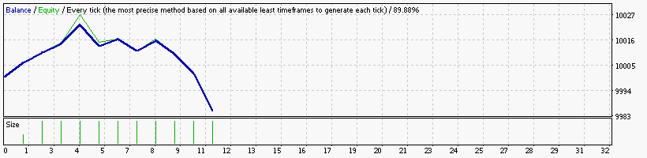

### Report: Strategy MA MA_EURUSD_10000USD_10spread_5digits_2014 DS test

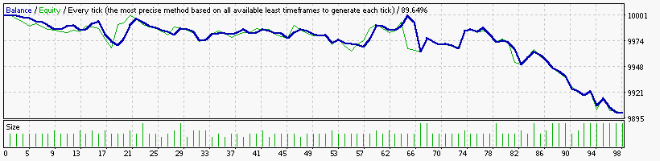

### Report: Strategy MACD MACD15_EURUSD_10000USD_10spread_5digits_2014 DS test

### Report: Strategy MACD MACD1_EURUSD_10000USD_10spread_5digits_2014 DS test

### Report: Strategy MACD MACD30_EURUSD_10000USD_10spread_5digits_2014 DS test

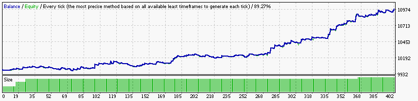

### Report: Strategy MACD MACD5_EURUSD_10000USD_10spread_5digits_2014 DS test

### Report: Strategy MACD MACD_EURUSD_10000USD_10spread_5digits_2014 DS test

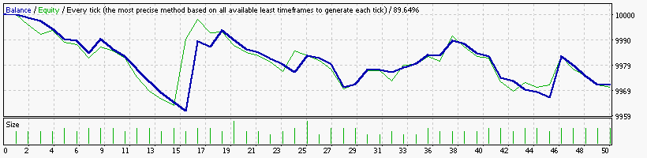

### Report: Strategy RSI RSI15_EURUSD_10000USD_10spread_5digits_2014 DS test

### Report: Strategy RSI RSI1_EURUSD_10000USD_10spread_5digits_2014 DS test

### Report: Strategy RSI RSI30_EURUSD_10000USD_10spread_5digits_2014 DS test

### Report: Strategy RSI RSI5_EURUSD_10000USD_10spread_5digits_2014 DS test

### Report: Strategy RSI RSI_EURUSD_10000USD_10spread_5digits_2014 DS test

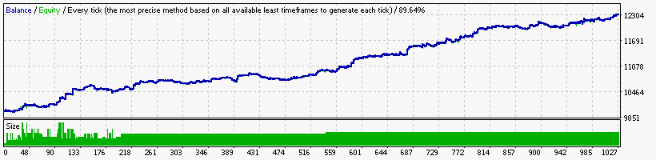

### Report: Strategy SAR SAR15_EURUSD_10000USD_10spread_5digits_2014 DS test

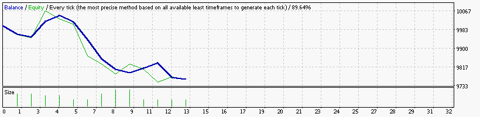

### Report: Strategy SAR SAR1_EURUSD_10000USD_10spread_5digits_2014 DS test

### Report: Strategy SAR SAR30_EURUSD_10000USD_10spread_5digits_2014 DS test

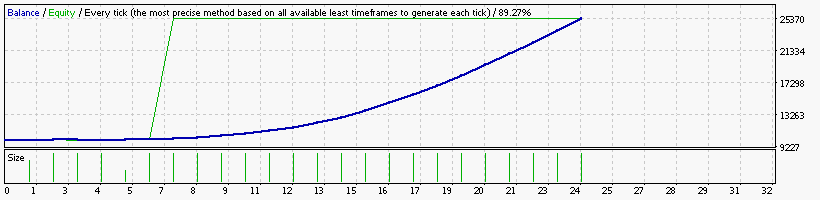

### Report: Strategy SAR SAR5_EURUSD_10000USD_10spread_5digits_2014 DS test

### Report: Strategy SAR SAR_EURUSD_10000USD_10spread_5digits_2014 DS test

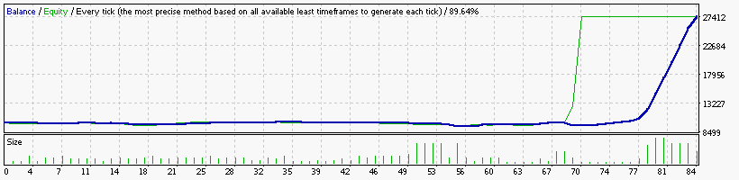

### Report: Strategy WPR WPR15_EURUSD_10000USD_10spread_5digits_2014 DS test

### Report: Strategy WPR WPR1_EURUSD_10000USD_10spread_5digits_2014 DS test

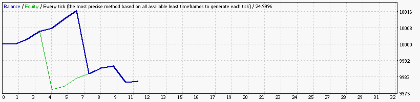

### Report: Strategy WPR WPR30_EURUSD_10000USD_10spread_5digits_2014 DS test

### Report: Strategy WPR WPR5_EURUSD_10000USD_10spread_5digits_2014 DS test

### Report: Strategy WPR WPR_EURUSD_10000USD_10spread_5digits_2014 DS test

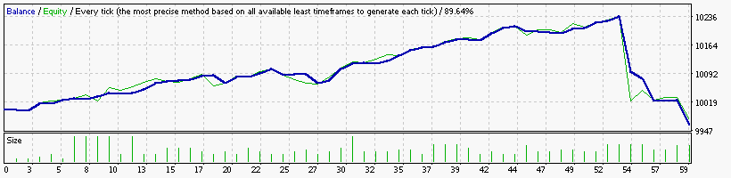

