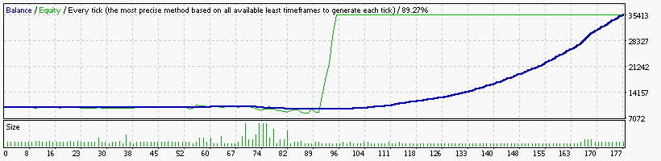

### Report: EURUSD 10000USD 2014year 10spread DS test

    Symbol                            EURUSD (Euro vs US Dollar)
    Period                            30 Minutes (M30) 2014.01.06 00:00 - 2014.12.29 23:30 (2014.01.01 - 2014.12.30)
    Model                             Every tick (the most precise method based on all available least timeframes)
    Parameters                        Alligator15_SignalMethod=15; Alligator30_SignalMethod=63; __Bands_Parameters__="-- Settings for the Bollinger Bands
    Bars in test                12360 Ticks modelled                         3091822 Modelling quality                                              89.27%
    Mismatched charts errors        0
    Initial deposit          10000.00                                                Spread                                                             10
    Total net profit         49378.16 Gross profit                          61583.82 Gross loss                                                  -12205.66
    Profit factor                5.05 Expected payoff                         242.05
    Absolute drawdown          955.56 Maximal drawdown             17438.53 (32.12%) Relative drawdown                                   39.77% (15562.71)
    Total trades                  204 Short positions (won %)           168 (76.19%) Long positions (won %)                                    36 (58.33%)
