### Report: Strategy Alligator Alligator15_EURUSD_10000USD_10spread_5digits_2015 DS test

### Report: Strategy Alligator Alligator1_EURUSD_10000USD_10spread_5digits_2015 DS test

### Report: Strategy Alligator Alligator30_EURUSD_10000USD_10spread_5digits_2015 DS test

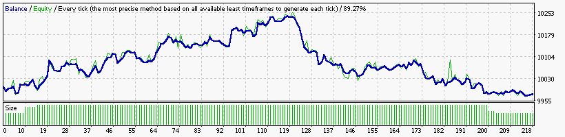

### Report: Strategy Alligator Alligator5_EURUSD_10000USD_10spread_5digits_2015 DS test

### Report: Strategy Alligator Alligator_EURUSD_10000USD_10spread_5digits_2015 DS test

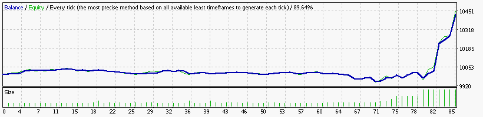

### Report: Strategy Bands Bands15_EURUSD_10000USD_10spread_5digits_2015 DS test

### Report: Strategy Bands Bands1_EURUSD_10000USD_10spread_5digits_2015 DS test

### Report: Strategy Bands Bands30_EURUSD_10000USD_10spread_5digits_2015 DS test

### Report: Strategy Bands Bands_EURUSD_10000USD_10spread_5digits_2015 DS test

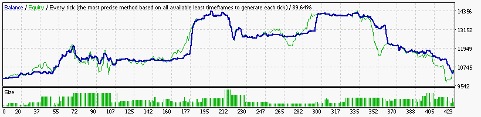

    Symbol                            EURUSD (Euro vs US Dollar)
    Period                            15 Minutes (M15) 2015.01.04 23:00 - 2015.12.29 23:45 (2015.01.01 - 2015.12.30)
    Model                             Every tick (the most precise method based on all available least timeframes)
    Parameters                        Alligator5_SignalMethod=18; Alligator15_SignalMethod=15; Alligator30_SignalMethod=63; __Bands_Parameters__="-
    Bars in test                24710 Ticks modelled                        5877499 Modelling quality                                              89.64%
    Mismatched charts errors        0
    Initial deposit          10000.00                                               Spread                                                             10
    Total net profit           514.54 Gross profit                         15728.88 Gross loss                                                  -15214.35
    Profit factor                1.03 Expected payoff                          1.22
    Absolute drawdown          632.53 Maximal drawdown             5023.59 (34.80%) Relative drawdown                                    34.80% (5023.59)
    Total trades                  422 Short positions (won %)          390 (53.08%) Long positions (won %)                                    32 (43.75%)

### Report: Strategy DeMarker DeMarker15_EURUSD_10000USD_10spread_5digits_2015 DS test

    Symbol                            EURUSD (Euro vs US Dollar)
    Period                            15 Minutes (M15) 2015.01.04 23:00 - 2015.12.29 23:45 (2015.01.01 - 2015.12.30)
    Model                             Every tick (the most precise method based on all available least timeframes)
    Parameters                        Alligator15_SignalMethod=15; Alligator30_SignalMethod=63; __Bands_Parameters__="-- Settings for the Bollinger Bands
    Bars in test                24710 Ticks modelled                         5877499 Modelling quality                                              89.64%
    Mismatched charts errors        0
    Initial deposit          10000.00                                                Spread                                                             10
    Total net profit          3003.08 Gross profit                           4325.87 Gross loss                                                   -1322.79
    Profit factor                3.27 Expected payoff                         176.65
    Absolute drawdown         8663.46 Maximal drawdown             18610.31 (93.30%) Relative drawdown                                   93.30% (18610.31)
    Total trades                   17 Short positions (won %)            17 (64.71%) Long positions (won %)                                      0 (0.00%)

### Report: Strategy DeMarker DeMarker30_EURUSD_10000USD_10spread_5digits_2015 DS test

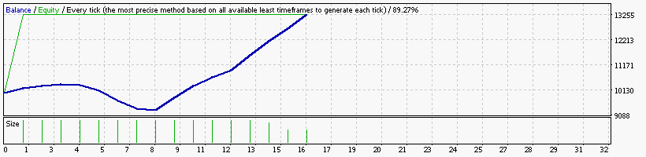

    Symbol                            EURUSD (Euro vs US Dollar)
    Period                            30 Minutes (M30) 2015.01.06 00:00 - 2015.12.29 23:30 (2015.01.01 - 2015.12.30)
    Model                             Every tick (the most precise method based on all available least timeframes)
    Parameters                        Alligator15_SignalMethod=15; Alligator30_SignalMethod=63; __Bands_Parameters__="-- Settings for the Bollinger Bands
    Bars in test                12356 Ticks modelled                         3177598 Modelling quality                                              89.27%
    Mismatched charts errors        0
    Initial deposit          10000.00                                                Spread                                                             10
    Total net profit          3278.65 Gross profit                           4353.51 Gross loss                                                   -1074.86
    Profit factor                4.05 Expected payoff                         204.92
    Absolute drawdown         7910.33 Maximal drawdown             16501.56 (88.76%) Relative drawdown                                   88.76% (16501.56)
    Total trades                   16 Short positions (won %)            16 (68.75%) Long positions (won %)                                      0 (0.00%)

### Report: Strategy DeMarker DeMarker5_EURUSD_10000USD_10spread_5digits_2015 DS test

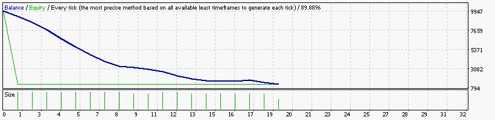

    Symbol                            EURUSD (Euro vs US Dollar)
    Period                            5 Minutes (M5) 2015.01.02 06:20 - 2015.12.29 23:55 (2015.01.01 - 2015.12.30)
    Model                             Every tick (the most precise method based on all available least timeframes)
    Parameters                        Alligator15_SignalMethod=15; Alligator30_SignalMethod=63; __Bands_Parameters__="-- Settings for the Bollinger Bands
    Bars in test                74123 Ticks modelled                        16458073 Modelling quality                                              89.88%
    Mismatched charts errors        0
    Initial deposit          10000.00                                                Spread                                                             10
    Total net profit         -8767.39 Gross profit                            171.08 Gross loss                                                   -8938.47
    Profit factor                0.02 Expected payoff                        -461.44
    Absolute drawdown         8767.39 Maximal drawdown             16393.80 (93.01%) Relative drawdown                                   93.01% (16393.80)
    Total trades                   19 Short positions (won %)             17 (5.88%) Long positions (won %)                                      2 (0.00%)

### Report: Strategy DeMarker DeMarker_EURUSD_10000USD_10spread_5digits_2015 DS test

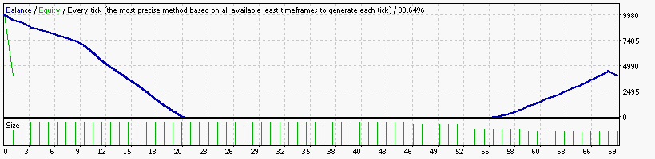

    Symbol                            EURUSD (Euro vs US Dollar)
    Period                            15 Minutes (M15) 2015.01.04 23:00 - 2015.12.29 23:45 (2015.01.01 - 2015.12.30)
    Model                             Every tick (the most precise method based on all available least timeframes)
    Parameters                        Alligator15_SignalMethod=15; Alligator30_SignalMethod=63; __Bands_Parameters__="-- Settings for the Bollinger Bands
    Bars in test                24710 Ticks modelled                         5877499 Modelling quality                                              89.64%
    Mismatched charts errors        0
    Initial deposit          10000.00                                                Spread                                                             10
    Total net profit         -5960.70 Gross profit                           7988.67 Gross loss                                                  -13949.37
    Profit factor                0.57 Expected payoff                         -86.39
    Absolute drawdown         5960.70 Maximal drawdown             42534.18 (91.33%) Relative drawdown                                   91.33% (42534.18)
    Total trades                   69 Short positions (won %)            68 (48.53%) Long positions (won %)                                      1 (0.00%)

### Report: Strategy Envelopes Envelopes15_EURUSD_10000USD_10spread_5digits_2015 DS test

### Report: Strategy Envelopes Envelopes30_EURUSD_10000USD_10spread_5digits_2015 DS test

### Report: Strategy Envelopes Envelopes5_EURUSD_10000USD_10spread_5digits_2015 DS test

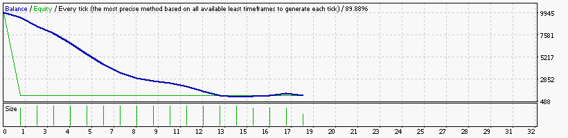

    Symbol                            EURUSD (Euro vs US Dollar)
    Period                            5 Minutes (M5) 2015.01.02 06:20 - 2015.12.29 23:55 (2015.01.01 - 2015.12.30)
    Model                             Every tick (the most precise method based on all available least timeframes)
    Parameters                        Alligator15_SignalMethod=15; Alligator30_SignalMethod=63; __Bands_Parameters__="-- Settings for the Bollinger Bands
    Bars in test                74123 Ticks modelled                        16458073 Modelling quality                                              89.88%
    Mismatched charts errors        0
    Initial deposit          10000.00                                                Spread                                                             10
    Total net profit         -8858.11 Gross profit                            409.03 Gross loss                                                   -9267.14
    Profit factor                0.04 Expected payoff                        -492.12
    Absolute drawdown         8858.11 Maximal drawdown             18430.06 (94.17%) Relative drawdown                                   94.17% (18430.06)
    Total trades                   18 Short positions (won %)            17 (17.65%) Long positions (won %)                                      1 (0.00%)

### Report: Strategy Envelopes Envelopes_EURUSD_10000USD_10spread_5digits_2015 DS test

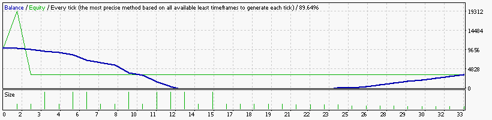

    Symbol                            EURUSD (Euro vs US Dollar)
    Period                            15 Minutes (M15) 2015.01.04 23:00 - 2015.12.29 23:45 (2015.01.01 - 2015.12.30)
    Model                             Every tick (the most precise method based on all available least timeframes)
    Parameters                        Alligator15_SignalMethod=15; Alligator30_SignalMethod=63; __Bands_Parameters__="-- Settings for the Bollinger Bands
    Bars in test                24710 Ticks modelled                         5877499 Modelling quality                                              89.64%
    Mismatched charts errors        0
    Initial deposit          10000.00                                                Spread                                                             10
    Total net profit         -6583.09 Gross profit                           5285.70 Gross loss                                                  -11868.79
    Profit factor                0.45 Expected payoff                        -199.49
    Absolute drawdown         6583.09 Maximal drawdown             28139.12 (89.17%) Relative drawdown                                   89.17% (28139.12)
    Total trades                   33 Short positions (won %)            33 (57.58%) Long positions (won %)                                      0 (0.00%)

### Report: Strategy Fractals Fractals15_EURUSD_10000USD_10spread_5digits_2015 DS test

### Report: Strategy Fractals Fractals1_EURUSD_10000USD_10spread_5digits_2015 DS test

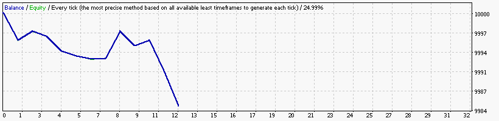

### Report: Strategy Fractals Fractals30_EURUSD_10000USD_10spread_5digits_2015 DS test

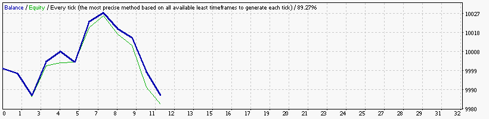

### Report: Strategy Fractals Fractals5_EURUSD_10000USD_10spread_5digits_2015 DS test

### Report: Strategy Fractals Fractals_EURUSD_10000USD_10spread_5digits_2015 DS test

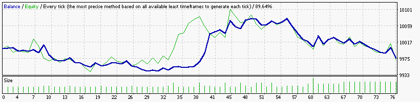

### Report: Strategy MA MA15_EURUSD_10000USD_10spread_5digits_2015 DS test

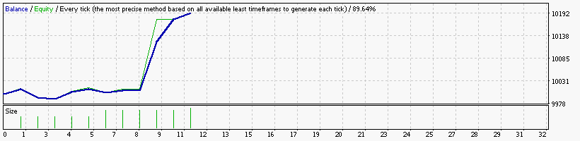

### Report: Strategy MA MA1_EURUSD_10000USD_10spread_5digits_2015 DS test

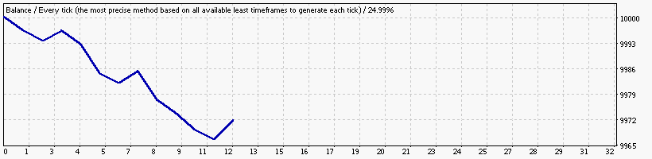

### Report: Strategy MA MA30_EURUSD_10000USD_10spread_5digits_2015 DS test

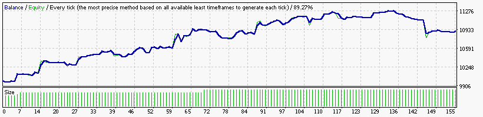

### Report: Strategy MA MA5_EURUSD_10000USD_10spread_5digits_2015 DS test

### Report: Strategy MA MA_EURUSD_10000USD_10spread_5digits_2015 DS test

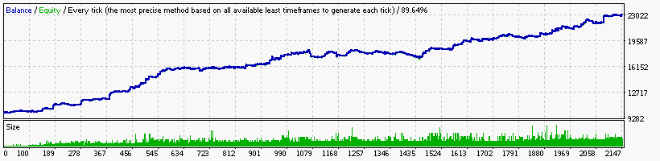

### Report: Strategy MACD MACD15_EURUSD_10000USD_10spread_5digits_2015 DS test

### Report: Strategy MACD MACD1_EURUSD_10000USD_10spread_5digits_2015 DS test

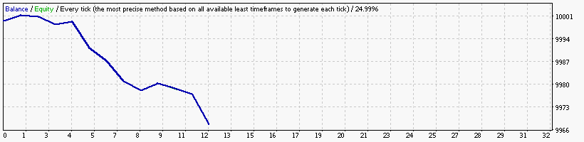

### Report: Strategy MACD MACD30_EURUSD_10000USD_10spread_5digits_2015 DS test

### Report: Strategy MACD MACD5_EURUSD_10000USD_10spread_5digits_2015 DS test

### Report: Strategy MACD MACD_EURUSD_10000USD_10spread_5digits_2015 DS test

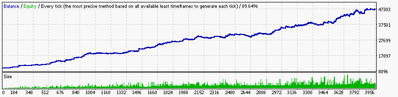

### Report: Strategy RSI RSI1_EURUSD_10000USD_10spread_5digits_2015 DS test

### Report: Strategy RSI RSI30_EURUSD_10000USD_10spread_5digits_2015 DS test

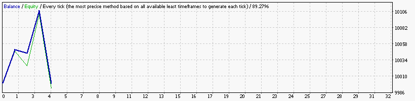

### Report: Strategy RSI RSI5_EURUSD_10000USD_10spread_5digits_2015 DS test

### Report: Strategy RSI RSI_EURUSD_10000USD_10spread_5digits_2015 DS test

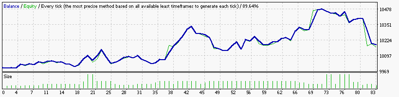

### Report: Strategy SAR SAR15_EURUSD_10000USD_10spread_5digits_2015 DS test

    Symbol                            EURUSD (Euro vs US Dollar)
    Period                            15 Minutes (M15) 2015.01.04 23:00 - 2015.12.29 23:45 (2015.01.01 - 2015.12.30)
    Model                             Every tick (the most precise method based on all available least timeframes)
    Parameters                        Alligator15_SignalMethod=15; Alligator30_SignalMethod=63; __Bands_Parameters__="-- Settings for the Bollinger Bands
    Bars in test                24710 Ticks modelled                         5877499 Modelling quality                                              89.64%
    Mismatched charts errors        0
    Initial deposit          10000.00                                                Spread                                                             10
    Total net profit          5228.41 Gross profit                           8371.19 Gross loss                                                   -3142.78
    Profit factor                2.66 Expected payoff                         134.06
    Absolute drawdown         4934.19 Maximal drawdown             14542.21 (74.16%) Relative drawdown                                   74.16% (14542.21)
    Total trades                   39 Short positions (won %)            39 (64.10%) Long positions (won %)                                      0 (0.00%)

### Report: Strategy SAR SAR1_EURUSD_10000USD_10spread_5digits_2015 DS test

### Report: Strategy SAR SAR30_EURUSD_10000USD_10spread_5digits_2015 DS test

    Symbol                            EURUSD (Euro vs US Dollar)
    Period                            30 Minutes (M30) 2015.01.06 00:00 - 2015.12.29 23:30 (2015.01.01 - 2015.12.30)
    Model                             Every tick (the most precise method based on all available least timeframes)
    Parameters                        Alligator15_SignalMethod=15; Alligator30_SignalMethod=63; __Bands_Parameters__="-- Settings for the Bollinger Bands
    Bars in test                12356 Ticks modelled                         3177598 Modelling quality                                              89.27%
    Mismatched charts errors        0
    Initial deposit          10000.00                                                Spread                                                             10
    Total net profit         -2796.06 Gross profit                            948.16 Gross loss                                                   -3744.22
    Profit factor                0.25 Expected payoff                        -199.72
    Absolute drawdown         7884.03 Maximal drawdown             14755.00 (87.46%) Relative drawdown                                   87.46% (14755.00)
    Total trades                   14 Short positions (won %)            14 (35.71%) Long positions (won %)                                      0 (0.00%)

### Report: Strategy SAR SAR5_EURUSD_10000USD_10spread_5digits_2015 DS test

    Symbol                            EURUSD (Euro vs US Dollar)
    Period                            5 Minutes (M5) 2015.01.02 06:20 - 2015.12.29 23:55 (2015.01.01 - 2015.12.30)
    Model                             Every tick (the most precise method based on all available least timeframes)
    Parameters                        Alligator15_SignalMethod=15; Alligator30_SignalMethod=63; __Bands_Parameters__="-- Settings for the Bollinger Bands
    Bars in test                74123 Ticks modelled                        16458073 Modelling quality                                              89.88%
    Mismatched charts errors        0
    Initial deposit          10000.00                                                Spread                                                             10
    Total net profit          -943.08 Gross profit                           8199.35 Gross loss                                                   -9142.43
    Profit factor                0.90 Expected payoff                         -13.28
    Absolute drawdown         1220.31 Maximal drawdown             10148.78 (53.62%) Relative drawdown                                   53.62% (10148.78)
    Total trades                   71 Short positions (won %)            63 (46.03%) Long positions (won %)                                     8 (12.50%)

### Report: Strategy SAR SAR_EURUSD_10000USD_10spread_5digits_2015 DS test

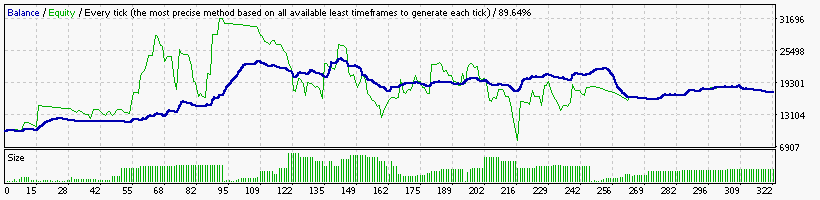

    Symbol                            EURUSD (Euro vs US Dollar)
    Period                            15 Minutes (M15) 2015.01.04 23:00 - 2015.12.29 23:45 (2015.01.01 - 2015.12.30)
    Model                             Every tick (the most precise method based on all available least timeframes)
    Parameters                        Alligator15_SignalMethod=15; Alligator30_SignalMethod=63; __Bands_Parameters__="-- Settings for the Bollinger Bands
    Bars in test                24710 Ticks modelled                         5877499 Modelling quality                                              89.64%
    Mismatched charts errors        0
    Initial deposit          10000.00                                                Spread                                                             10
    Total net profit          7521.61 Gross profit                          39045.89 Gross loss                                                  -31524.28
    Profit factor                1.24 Expected payoff                          23.36
    Absolute drawdown         4718.03 Maximal drawdown             28830.42 (84.52%) Relative drawdown                                   84.52% (28830.42)
    Total trades                  322 Short positions (won %)           302 (45.03%) Long positions (won %)                                    20 (20.00%)

### Report: Strategy WPR WPR15_EURUSD_10000USD_10spread_5digits_2015 DS test

### Report: Strategy WPR WPR1_EURUSD_10000USD_10spread_5digits_2015 DS test

### Report: Strategy WPR WPR30_EURUSD_10000USD_10spread_5digits_2015 DS test

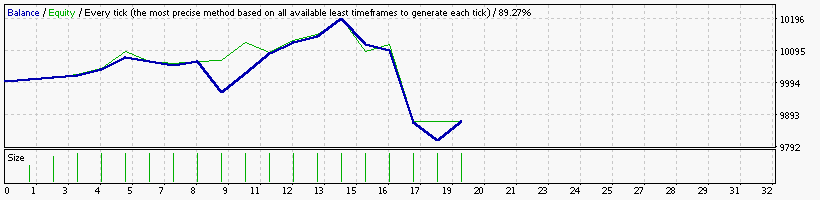

### Report: Strategy WPR WPR5_EURUSD_10000USD_10spread_5digits_2015 DS test

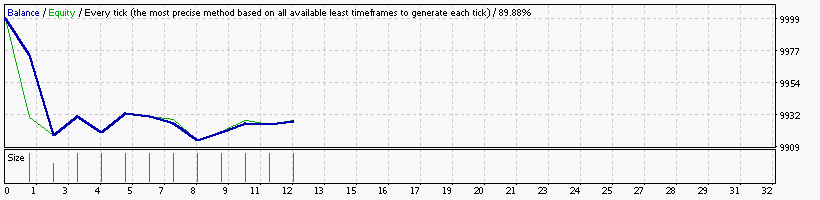

### Report: Strategy WPR WPR_EURUSD_10000USD_10spread_5digits_2015 DS test

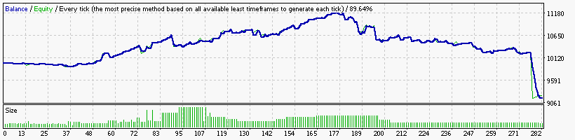

