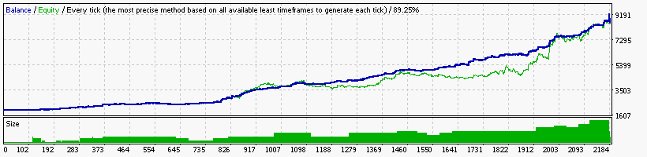

### Report: EURUSD 2000USD 2010year 10spread M30 DS test

    Symbol                             EURUSD (Euro vs US Dollar)
    Period                             30 Minutes (M30) 2010.01.05 05:00 - 2010.12.30 23:30 (2010.01.01 - 2010.12.31)
    Model                              Every tick (the most precise method based on all available least timeframes)
    Parameters                         0.21; Alligator1_SignalMethod=21; Alligator5_SignalMethod=18; Alligator15_SignalMethod=12;
    Bars in test                 11960 Ticks modelled                        1271807 Modelling quality                                              89.25%
    Mismatched charts errors         0
    Initial deposit            2000.00                                               Spread                                                             10
    Total net profit         204355.96 Gross profit                        374681.12 Gross loss                                                 -170325.16
    Profit factor                 2.20 Expected payoff                         19.72
    Absolute drawdown            17.71 Maximal drawdown             13958.88 (6.84%) Relative drawdown                                    10.14% (1954.54)
    Total trades                 10364 Short positions (won %)         5748 (39.44%) Long positions (won %)                                  4616 (42.05%)
