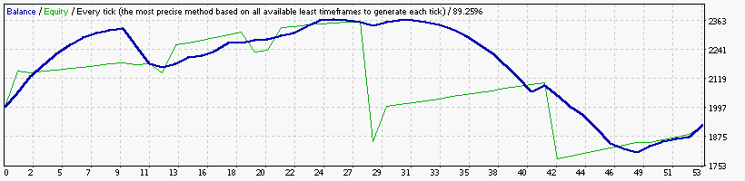
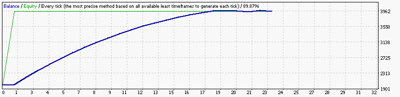
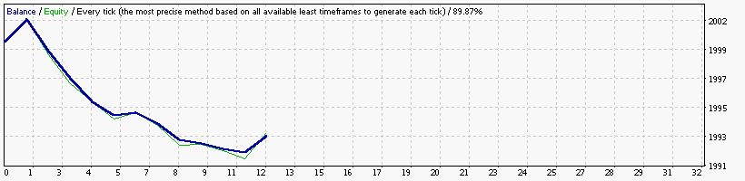
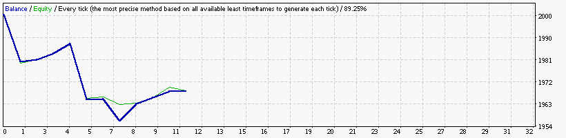

### Report: Strategy Alligator Alligator15_EURUSD_2000USD_10spread_5digits_2011 M15 DS test

    Symbol                           EURUSD (Euro vs US Dollar)
    Period                           15 Minutes (M15) 2011.01.04 01:00 - 2011.12.30 21:45 (2011.01.01 - 2011.12.31)
    Model                            Every tick (the most precise method based on all available least timeframes)
    Parameters                       Alligator30_SignalMethod=63; __Bands_Parameters__="-- Settings for the Bollinger Bands indicator --";
    Bars in test               23920 Ticks modelled                          6540863 Modelling quality                                              89.62%
    Mismatched charts errors       0
    Initial deposit          2000.00                                                 Spread                                                             10
    Total net profit           -0.72 Gross profit                               4.81 Gross loss                                                      -5.53
    Profit factor               0.87 Expected payoff                           -0.06
    Absolute drawdown           4.96 Maximal drawdown                   4.96 (0.25%) Relative drawdown                                        0.25% (4.96)
    Total trades                  12 Short positions (won %)             10 (60.00%) Long positions (won %)                                      2 (0.00%)

### Report: Strategy Bands Bands15_EURUSD_2000USD_10spread_5digits_2011 M15 DS test

### Report: Strategy Bands Bands30_EURUSD_2000USD_10spread_5digits_2011 M30 DS test

### Report: Strategy Bands Bands5_EURUSD_2000USD_10spread_5digits_2011 M5 DS test

    Symbol                           EURUSD (Euro vs US Dollar)
    Period                           5 Minutes (M5) 2011.01.03 07:20 - 2011.12.30 21:55 (2011.01.01 - 2011.12.31)
    Model                            Every tick (the most precise method based on all available least timeframes)
    Parameters                       Alligator30_SignalMethod=63; __Bands_Parameters__="-- Settings for the Bollinger Bands indicator --";
    Bars in test               71760 Ticks modelled                         18638212 Modelling quality                                              89.87%
    Mismatched charts errors       0
    Initial deposit          2000.00                                                 Spread                                                             10
    Total net profit            0.00 Gross profit                               0.00 Gross loss                                                      -0.00
    Profit factor                    Expected payoff                            0.00
    Absolute drawdown           0.00 Maximal drawdown                   0.00 (0.00%) Relative drawdown                                        0.00% (0.00)
    Total trades                   0 Short positions (won %)               0 (0.00%) Long positions (won %)                                      0 (0.00%)

### Report: Strategy Bands Bands_EURUSD_2000USD_10spread_5digits_2011 M15 DS test

### Report: Strategy DeMarker DeMarker15_EURUSD_2000USD_10spread_5digits_2011 M15 DS test

### Report: Strategy DeMarker DeMarker30_EURUSD_2000USD_10spread_5digits_2011 M30 DS test

### Report: Strategy Envelopes Envelopes15_EURUSD_2000USD_10spread_5digits_2011 M15 DS test

### Report: Strategy Envelopes Envelopes5_EURUSD_2000USD_10spread_5digits_2011 M5 DS test

### Report: Strategy Fractals Fractals15_EURUSD_2000USD_10spread_5digits_2011 M15 DS test

### Report: Strategy Fractals Fractals30_EURUSD_2000USD_10spread_5digits_2011 M30 DS test

### Report: Strategy Fractals Fractals5_EURUSD_2000USD_10spread_5digits_2011 M5 DS test

### Report: Strategy MA MA30_EURUSD_2000USD_10spread_5digits_2011 M30 DS test

### Report: Strategy MACD MACD30_EURUSD_2000USD_10spread_5digits_2011 M30 DS test

    Symbol                           EURUSD (Euro vs US Dollar)
    Period                           30 Minutes (M30) 2011.01.05 03:00 - 2011.12.30 21:30 (2011.01.01 - 2011.12.31)
    Model                            Every tick (the most precise method based on all available least timeframes)
    Parameters                       Alligator30_SignalMethod=63; __Bands_Parameters__="-- Settings for the Bollinger Bands indicator --";
    Bars in test               11960 Ticks modelled                          3438420 Modelling quality                                              89.25%
    Mismatched charts errors       0
    Initial deposit          2000.00                                                 Spread                                                             10
    Total net profit           -5.80 Gross profit                               0.00 Gross loss                                                      -5.80
    Profit factor               0.00 Expected payoff                           -0.53
    Absolute drawdown           5.91 Maximal drawdown                   5.91 (0.30%) Relative drawdown                                        0.30% (5.91)
    Total trades                  11 Short positions (won %)               1 (0.00%) Long positions (won %)                                     10 (0.00%)

### Report: Strategy SAR SAR15_EURUSD_2000USD_10spread_5digits_2011 M15 DS test

### Report: Strategy WPR WPR15_EURUSD_2000USD_10spread_5digits_2011 M15 DS test

### Report: Strategy WPR WPR30_EURUSD_2000USD_10spread_5digits_2011 M30 DS test

