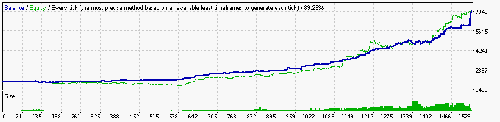

### Report: EURUSD 2000USD 2011year 10spread M30 DS test

    Symbol                             EURUSD (Euro vs US Dollar)
    Period                             30 Minutes (M30) 2011.01.05 03:00 - 2011.12.30 21:30 (2011.01.01 - 2011.12.31)
    Model                              Every tick (the most precise method based on all available least timeframes)
    Parameters                         0.21; Alligator1_SignalMethod=21; Alligator5_SignalMethod=18; Alligator15_SignalMethod=12;
    Bars in test                 11960 Ticks modelled                        3438420 Modelling quality                                              89.25%
    Mismatched charts errors         0
    Initial deposit            2000.00                                               Spread                                                             10
    Total net profit         115425.85 Gross profit                        209749.30 Gross loss                                                  -94323.45
    Profit factor                 2.22 Expected payoff                         17.17
    Absolute drawdown            11.72 Maximal drawdown             7020.60 (11.21%) Relative drawdown                                    11.21% (7020.60)
    Total trades                  6724 Short positions (won %)         2968 (40.57%) Long positions (won %)                                  3756 (39.48%)
