### Report: Strategy Alligator Alligator15_EURUSD_2000USD_10spread_5digits_2012 DS test

    Symbol                           EURUSD (Euro vs US Dollar)
    Period                           15 Minutes (M15) 2012.01.02 23:00 - 2012.12.28 21:45 (2012.01.01 - 2012.12.30)
    Model                            Every tick (the most precise method based on all available least timeframes)
    Parameters                       Alligator30_SignalMethod=63; __Bands_Parameters__="-- Settings for the Bollinger Bands indicator --";
    Bars in test               24957 Ticks modelled                          6384541 Modelling quality                                              89.64%
    Mismatched charts errors       0
    Initial deposit          2000.00                                                 Spread                                                             10
    Total net profit           -1.08 Gross profit                               5.12 Gross loss                                                      -6.20
    Profit factor               0.83 Expected payoff                           -0.07
    Absolute drawdown           1.94 Maximal drawdown                   5.58 (0.28%) Relative drawdown                                        0.28% (5.58)
    Total trades                  15 Short positions (won %)             12 (58.33%) Long positions (won %)                                     3 (66.67%)

### Report: Strategy Alligator Alligator1_EURUSD_2000USD_10spread_5digits_2012 DS test

    Symbol                           EURUSD (Euro vs US Dollar)
    Period                           1 Minute (M1) 2012.01.01 23:40 - 2012.12.28 21:59 (2012.01.01 - 2012.12.30)
    Model                            Every tick (the most precise method based on all available least timeframes)
    Parameters                       Alligator30_SignalMethod=63; __Bands_Parameters__="-- Settings for the Bollinger Bands indicator --";
    Bars in test              374216 Ticks modelled                         86251867 Modelling quality                                              24.99%
    Mismatched charts errors       0
    Initial deposit          2000.00                                                 Spread                                                             10
    Total net profit           -0.77 Gross profit                               1.60 Gross loss                                                      -2.37
    Profit factor               0.68 Expected payoff                           -0.06
    Absolute drawdown           0.77 Maximal drawdown                   2.51 (0.13%) Relative drawdown                                        0.13% (2.51)
    Total trades                  14 Short positions (won %)              5 (60.00%) Long positions (won %)                                     9 (33.33%)

### Report: Strategy Alligator Alligator30_EURUSD_2000USD_10spread_5digits_2012 DS test

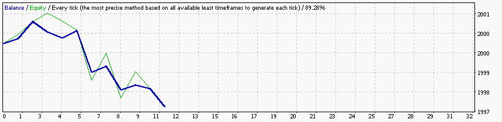

    Symbol                           EURUSD (Euro vs US Dollar)
    Period                           30 Minutes (M30) 2012.01.04 00:00 - 2012.12.28 21:30 (2012.01.01 - 2012.12.30)
    Model                            Every tick (the most precise method based on all available least timeframes)
    Parameters                       Alligator30_SignalMethod=63; __Bands_Parameters__="-- Settings for the Bollinger Bands indicator --";
    Bars in test               12479 Ticks modelled                          3389220 Modelling quality                                              89.28%
    Mismatched charts errors       0
    Initial deposit          2000.00                                                 Spread                                                             10
    Total net profit           -2.41 Gross profit                               1.50 Gross loss                                                      -3.91
    Profit factor               0.38 Expected payoff                           -0.22
    Absolute drawdown           2.41 Maximal drawdown                   4.74 (0.24%) Relative drawdown                                        0.24% (4.74)
    Total trades                  11 Short positions (won %)              7 (57.14%) Long positions (won %)                                     4 (25.00%)

### Report: Strategy Alligator Alligator5_EURUSD_2000USD_10spread_5digits_2012 DS test

    Symbol                           EURUSD (Euro vs US Dollar)
    Period                           5 Minutes (M5) 2012.01.02 06:20 - 2012.12.28 21:55 (2012.01.01 - 2012.12.30)
    Model                            Every tick (the most precise method based on all available least timeframes)
    Parameters                       Alligator30_SignalMethod=63; __Bands_Parameters__="-- Settings for the Bollinger Bands indicator --";
    Bars in test               74862 Ticks modelled                         17976238 Modelling quality                                              89.88%
    Mismatched charts errors       0
    Initial deposit          2000.00                                                 Spread                                                             10
    Total net profit           -3.14 Gross profit                               3.45 Gross loss                                                      -6.59
    Profit factor               0.52 Expected payoff                           -0.26
    Absolute drawdown           5.49 Maximal drawdown                   5.49 (0.27%) Relative drawdown                                        0.27% (5.49)
    Total trades                  12 Short positions (won %)               3 (0.00%) Long positions (won %)                                     9 (33.33%)

### Report: Strategy Alligator Alligator_EURUSD_2000USD_10spread_5digits_2012 DS test

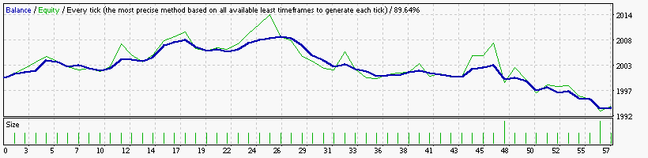

### Report: Strategy Bands Bands15_EURUSD_2000USD_10spread_5digits_2012 DS test

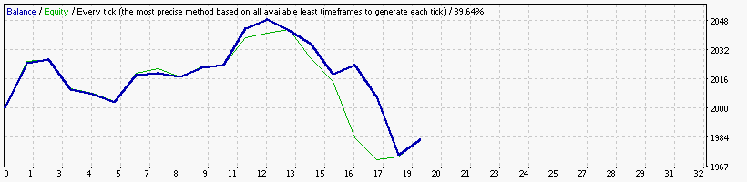

### Report: Strategy Bands Bands1_EURUSD_2000USD_10spread_5digits_2012 DS test

### Report: Strategy Bands Bands30_EURUSD_2000USD_10spread_5digits_2012 DS test

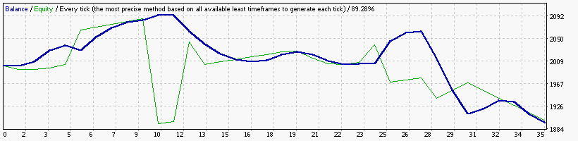

### Report: Strategy Bands Bands5_EURUSD_2000USD_10spread_5digits_2012 DS test

    Symbol                           EURUSD (Euro vs US Dollar)
    Period                           5 Minutes (M5) 2012.01.02 06:20 - 2012.12.28 21:55 (2012.01.01 - 2012.12.30)
    Model                            Every tick (the most precise method based on all available least timeframes)
    Parameters                       Alligator30_SignalMethod=63; __Bands_Parameters__="-- Settings for the Bollinger Bands indicator --";
    Bars in test               74862 Ticks modelled                         17976238 Modelling quality                                              89.88%
    Mismatched charts errors       0
    Initial deposit          2000.00                                                 Spread                                                             10
    Total net profit            0.00 Gross profit                               0.00 Gross loss                                                      -0.00
    Profit factor                    Expected payoff                            0.00
    Absolute drawdown           0.00 Maximal drawdown                   0.00 (0.00%) Relative drawdown                                        0.00% (0.00)
    Total trades                   0 Short positions (won %)               0 (0.00%) Long positions (won %)                                      0 (0.00%)

### Report: Strategy Bands Bands_EURUSD_2000USD_10spread_5digits_2012 DS test

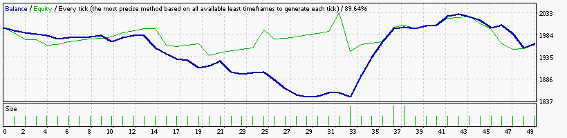

### Report: Strategy DeMarker DeMarker15_EURUSD_2000USD_10spread_5digits_2012 DS test

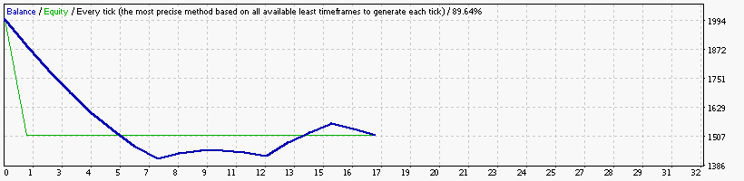

### Report: Strategy DeMarker DeMarker30_EURUSD_2000USD_10spread_5digits_2012 DS test

### Report: Strategy DeMarker DeMarker5_EURUSD_2000USD_10spread_5digits_2012 DS test

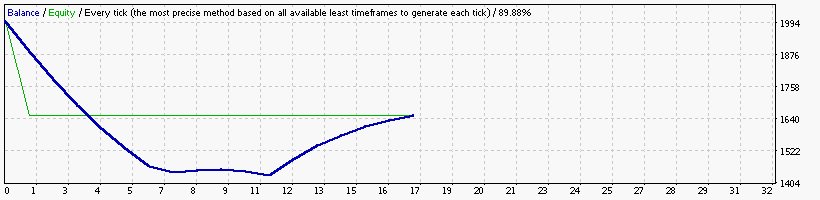

### Report: Strategy DeMarker DeMarker_EURUSD_2000USD_10spread_5digits_2012 DS test

### Report: Strategy Envelopes Envelopes15_EURUSD_2000USD_10spread_5digits_2012 DS test

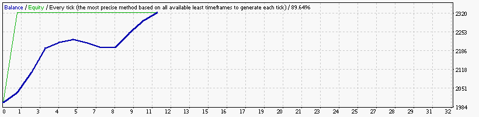

### Report: Strategy Envelopes Envelopes30_EURUSD_2000USD_10spread_5digits_2012 DS test

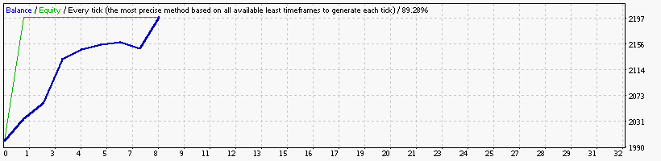

### Report: Strategy Envelopes Envelopes5_EURUSD_2000USD_10spread_5digits_2012 DS test

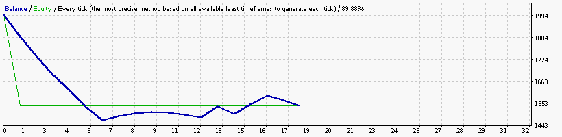

### Report: Strategy Envelopes Envelopes_EURUSD_2000USD_10spread_5digits_2012 DS test

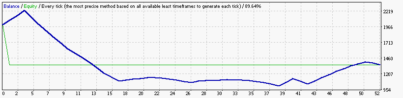

### Report: Strategy Fractals Fractals15_EURUSD_2000USD_10spread_5digits_2012 DS test

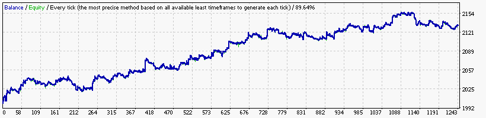

### Report: Strategy Fractals Fractals1_EURUSD_2000USD_10spread_5digits_2012 DS test

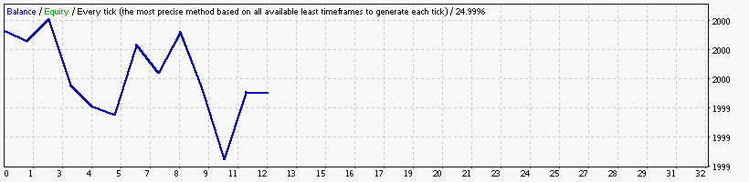

    Symbol                           EURUSD (Euro vs US Dollar)
    Period                           1 Minute (M1) 2012.01.01 23:40 - 2012.12.28 21:59 (2012.01.01 - 2012.12.30)
    Model                            Every tick (the most precise method based on all available least timeframes)
    Parameters                       Alligator30_SignalMethod=63; __Bands_Parameters__="-- Settings for the Bollinger Bands indicator --";
    Bars in test              374216 Ticks modelled                         86251867 Modelling quality                                              24.99%
    Mismatched charts errors       0
    Initial deposit          2000.00                                                 Spread                                                             10
    Total net profit           -0.62 Gross profit                               2.00 Gross loss                                                      -2.62
    Profit factor               0.76 Expected payoff                           -0.05
    Absolute drawdown           1.50 Maximal drawdown                   2.01 (0.10%) Relative drawdown                                        0.10% (2.01)
    Total trades                  12 Short positions (won %)              3 (66.67%) Long positions (won %)                                     9 (22.22%)

### Report: Strategy Fractals Fractals30_EURUSD_2000USD_10spread_5digits_2012 DS test

### Report: Strategy Fractals Fractals5_EURUSD_2000USD_10spread_5digits_2012 DS test

    Symbol                           EURUSD (Euro vs US Dollar)
    Period                           5 Minutes (M5) 2012.01.02 06:20 - 2012.12.28 21:55 (2012.01.01 - 2012.12.30)
    Model                            Every tick (the most precise method based on all available least timeframes)
    Parameters                       Alligator30_SignalMethod=63; __Bands_Parameters__="-- Settings for the Bollinger Bands indicator --";
    Bars in test               74862 Ticks modelled                         17976238 Modelling quality                                              89.88%
    Mismatched charts errors       0
    Initial deposit          2000.00                                                 Spread                                                             10
    Total net profit           -1.47 Gross profit                               5.11 Gross loss                                                      -6.58
    Profit factor               0.78 Expected payoff                           -0.11
    Absolute drawdown           2.73 Maximal drawdown                   5.58 (0.28%) Relative drawdown                                        0.28% (5.58)
    Total trades                  13 Short positions (won %)               6 (0.00%) Long positions (won %)                                     7 (57.14%)

### Report: Strategy Fractals Fractals_EURUSD_2000USD_10spread_5digits_2012 DS test

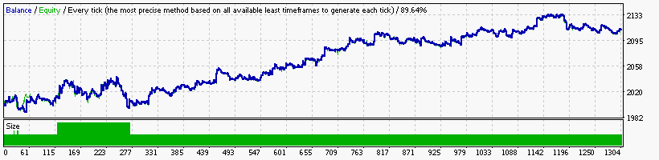

### Report: Strategy MA MA15_EURUSD_2000USD_10spread_5digits_2012 DS test

### Report: Strategy MA MA1_EURUSD_2000USD_10spread_5digits_2012 DS test

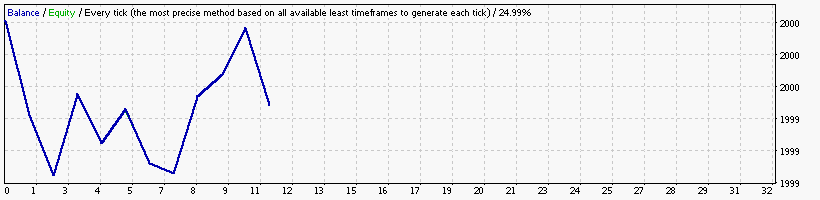

    Symbol                           EURUSD (Euro vs US Dollar)
    Period                           1 Minute (M1) 2012.01.01 23:40 - 2012.12.28 21:59 (2012.01.01 - 2012.12.30)
    Model                            Every tick (the most precise method based on all available least timeframes)
    Parameters                       Alligator30_SignalMethod=63; __Bands_Parameters__="-- Settings for the Bollinger Bands indicator --";
    Bars in test              374216 Ticks modelled                         86251867 Modelling quality                                              24.99%
    Mismatched charts errors       0
    Initial deposit          2000.00                                                 Spread                                                             10
    Total net profit           -0.56 Gross profit                               1.74 Gross loss                                                      -2.30
    Profit factor               0.76 Expected payoff                           -0.05
    Absolute drawdown           2.05 Maximal drawdown                   2.30 (0.11%) Relative drawdown                                        0.11% (2.30)
    Total trades                  11 Short positions (won %)              7 (28.57%) Long positions (won %)                                     4 (75.00%)

### Report: Strategy MA MA30_EURUSD_2000USD_10spread_5digits_2012 DS test

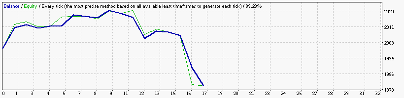

### Report: Strategy MA MA5_EURUSD_2000USD_10spread_5digits_2012 DS test

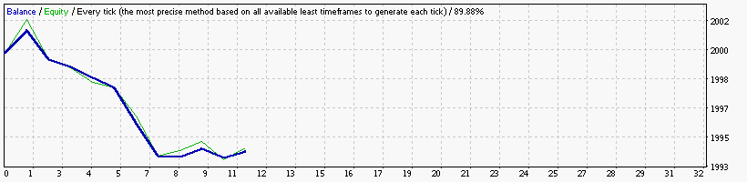

    Symbol                           EURUSD (Euro vs US Dollar)
    Period                           5 Minutes (M5) 2012.01.02 06:20 - 2012.12.28 21:55 (2012.01.01 - 2012.12.30)
    Model                            Every tick (the most precise method based on all available least timeframes)
    Parameters                       Alligator30_SignalMethod=63; __Bands_Parameters__="-- Settings for the Bollinger Bands indicator --";
    Bars in test               74862 Ticks modelled                         17976238 Modelling quality                                              89.88%
    Mismatched charts errors       0
    Initial deposit          2000.00                                                 Spread                                                             10
    Total net profit           -5.78 Gross profit                               2.09 Gross loss                                                      -7.87
    Profit factor               0.27 Expected payoff                           -0.53
    Absolute drawdown           8.23 Maximal drawdown                   9.53 (0.48%) Relative drawdown                                        0.48% (9.53)
    Total trades                  11 Short positions (won %)              9 (22.22%) Long positions (won %)                                     2 (50.00%)

### Report: Strategy MA MA_EURUSD_2000USD_10spread_5digits_2012 DS test

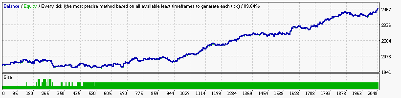

### Report: Strategy MACD MACD15_EURUSD_2000USD_10spread_5digits_2012 DS test

### Report: Strategy MACD MACD1_EURUSD_2000USD_10spread_5digits_2012 DS test

    Symbol                           EURUSD (Euro vs US Dollar)
    Period                           1 Minute (M1) 2012.01.01 23:40 - 2012.12.28 21:59 (2012.01.01 - 2012.12.30)
    Model                            Every tick (the most precise method based on all available least timeframes)
    Parameters                       Alligator30_SignalMethod=63; __Bands_Parameters__="-- Settings for the Bollinger Bands indicator --";
    Bars in test              374216 Ticks modelled                         86251867 Modelling quality                                              24.99%
    Mismatched charts errors       0
    Initial deposit          2000.00                                                 Spread                                                             10
    Total net profit           -2.01 Gross profit                               3.43 Gross loss                                                      -5.44
    Profit factor               0.63 Expected payoff                           -0.17
    Absolute drawdown           4.96 Maximal drawdown                   5.78 (0.29%) Relative drawdown                                        0.29% (5.78)
    Total trades                  12 Short positions (won %)              6 (16.67%) Long positions (won %)                                     6 (50.00%)

### Report: Strategy MACD MACD30_EURUSD_2000USD_10spread_5digits_2012 DS test

### Report: Strategy MACD MACD5_EURUSD_2000USD_10spread_5digits_2012 DS test

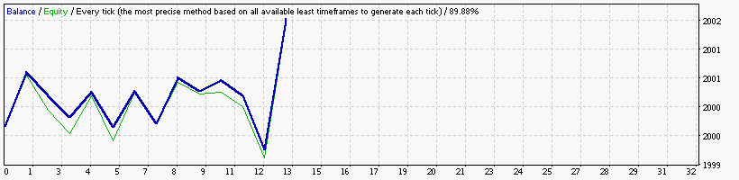

    Symbol                           EURUSD (Euro vs US Dollar)
    Period                           5 Minutes (M5) 2012.01.02 06:20 - 2012.12.28 21:55 (2012.01.01 - 2012.12.30)
    Model                            Every tick (the most precise method based on all available least timeframes)
    Parameters                       Alligator30_SignalMethod=63; __Bands_Parameters__="-- Settings for the Bollinger Bands indicator --";
    Bars in test               74862 Ticks modelled                         17976238 Modelling quality                                              89.88%
    Mismatched charts errors       0
    Initial deposit          2000.00                                                 Spread                                                             10
    Total net profit            1.74 Gross profit                               4.91 Gross loss                                                      -3.17
    Profit factor               1.55 Expected payoff                            0.13
    Absolute drawdown           0.81 Maximal drawdown                   2.27 (0.11%) Relative drawdown                                        0.11% (2.27)
    Total trades                  13 Short positions (won %)              7 (42.86%) Long positions (won %)                                     6 (50.00%)

### Report: Strategy MACD MACD_EURUSD_2000USD_10spread_5digits_2012 DS test

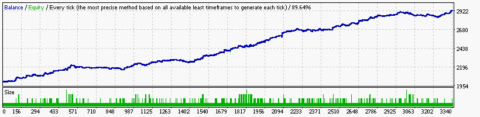

### Report: Strategy RSI RSI15_EURUSD_2000USD_10spread_5digits_2012 DS test

### Report: Strategy RSI RSI1_EURUSD_2000USD_10spread_5digits_2012 DS test

    Symbol                           EURUSD (Euro vs US Dollar)
    Period                           1 Minute (M1) 2012.01.01 23:40 - 2012.12.28 21:59 (2012.01.01 - 2012.12.30)
    Model                            Every tick (the most precise method based on all available least timeframes)
    Parameters                       Alligator30_SignalMethod=63; __Bands_Parameters__="-- Settings for the Bollinger Bands indicator --";
    Bars in test              374216 Ticks modelled                         86251867 Modelling quality                                              24.99%
    Mismatched charts errors       0
    Initial deposit          2000.00                                                 Spread                                                             10
    Total net profit           -2.69 Gross profit                               4.35 Gross loss                                                      -7.04
    Profit factor               0.62 Expected payoff                           -0.13
    Absolute drawdown           3.61 Maximal drawdown                   7.37 (0.37%) Relative drawdown                                        0.37% (7.37)
    Total trades                  21 Short positions (won %)             10 (50.00%) Long positions (won %)                                    11 (45.45%)

### Report: Strategy RSI RSI30_EURUSD_2000USD_10spread_5digits_2012 DS test

    Symbol                           EURUSD (Euro vs US Dollar)
    Period                           30 Minutes (M30) 2012.01.04 00:00 - 2012.12.28 21:30 (2012.01.01 - 2012.12.30)
    Model                            Every tick (the most precise method based on all available least timeframes)
    Parameters                       Alligator30_SignalMethod=63; __Bands_Parameters__="-- Settings for the Bollinger Bands indicator --";
    Bars in test               12479 Ticks modelled                          3389220 Modelling quality                                              89.28%
    Mismatched charts errors       0
    Initial deposit          2000.00                                                 Spread                                                             10
    Total net profit           16.25 Gross profit                              21.52 Gross loss                                                      -5.27
    Profit factor               4.09 Expected payoff                            3.25
    Absolute drawdown           2.33 Maximal drawdown                   7.24 (0.36%) Relative drawdown                                        0.36% (7.24)
    Total trades                   5 Short positions (won %)              3 (66.67%) Long positions (won %)                                     2 (50.00%)

### Report: Strategy RSI RSI5_EURUSD_2000USD_10spread_5digits_2012 DS test

    Symbol                           EURUSD (Euro vs US Dollar)
    Period                           5 Minutes (M5) 2012.01.02 06:20 - 2012.12.28 21:55 (2012.01.01 - 2012.12.30)
    Model                            Every tick (the most precise method based on all available least timeframes)
    Parameters                       Alligator30_SignalMethod=63; __Bands_Parameters__="-- Settings for the Bollinger Bands indicator --";
    Bars in test               74862 Ticks modelled                         17976238 Modelling quality                                              89.88%
    Mismatched charts errors       0
    Initial deposit          2000.00                                                 Spread                                                             10
    Total net profit           -5.03 Gross profit                               0.62 Gross loss                                                      -5.65
    Profit factor               0.11 Expected payoff                           -1.26
    Absolute drawdown           6.18 Maximal drawdown                   7.35 (0.37%) Relative drawdown                                        0.37% (7.35)
    Total trades                   4 Short positions (won %)              3 (33.33%) Long positions (won %)                                      1 (0.00%)

### Report: Strategy RSI RSI_EURUSD_2000USD_10spread_5digits_2012 DS test

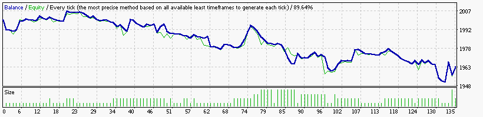

### Report: Strategy SAR SAR15_EURUSD_2000USD_10spread_5digits_2012 DS test

### Report: Strategy SAR SAR1_EURUSD_2000USD_10spread_5digits_2012 DS test

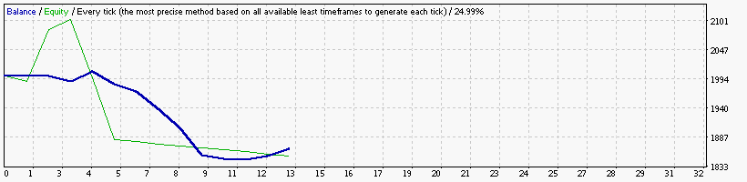

### Report: Strategy SAR SAR30_EURUSD_2000USD_10spread_5digits_2012 DS test

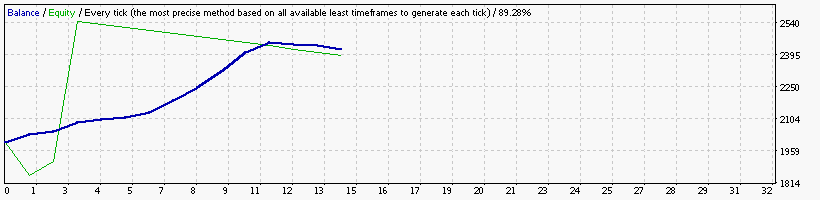

### Report: Strategy SAR SAR5_EURUSD_2000USD_10spread_5digits_2012 DS test

### Report: Strategy SAR SAR_EURUSD_2000USD_10spread_5digits_2012 DS test

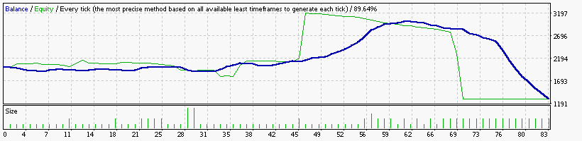

### Report: Strategy WPR WPR15_EURUSD_2000USD_10spread_5digits_2012 DS test

### Report: Strategy WPR WPR1_EURUSD_2000USD_10spread_5digits_2012 DS test

    Symbol                           EURUSD (Euro vs US Dollar)
    Period                           1 Minute (M1) 2012.01.01 23:40 - 2012.12.28 21:59 (2012.01.01 - 2012.12.30)
    Model                            Every tick (the most precise method based on all available least timeframes)
    Parameters                       Alligator30_SignalMethod=63; __Bands_Parameters__="-- Settings for the Bollinger Bands indicator --";
    Bars in test              374216 Ticks modelled                         86251867 Modelling quality                                              24.99%
    Mismatched charts errors       0
    Initial deposit          2000.00                                                 Spread                                                             10
    Total net profit           -1.60 Gross profit                               8.85 Gross loss                                                     -10.45
    Profit factor               0.85 Expected payoff                           -0.08
    Absolute drawdown           2.80 Maximal drawdown                   7.56 (0.38%) Relative drawdown                                        0.38% (7.56)
    Total trades                  21 Short positions (won %)             17 (58.82%) Long positions (won %)                                    4 (100.00%)

### Report: Strategy WPR WPR30_EURUSD_2000USD_10spread_5digits_2012 DS test

### Report: Strategy WPR WPR5_EURUSD_2000USD_10spread_5digits_2012 DS test

### Report: Strategy WPR WPR_EURUSD_2000USD_10spread_5digits_2012 DS test

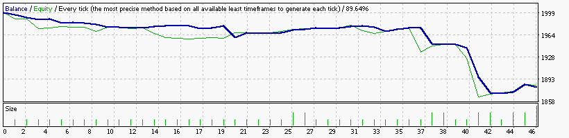

