### Report: Strategy Alligator Alligator15_EURUSD_2000USD_10spread_5digits_2013 DS test

    Symbol                           EURUSD (Euro vs US Dollar)
    Period                           15 Minutes (M15) 2013.01.02 22:45 - 2013.12.29 23:45 (2013.01.01 - 2013.12.30)
    Model                            Every tick (the most precise method based on all available least timeframes)
    Parameters                       Alligator30_SignalMethod=63; __Bands_Parameters__="-- Settings for the Bollinger Bands indicator --";
    Bars in test               24720 Ticks modelled                          6476958 Modelling quality                                              89.64%
    Mismatched charts errors       0
    Initial deposit          2000.00                                                 Spread                                                             10
    Total net profit           -0.54 Gross profit                               4.34 Gross loss                                                      -4.88
    Profit factor               0.89 Expected payoff                           -0.05
    Absolute drawdown           4.70 Maximal drawdown                   4.70 (0.24%) Relative drawdown                                        0.24% (4.70)
    Total trades                  11 Short positions (won %)              4 (75.00%) Long positions (won %)                                     7 (42.86%)

### Report: Strategy Alligator Alligator1_EURUSD_2000USD_10spread_5digits_2013 DS test

    Symbol                           EURUSD (Euro vs US Dollar)
    Period                           1 Minute (M1) 2013.01.01 23:40 - 2013.12.29 23:59 (2013.01.01 - 2013.12.30)
    Model                            Every tick (the most precise method based on all available least timeframes)
    Parameters                       Alligator30_SignalMethod=63; __Bands_Parameters__="-- Settings for the Bollinger Bands indicator --";
    Bars in test              369765 Ticks modelled                         83626545 Modelling quality                                              24.99%
    Mismatched charts errors       0
    Initial deposit          2000.00                                                 Spread                                                             10
    Total net profit           -0.58 Gross profit                               3.32 Gross loss                                                      -3.90
    Profit factor               0.85 Expected payoff                           -0.03
    Absolute drawdown           1.37 Maximal drawdown                   3.46 (0.17%) Relative drawdown                                        0.17% (3.46)
    Total trades                  19 Short positions (won %)              7 (28.57%) Long positions (won %)                                    12 (58.33%)

### Report: Strategy Alligator Alligator30_EURUSD_2000USD_10spread_5digits_2013 DS test

    Symbol                           EURUSD (Euro vs US Dollar)
    Period                           30 Minutes (M30) 2013.01.03 23:30 - 2013.12.29 23:30 (2013.01.01 - 2013.12.30)
    Model                            Every tick (the most precise method based on all available least timeframes)
    Parameters                       Alligator30_SignalMethod=63; __Bands_Parameters__="-- Settings for the Bollinger Bands indicator --";
    Bars in test               12362 Ticks modelled                          3549630 Modelling quality                                              89.27%
    Mismatched charts errors       0
    Initial deposit          2000.00                                                 Spread                                                             10
    Total net profit           -6.89 Gross profit                               0.69 Gross loss                                                      -7.58
    Profit factor               0.09 Expected payoff                           -0.63
    Absolute drawdown           7.47 Maximal drawdown                   7.47 (0.37%) Relative drawdown                                        0.37% (7.47)
    Total trades                  11 Short positions (won %)              7 (14.29%) Long positions (won %)                                     4 (50.00%)

### Report: Strategy Alligator Alligator5_EURUSD_2000USD_10spread_5digits_2013 DS test

    Symbol                           EURUSD (Euro vs US Dollar)
    Period                           5 Minutes (M5) 2013.01.02 06:15 - 2013.12.29 23:55 (2013.01.01 - 2013.12.30)
    Model                            Every tick (the most precise method based on all available least timeframes)
    Parameters                       Alligator30_SignalMethod=63; __Bands_Parameters__="-- Settings for the Bollinger Bands indicator --";
    Bars in test               74139 Ticks modelled                         17662286 Modelling quality                                              89.88%
    Mismatched charts errors       0
    Initial deposit          2000.00                                                 Spread                                                             10
    Total net profit           -0.93 Gross profit                               2.61 Gross loss                                                      -3.54
    Profit factor               0.74 Expected payoff                           -0.08
    Absolute drawdown           1.34 Maximal drawdown                   2.59 (0.13%) Relative drawdown                                        0.13% (2.59)
    Total trades                  11 Short positions (won %)              5 (60.00%) Long positions (won %)                                     6 (33.33%)

### Report: Strategy Alligator Alligator_EURUSD_2000USD_10spread_5digits_2013 DS test

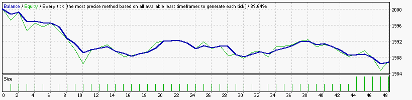

### Report: Strategy Bands Bands15_EURUSD_2000USD_10spread_5digits_2013 DS test

### Report: Strategy Bands Bands1_EURUSD_2000USD_10spread_5digits_2013 DS test

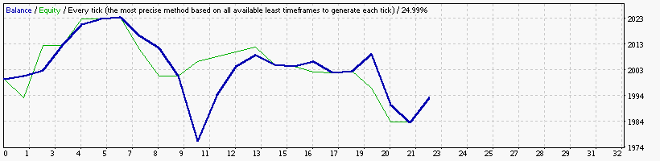

### Report: Strategy Bands Bands30_EURUSD_2000USD_10spread_5digits_2013 DS test

### Report: Strategy Bands Bands5_EURUSD_2000USD_10spread_5digits_2013 DS test

    Symbol                           EURUSD (Euro vs US Dollar)
    Period                           5 Minutes (M5) 2013.01.02 06:15 - 2013.12.29 23:55 (2013.01.01 - 2013.12.30)
    Model                            Every tick (the most precise method based on all available least timeframes)
    Parameters                       Alligator30_SignalMethod=63; __Bands_Parameters__="-- Settings for the Bollinger Bands indicator --";
    Bars in test               74139 Ticks modelled                         17662286 Modelling quality                                              89.88%
    Mismatched charts errors       0
    Initial deposit          2000.00                                                 Spread                                                             10
    Total net profit            0.00 Gross profit                               0.00 Gross loss                                                      -0.00
    Profit factor                    Expected payoff                            0.00
    Absolute drawdown           0.00 Maximal drawdown                   0.00 (0.00%) Relative drawdown                                        0.00% (0.00)
    Total trades                   0 Short positions (won %)               0 (0.00%) Long positions (won %)                                      0 (0.00%)

### Report: Strategy Bands Bands_EURUSD_2000USD_10spread_5digits_2013 DS test

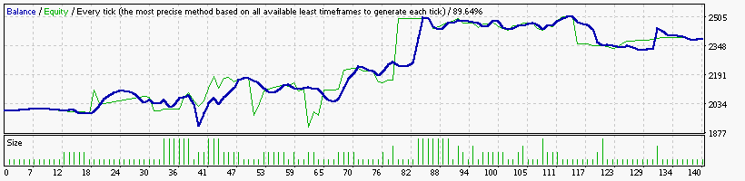

### Report: Strategy DeMarker DeMarker15_EURUSD_2000USD_10spread_5digits_2013 DS test

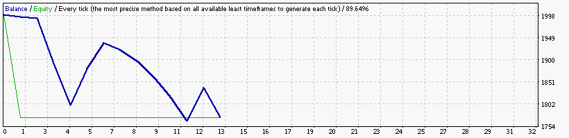

### Report: Strategy DeMarker DeMarker30_EURUSD_2000USD_10spread_5digits_2013 DS test

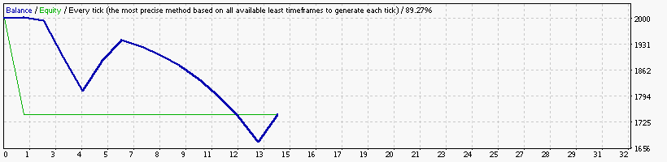

### Report: Strategy DeMarker DeMarker5_EURUSD_2000USD_10spread_5digits_2013 DS test

### Report: Strategy DeMarker DeMarker_EURUSD_2000USD_10spread_5digits_2013 DS test

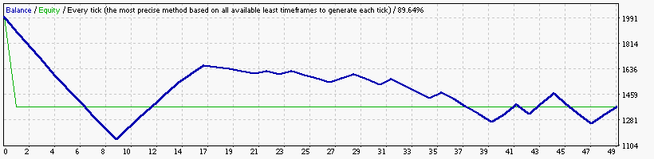

### Report: Strategy Envelopes Envelopes15_EURUSD_2000USD_10spread_5digits_2013 DS test

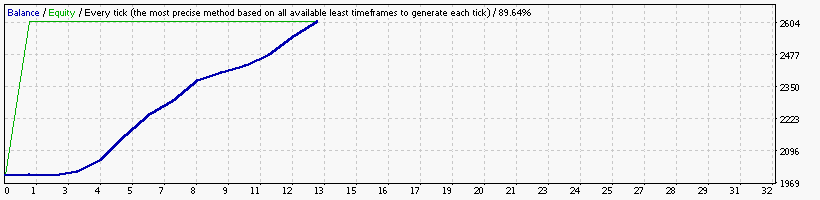

### Report: Strategy Envelopes Envelopes30_EURUSD_2000USD_10spread_5digits_2013 DS test

### Report: Strategy Envelopes Envelopes5_EURUSD_2000USD_10spread_5digits_2013 DS test

### Report: Strategy Envelopes Envelopes_EURUSD_2000USD_10spread_5digits_2013 DS test

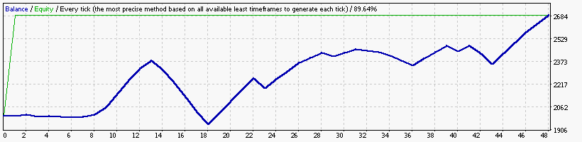

### Report: Strategy Fractals Fractals15_EURUSD_2000USD_10spread_5digits_2013 DS test

### Report: Strategy Fractals Fractals1_EURUSD_2000USD_10spread_5digits_2013 DS test

    Symbol                           EURUSD (Euro vs US Dollar)
    Period                           1 Minute (M1) 2013.01.01 23:40 - 2013.12.29 23:59 (2013.01.01 - 2013.12.30)
    Model                            Every tick (the most precise method based on all available least timeframes)
    Parameters                       Alligator30_SignalMethod=63; __Bands_Parameters__="-- Settings for the Bollinger Bands indicator --";
    Bars in test              369765 Ticks modelled                         83626545 Modelling quality                                              24.99%
    Mismatched charts errors       0
    Initial deposit          2000.00                                                 Spread                                                             10
    Total net profit           -4.01 Gross profit                              11.25 Gross loss                                                     -15.26
    Profit factor               0.74 Expected payoff                           -0.14
    Absolute drawdown           4.47 Maximal drawdown                   9.36 (0.47%) Relative drawdown                                        0.47% (9.36)
    Total trades                  28 Short positions (won %)             12 (25.00%) Long positions (won %)                                    16 (37.50%)

### Report: Strategy Fractals Fractals30_EURUSD_2000USD_10spread_5digits_2013 DS test

    Symbol                           EURUSD (Euro vs US Dollar)
    Period                           30 Minutes (M30) 2013.01.03 23:30 - 2013.12.29 23:30 (2013.01.01 - 2013.12.30)
    Model                            Every tick (the most precise method based on all available least timeframes)
    Parameters                       Alligator30_SignalMethod=63; __Bands_Parameters__="-- Settings for the Bollinger Bands indicator --";
    Bars in test               12362 Ticks modelled                          3549630 Modelling quality                                              89.27%
    Mismatched charts errors       0
    Initial deposit          2000.00                                                 Spread                                                             10
    Total net profit           -3.36 Gross profit                               3.00 Gross loss                                                      -6.36
    Profit factor               0.47 Expected payoff                           -0.31
    Absolute drawdown           3.36 Maximal drawdown                   6.58 (0.33%) Relative drawdown                                        0.33% (6.58)
    Total trades                  11 Short positions (won %)               5 (0.00%) Long positions (won %)                                     6 (50.00%)

### Report: Strategy Fractals Fractals_EURUSD_2000USD_10spread_5digits_2013 DS test

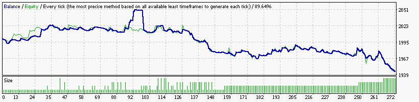

### Report: Strategy MA MA15_EURUSD_2000USD_10spread_5digits_2013 DS test

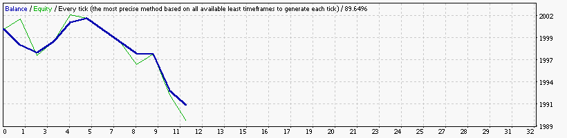

    Symbol                           EURUSD (Euro vs US Dollar)
    Period                           15 Minutes (M15) 2013.01.02 22:45 - 2013.12.29 23:45 (2013.01.01 - 2013.12.30)
    Model                            Every tick (the most precise method based on all available least timeframes)
    Parameters                       Alligator30_SignalMethod=63; __Bands_Parameters__="-- Settings for the Bollinger Bands indicator --";
    Bars in test               24720 Ticks modelled                          6476958 Modelling quality                                              89.64%
    Mismatched charts errors       0
    Initial deposit          2000.00                                                 Spread                                                             10
    Total net profit           -8.62 Gross profit                               3.90 Gross loss                                                     -12.52
    Profit factor               0.31 Expected payoff                           -0.78
    Absolute drawdown           8.66 Maximal drawdown                   9.93 (0.50%) Relative drawdown                                        0.50% (9.93)
    Total trades                  11 Short positions (won %)              8 (37.50%) Long positions (won %)                                      3 (0.00%)

### Report: Strategy MA MA1_EURUSD_2000USD_10spread_5digits_2013 DS test

    Symbol                           EURUSD (Euro vs US Dollar)
    Period                           1 Minute (M1) 2013.01.01 23:40 - 2013.12.29 23:59 (2013.01.01 - 2013.12.30)
    Model                            Every tick (the most precise method based on all available least timeframes)
    Parameters                       Alligator30_SignalMethod=63; __Bands_Parameters__="-- Settings for the Bollinger Bands indicator --";
    Bars in test              369765 Ticks modelled                         83626545 Modelling quality                                              24.99%
    Mismatched charts errors       0
    Initial deposit          2000.00                                                 Spread                                                             10
    Total net profit           -2.54 Gross profit                               2.01 Gross loss                                                      -4.55
    Profit factor               0.44 Expected payoff                           -0.21
    Absolute drawdown           3.52 Maximal drawdown                   3.52 (0.18%) Relative drawdown                                        0.18% (3.52)
    Total trades                  12 Short positions (won %)              6 (33.33%) Long positions (won %)                                     6 (33.33%)

### Report: Strategy MA MA30_EURUSD_2000USD_10spread_5digits_2013 DS test

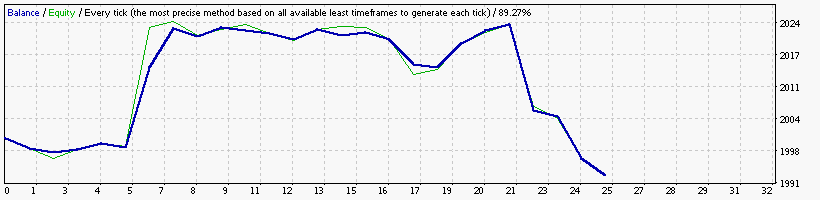

### Report: Strategy MA MA5_EURUSD_2000USD_10spread_5digits_2013 DS test

    Symbol                           EURUSD (Euro vs US Dollar)
    Period                           5 Minutes (M5) 2013.01.02 06:15 - 2013.12.29 23:55 (2013.01.01 - 2013.12.30)
    Model                            Every tick (the most precise method based on all available least timeframes)
    Parameters                       Alligator30_SignalMethod=63; __Bands_Parameters__="-- Settings for the Bollinger Bands indicator --";
    Bars in test               74139 Ticks modelled                         17662286 Modelling quality                                              89.88%
    Mismatched charts errors       0
    Initial deposit          2000.00                                                 Spread                                                             10
    Total net profit           -2.94 Gross profit                               2.33 Gross loss                                                      -5.27
    Profit factor               0.44 Expected payoff                           -0.27
    Absolute drawdown           6.31 Maximal drawdown                   8.71 (0.43%) Relative drawdown                                        0.43% (8.71)
    Total trades                  11 Short positions (won %)              4 (50.00%) Long positions (won %)                                     7 (42.86%)

### Report: Strategy MA MA_EURUSD_2000USD_10spread_5digits_2013 DS test

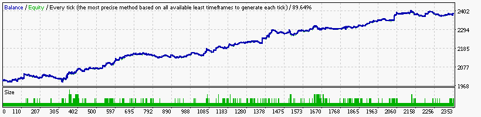

### Report: Strategy MACD MACD15_EURUSD_2000USD_10spread_5digits_2013 DS test

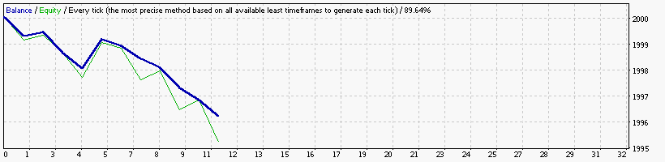

    Symbol                           EURUSD (Euro vs US Dollar)
    Period                           15 Minutes (M15) 2013.01.02 22:45 - 2013.12.29 23:45 (2013.01.01 - 2013.12.30)
    Model                            Every tick (the most precise method based on all available least timeframes)
    Parameters                       Alligator30_SignalMethod=63; __Bands_Parameters__="-- Settings for the Bollinger Bands indicator --";
    Bars in test               24720 Ticks modelled                          6476958 Modelling quality                                              89.64%
    Mismatched charts errors       0
    Initial deposit          2000.00                                                 Spread                                                             10
    Total net profit           -3.99 Gross profit                               1.35 Gross loss                                                      -5.34
    Profit factor               0.25 Expected payoff                           -0.36
    Absolute drawdown           3.99 Maximal drawdown                   3.99 (0.20%) Relative drawdown                                        0.20% (3.99)
    Total trades                  11 Short positions (won %)               0 (0.00%) Long positions (won %)                                    11 (18.18%)

### Report: Strategy MACD MACD1_EURUSD_2000USD_10spread_5digits_2013 DS test

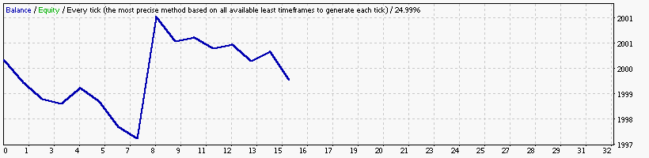

    Symbol                           EURUSD (Euro vs US Dollar)
    Period                           1 Minute (M1) 2013.01.01 23:40 - 2013.12.29 23:59 (2013.01.01 - 2013.12.30)
    Model                            Every tick (the most precise method based on all available least timeframes)
    Parameters                       Alligator30_SignalMethod=63; __Bands_Parameters__="-- Settings for the Bollinger Bands indicator --";
    Bars in test              369765 Ticks modelled                         83626545 Modelling quality                                              24.99%
    Mismatched charts errors       0
    Initial deposit          2000.00                                                 Spread                                                             10
    Total net profit           -0.66 Gross profit                               5.27 Gross loss                                                      -5.93
    Profit factor               0.89 Expected payoff                           -0.04
    Absolute drawdown           3.39 Maximal drawdown                   3.55 (0.18%) Relative drawdown                                        0.18% (3.55)
    Total trades                  15 Short positions (won %)              6 (33.33%) Long positions (won %)                                     9 (33.33%)

### Report: Strategy MACD MACD30_EURUSD_2000USD_10spread_5digits_2013 DS test

### Report: Strategy MACD MACD5_EURUSD_2000USD_10spread_5digits_2013 DS test

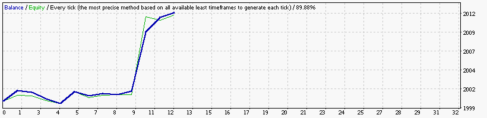

    Symbol                           EURUSD (Euro vs US Dollar)
    Period                           5 Minutes (M5) 2013.01.02 06:15 - 2013.12.29 23:55 (2013.01.01 - 2013.12.30)
    Model                            Every tick (the most precise method based on all available least timeframes)
    Parameters                       Alligator30_SignalMethod=63; __Bands_Parameters__="-- Settings for the Bollinger Bands indicator --";
    Bars in test               74139 Ticks modelled                         17662286 Modelling quality                                              89.88%
    Mismatched charts errors       0
    Initial deposit          2000.00                                                 Spread                                                             10
    Total net profit           12.04 Gross profit                              14.54 Gross loss                                                      -2.50
    Profit factor               5.82 Expected payoff                            1.00
    Absolute drawdown           0.59 Maximal drawdown                   2.75 (0.14%) Relative drawdown                                        0.14% (2.75)
    Total trades                  12 Short positions (won %)              7 (71.43%) Long positions (won %)                                     5 (40.00%)

### Report: Strategy MACD MACD_EURUSD_2000USD_10spread_5digits_2013 DS test

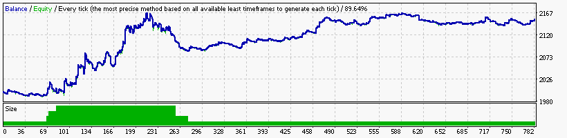

### Report: Strategy RSI RSI15_EURUSD_2000USD_10spread_5digits_2013 DS test

### Report: Strategy RSI RSI1_EURUSD_2000USD_10spread_5digits_2013 DS test

### Report: Strategy RSI RSI30_EURUSD_2000USD_10spread_5digits_2013 DS test

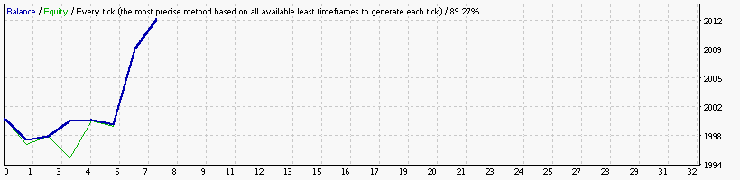

    Symbol                           EURUSD (Euro vs US Dollar)
    Period                           30 Minutes (M30) 2013.01.03 23:30 - 2013.12.29 23:30 (2013.01.01 - 2013.12.30)
    Model                            Every tick (the most precise method based on all available least timeframes)
    Parameters                       Alligator30_SignalMethod=63; __Bands_Parameters__="-- Settings for the Bollinger Bands indicator --";
    Bars in test               12362 Ticks modelled                          3549630 Modelling quality                                              89.27%
    Mismatched charts errors       0
    Initial deposit          2000.00                                                 Spread                                                             10
    Total net profit           12.50 Gross profit                              15.72 Gross loss                                                      -3.23
    Profit factor               4.87 Expected payoff                            1.79
    Absolute drawdown           5.09 Maximal drawdown                   6.45 (0.32%) Relative drawdown                                        0.32% (6.45)
    Total trades                   7 Short positions (won %)              2 (50.00%) Long positions (won %)                                     5 (80.00%)

### Report: Strategy RSI RSI5_EURUSD_2000USD_10spread_5digits_2013 DS test

### Report: Strategy RSI RSI_EURUSD_2000USD_10spread_5digits_2013 DS test

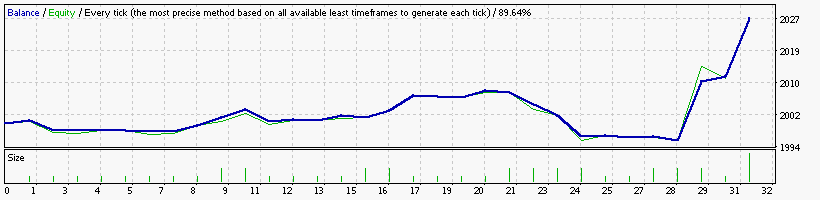

### Report: Strategy SAR SAR15_EURUSD_2000USD_10spread_5digits_2013 DS test

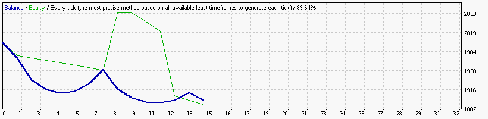

### Report: Strategy SAR SAR1_EURUSD_2000USD_10spread_5digits_2013 DS test

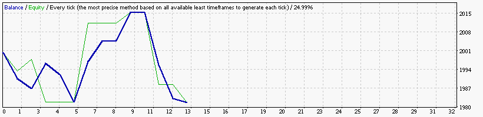

### Report: Strategy SAR SAR30_EURUSD_2000USD_10spread_5digits_2013 DS test

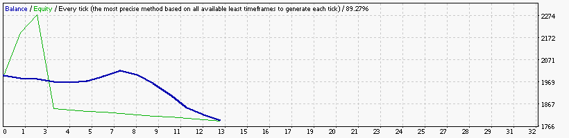

### Report: Strategy SAR SAR5_EURUSD_2000USD_10spread_5digits_2013 DS test

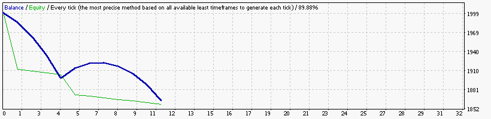

### Report: Strategy SAR SAR_EURUSD_2000USD_10spread_5digits_2013 DS test

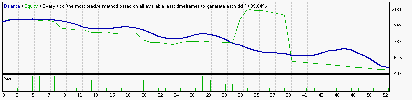

### Report: Strategy WPR WPR15_EURUSD_2000USD_10spread_5digits_2013 DS test

### Report: Strategy WPR WPR1_EURUSD_2000USD_10spread_5digits_2013 DS test

### Report: Strategy WPR WPR30_EURUSD_2000USD_10spread_5digits_2013 DS test

### Report: Strategy WPR WPR5_EURUSD_2000USD_10spread_5digits_2013 DS test

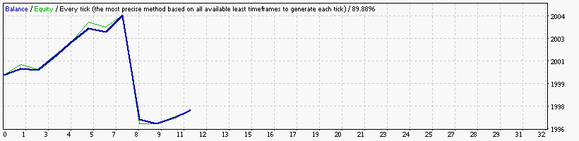

### Report: Strategy WPR WPR_EURUSD_2000USD_10spread_5digits_2013 DS test

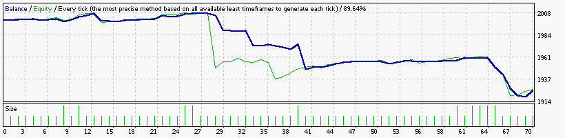

