### Report: All Account_Conditions_Active  EURUSD 2000USD 2014 2015year 10spread DS test

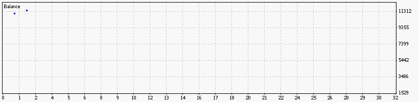

### Report: All Action_On_Condition_01  EURUSD 2000USD 2014 2015year 10spread DS test

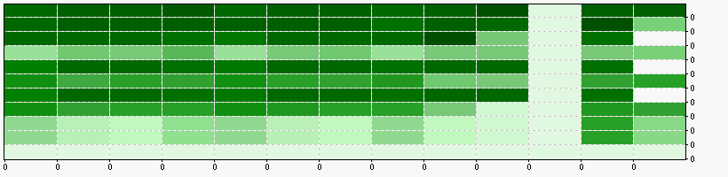

### Report: All Action_On_Condition_02  EURUSD 2000USD 2014 2015year 10spread DS test

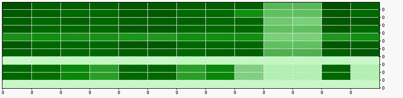

### Report: All Action_On_Condition_05  EURUSD 2000USD 2014 2015year 10spread DS test

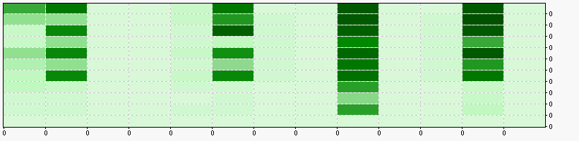

### Report: All BestDailyStrategyMultiplierFactor  EURUSD 2000USD 2014 2015year 10spread DS test

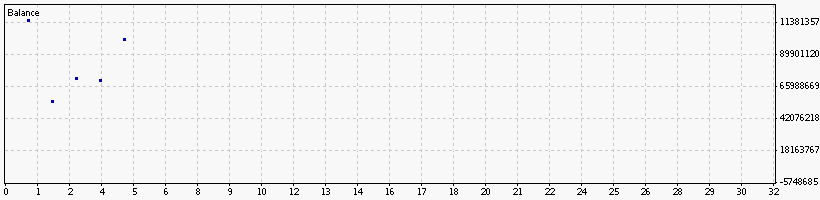

### Report: All BestMonthlyStrategyMultiplierFactor  EURUSD 2000USD 2014 2015year 10spread DS test

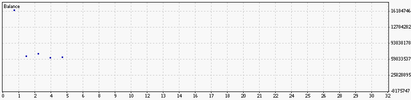

### Report: All BestWeeklyStrategyMultiplierFactor  EURUSD 2000USD 2014 2015year 10spread DS test

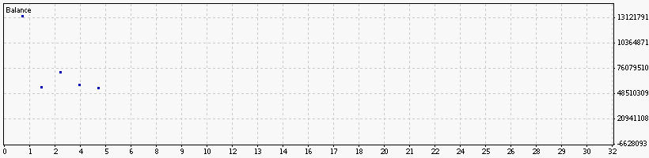

### Report: All BoostTrendFactor  EURUSD 2000USD 2014 2015year 10spread DS test

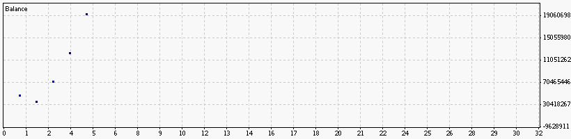

### Report: All Boosting_Enabled  EURUSD 2000USD 2014 2015year 10spread DS test

### Report: All CloseOrderAfterXHours  EURUSD 2000USD 2014 2015year 10spread DS test

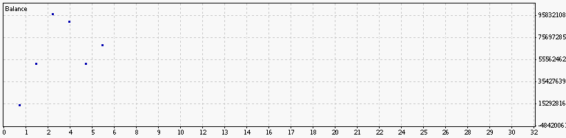

### Report: All MarketBigDropSize  EURUSD 2000USD 2014 2015year 10spread DS test

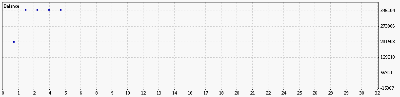

### Report: All MarketSpecificHour  EURUSD 2000USD 2014 2015year 10spread DS test

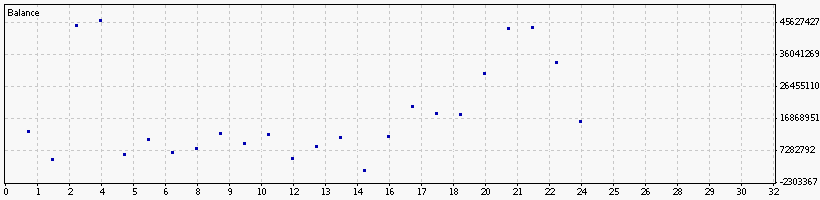

### Report: All MaxOrders  EURUSD 2000USD 2014 2015year 10spread DS test

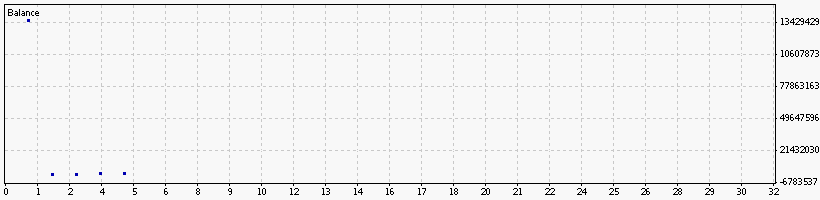

### Report: All MaxOrdersPerType  EURUSD 2000USD 2014 2015year 10spread DS test

### Report: All MinPipChangeToTrade  EURUSD 2000USD 2014 2015year 10spread DS test

### Report: All MinPipGap  EURUSD 2000USD 2014 2015year 10spread DS test

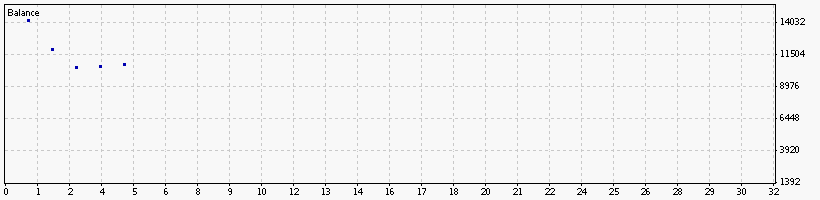

### Report: All ProfitFactorMinToTrade  EURUSD 2000USD 2014 2015year 10spread DS test

### Report: All RiskMargin  EURUSD 2000USD 2014 2015year 10spread DS test

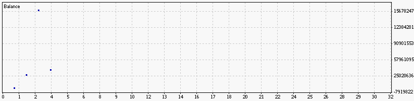

### Report: All RiskRatio  EURUSD 2000USD 2014 2015year 10spread DS test

### Report: All TradeWithTrend  EURUSD 2000USD 2014 2015year 10spread DS test

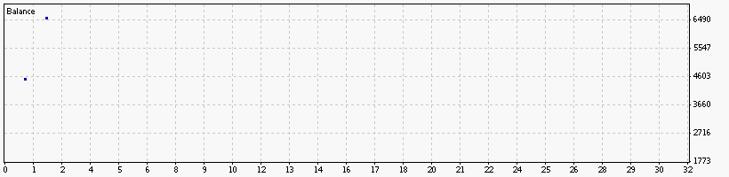

### Report: All TrailingProfitOneWay  EURUSD 2000USD 2014 2015year 10spread DS test

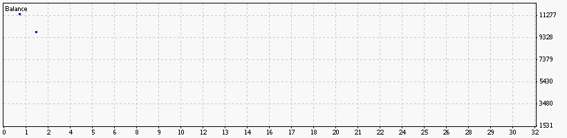

### Report: All TrailingStopAddPerMinute  EURUSD 2000USD 2014 2015year 10spread DS test

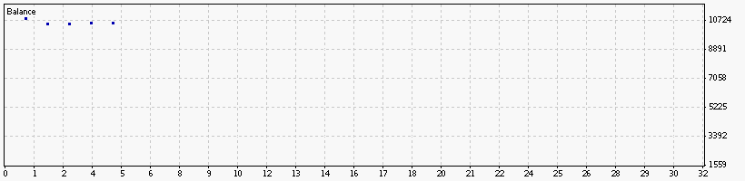

### Report: All TrailingStopOneWay  EURUSD 2000USD 2014 2015year 10spread DS test

### Report: All WorseDailyStrategyDividerFactor  EURUSD 2000USD 2014 2015year 10spread DS test

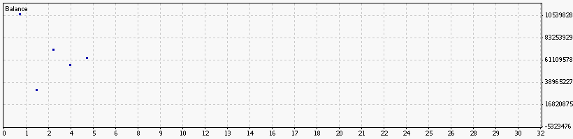

### Report: All WorseMonthlyStrategyDividerFactor  EURUSD 2000USD 2014 2015year 10spread DS test

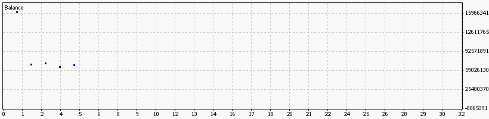

### Report: All WorseWeeklyStrategyDividerFactor  EURUSD 2000USD 2014 2015year 10spread DS test

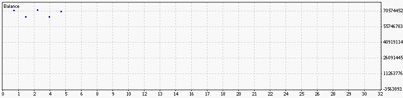

### Report: Strategy Alligator All Alligator_Applied_Price  EURUSD 2000USD 2014 2015year 10spread DS test

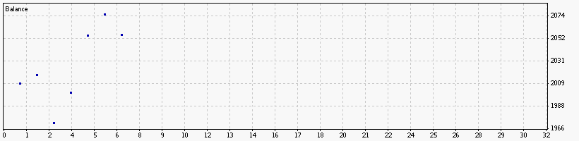

### Report: Strategy Alligator All Alligator_MA_Method  EURUSD 2000USD 2014 2015year 10spread DS test

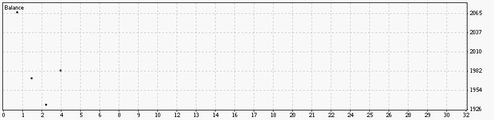

### Report: Strategy Alligator All Alligator_Period_Ratio  EURUSD 2000USD 2014 2015year 10spread DS test

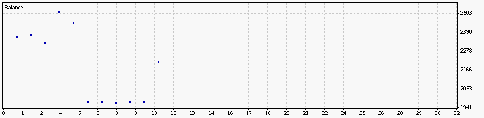

### Report: Strategy Alligator All Alligator_Periods  EURUSD 2000USD 2014 2015year 10spread DS test

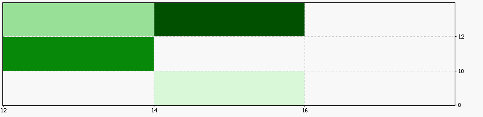

### Report: Strategy Alligator All Alligator_SignalLevel  EURUSD 2000USD 2014 2015year 10spread DS test

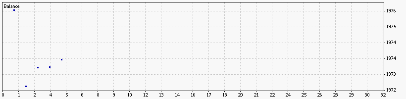

### Report: Strategy Alligator All Alligator_TrailingProfitMethod  EURUSD 2000USD 2014 2015year 10spread DS test

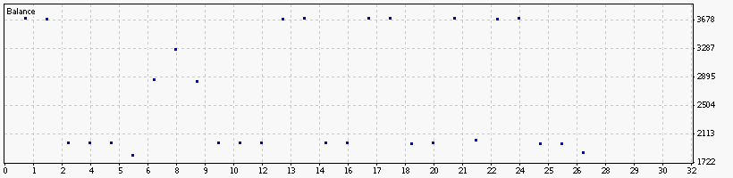

### Report: Strategy Alligator All Alligator_TrailingStopMethod  EURUSD 2000USD 2014 2015year 10spread DS test

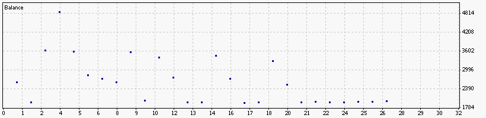

### Report: Strategy Alligator Alligator15_SignalMethod  EURUSD 2000USD 2014 2015year 10spread DS test

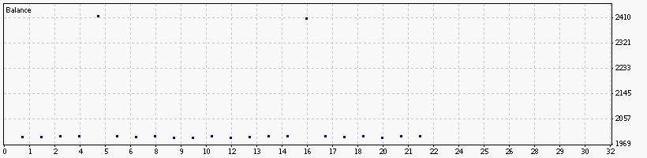

### Report: Strategy Alligator Alligator30_Active  EURUSD 2000USD 2014 2015year 10spread DS test

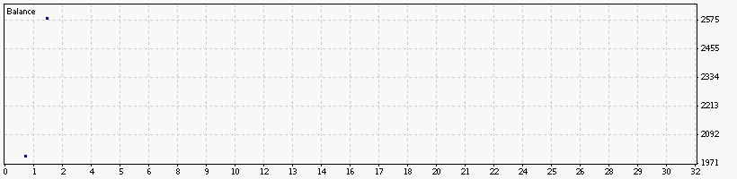

### Report: Strategy Alligator Alligator30_SignalMethod  EURUSD 2000USD 2014 2015year 10spread DS test

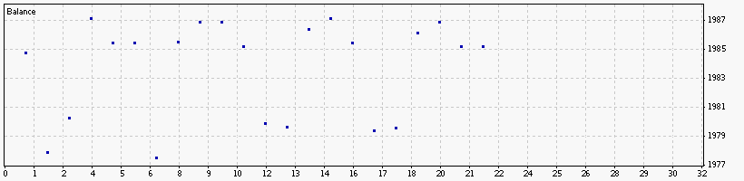

### Report: Strategy Alligator Alligator5_Active  EURUSD 2000USD 2014 2015year 10spread DS test

### Report: Strategy Bands All Bands_Applied_Price  EURUSD 2000USD 2014 2015year 10spread DS test

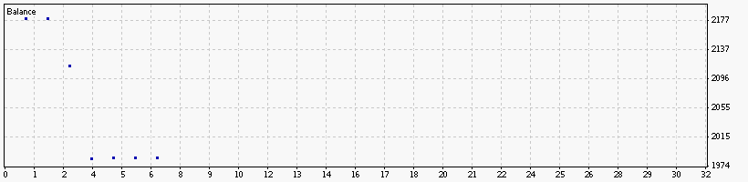

### Report: Strategy Bands All Bands_Deviation  EURUSD 2000USD 2014 2015year 10spread DS test

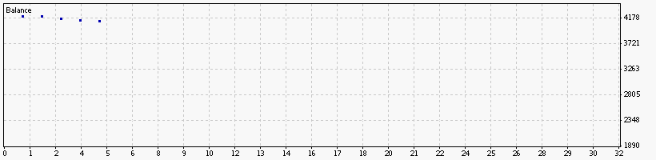

### Report: Strategy Bands All Bands_Deviation_Ratio  EURUSD 2000USD 2014 2015year 10spread DS test

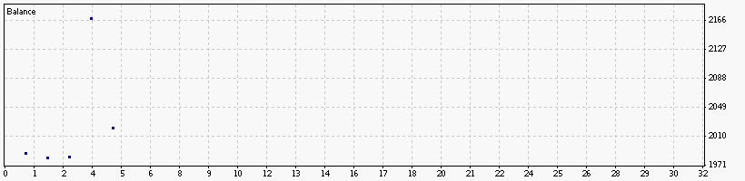

### Report: Strategy Bands All Bands_Period  EURUSD 2000USD 2014 2015year 10spread DS test

### Report: Strategy Bands All Bands_Period_Ratio  EURUSD 2000USD 2014 2015year 10spread DS test

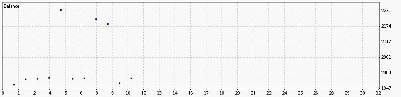

### Report: Strategy Bands All Bands_TrailingProfitMethod  EURUSD 2000USD 2014 2015year 10spread DS test

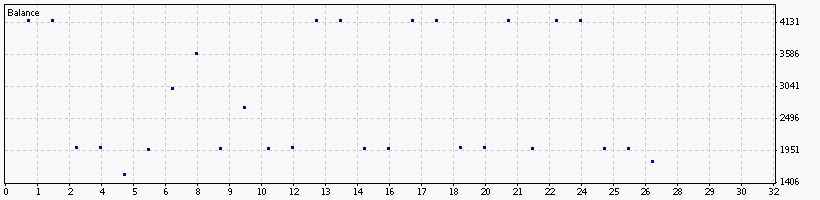

### Report: Strategy Bands All Bands_TrailingStopMethod  EURUSD 2000USD 2014 2015year 10spread DS test

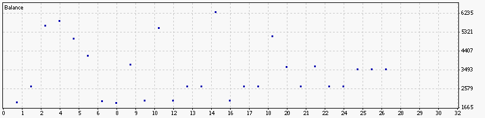

### Report: Strategy DeMarker All DeMarker_Period  EURUSD 2000USD 2014 2015year 10spread DS test

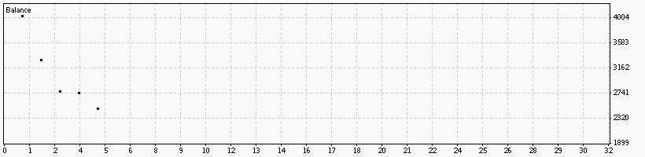

### Report: Strategy DeMarker All DeMarker_Period_Ratio  EURUSD 2000USD 2014 2015year 10spread DS test

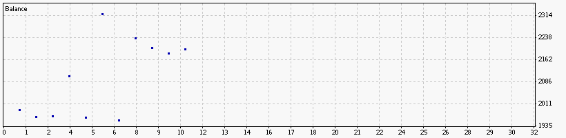

### Report: Strategy DeMarker All DeMarker_SignalLevel  EURUSD 2000USD 2014 2015year 10spread DS test

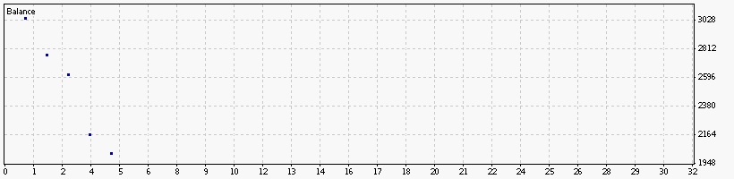

### Report: Strategy DeMarker All DeMarker_TrailingProfitMethod  EURUSD 2000USD 2014 2015year 10spread DS test

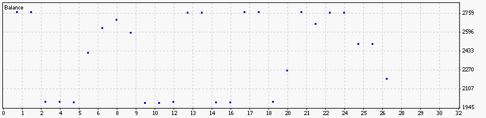

### Report: Strategy DeMarker All DeMarker_TrailingStopMethod  EURUSD 2000USD 2014 2015year 10spread DS test

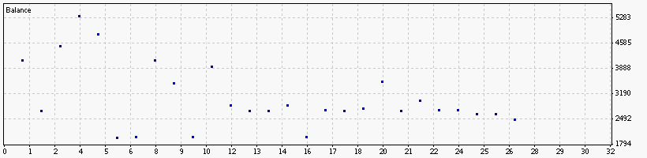

### Report: Strategy DeMarker DeMarker15_SignalMethod  EURUSD 2000USD 2014 2015year 10spread DS test

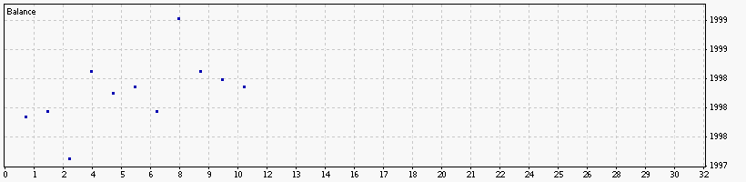

### Report: Strategy DeMarker DeMarker30_Active  EURUSD 2000USD 2014 2015year 10spread DS test

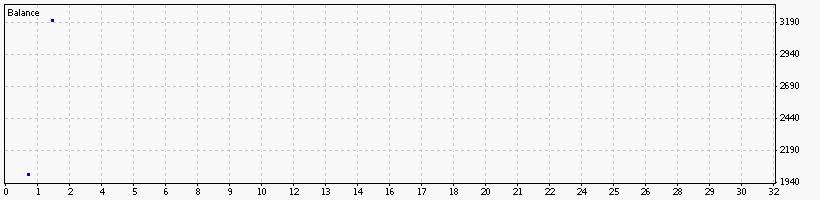

### Report: Strategy DeMarker DeMarker30_SignalMethod  EURUSD 2000USD 2014 2015year 10spread DS test

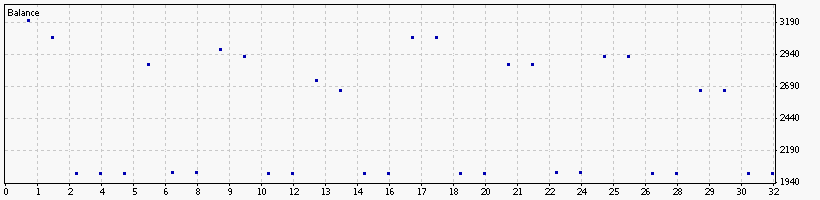

### Report: Strategy DeMarker DeMarker5_Active  EURUSD 2000USD 2014 2015year 10spread DS test

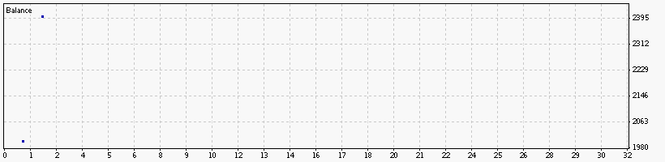

### Report: Strategy DeMarker DeMarker5_SignalMethod  EURUSD 2000USD 2014 2015year 10spread DS test

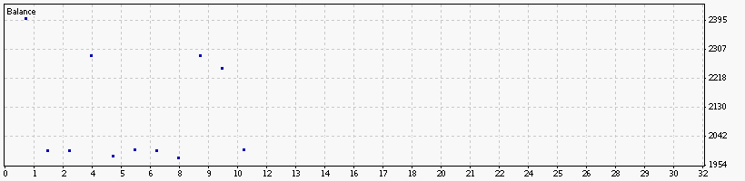

### Report: Strategy Envelopes All Envelopes_Applied_Price  EURUSD 2000USD 2014 2015year 10spread DS test

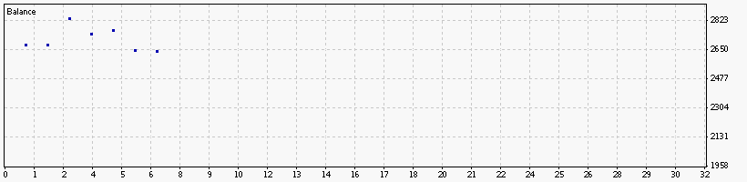

### Report: Strategy Envelopes All Envelopes_Deviation  EURUSD 2000USD 2014 2015year 10spread DS test

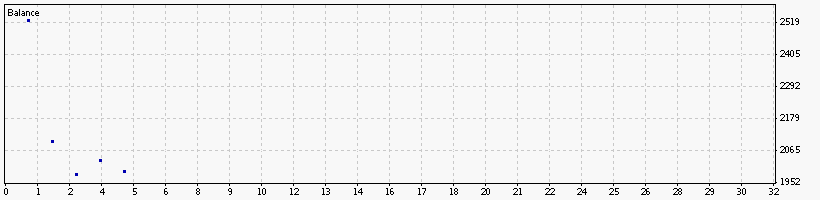

### Report: Strategy Envelopes All Envelopes_Deviation_Ratio  EURUSD 2000USD 2014 2015year 10spread DS test

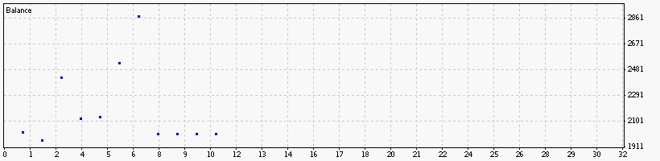

### Report: Strategy Envelopes All Envelopes_MA_Method  EURUSD 2000USD 2014 2015year 10spread DS test

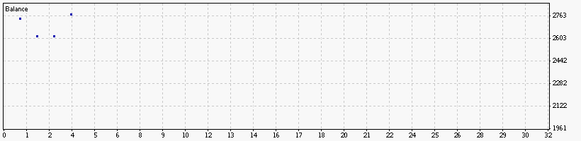

### Report: Strategy Envelopes All Envelopes_MA_Period  EURUSD 2000USD 2014 2015year 10spread DS test

### Report: Strategy Envelopes All Envelopes_MA_Period_Ratio  EURUSD 2000USD 2014 2015year 10spread DS test

### Report: Strategy Envelopes All Envelopes_TrailingProfitMethod  EURUSD 2000USD 2014 2015year 10spread DS test

### Report: Strategy Envelopes All Envelopes_TrailingStopMethod  EURUSD 2000USD 2014 2015year 10spread DS test

### Report: Strategy Envelopes Envelopes15_SignalMethod  EURUSD 2000USD 2014 2015year 10spread DS test

### Report: Strategy Envelopes Envelopes1_SignalMethod  EURUSD 2000USD 2014 2015year 10spread DS test

### Report: Strategy Envelopes Envelopes30_SignalMethod  EURUSD 2000USD 2014 2015year 10spread DS test

### Report: Strategy Fractals Fractals15_SignalMethod  EURUSD 2000USD 2014 2015year 10spread DS test

### Report: Strategy Fractals Fractals1_SignalMethod  EURUSD 2000USD 2014 2015year 10spread DS test

### Report: Strategy Fractals Fractals30_SignalMethod  EURUSD 2000USD 2014 2015year 10spread DS test

### Report: Strategy Fractals Fractals5_SignalMethod  EURUSD 2000USD 2014 2015year 10spread DS test

### Report: Strategy MA All MA_Applied_Price  EURUSD 2000USD 2014 2015year 10spread DS test

### Report: Strategy MA All MA_Method  EURUSD 2000USD 2014 2015year 10spread DS test

### Report: Strategy MA All MA_Period_Fast  EURUSD 2000USD 2014 2015year 10spread DS test

### Report: Strategy MA All MA_Period_Medium  EURUSD 2000USD 2014 2015year 10spread DS test

### Report: Strategy MA All MA_Period_Ratio  EURUSD 2000USD 2014 2015year 10spread DS test

### Report: Strategy MA All MA_Period_Slow  EURUSD 2000USD 2014 2015year 10spread DS test

### Report: Strategy MA All MA_SignalLevel  EURUSD 2000USD 2014 2015year 10spread DS test

### Report: Strategy MA All MA_TrailingProfitMethod  EURUSD 2000USD 2014 2015year 10spread DS test

### Report: Strategy MA All MA_TrailingStopMethod  EURUSD 2000USD 2014 2015year 10spread DS test

### Report: Strategy MA MA15_Active  EURUSD 2000USD 2014 2015year 10spread DS test

### Report: Strategy MA MA15_SignalMethod  EURUSD 2000USD 2014 2015year 10spread DS test

### Report: Strategy MA MA30_Active  EURUSD 2000USD 2014 2015year 10spread DS test

### Report: Strategy MACD All MACD_Applied_Price  EURUSD 2000USD 2014 2015year 10spread DS test

### Report: Strategy MACD All MACD_Period_Fast  EURUSD 2000USD 2014 2015year 10spread DS test

### Report: Strategy MACD All MACD_Period_Ratio  EURUSD 2000USD 2014 2015year 10spread DS test

### Report: Strategy MACD All MACD_Period_Signal  EURUSD 2000USD 2014 2015year 10spread DS test

### Report: Strategy MACD All MACD_Period_Slow  EURUSD 2000USD 2014 2015year 10spread DS test

### Report: Strategy MACD All MACD_SignalLevel  EURUSD 2000USD 2014 2015year 10spread DS test

### Report: Strategy MACD All MACD_TrailingProfitMethod  EURUSD 2000USD 2014 2015year 10spread DS test

### Report: Strategy MACD All MACD_TrailingStopMethod  EURUSD 2000USD 2014 2015year 10spread DS test

### Report: Strategy MACD MACD15_Active  EURUSD 2000USD 2014 2015year 10spread DS test

### Report: Strategy MACD MACD15_SignalMethod  EURUSD 2000USD 2014 2015year 10spread DS test

### Report: Strategy MACD MACD30_Active  EURUSD 2000USD 2014 2015year 10spread DS test

### Report: Strategy MACD MACD30_SignalMethod  EURUSD 2000USD 2014 2015year 10spread DS test

### Report: Strategy MACD MACD5_Active  EURUSD 2000USD 2014 2015year 10spread DS test

### Report: Strategy RSI All RSI_Applied_Price  EURUSD 2000USD 2014 2015year 10spread DS test

### Report: Strategy RSI All RSI_Period  EURUSD 2000USD 2014 2015year 10spread DS test

### Report: Strategy RSI All RSI_Period_Ratio  EURUSD 2000USD 2014 2015year 10spread DS test

### Report: Strategy RSI All RSI_SignalLevel  EURUSD 2000USD 2014 2015year 10spread DS test

### Report: Strategy RSI All RSI_TrailingProfitMethod  EURUSD 2000USD 2014 2015year 10spread DS test

### Report: Strategy RSI All RSI_TrailingStopMethod  EURUSD 2000USD 2014 2015year 10spread DS test

### Report: Strategy RSI RSI15_SignalMethod  EURUSD 2000USD 2014 2015year 10spread DS test

### Report: Strategy RSI RSI1_SignalMethod  EURUSD 2000USD 2014 2015year 10spread DS test

### Report: Strategy RSI RSI30_Active  EURUSD 2000USD 2014 2015year 10spread DS test

### Report: Strategy SAR SAR1_Active  EURUSD 2000USD 2014 2015year 10spread DS test

### Report: Strategy SAR SAR1_SignalMethod  EURUSD 2000USD 2014 2015year 10spread DS test

### Report: Strategy SAR SAR30_Active  EURUSD 2000USD 2014 2015year 10spread DS test

### Report: Strategy SAR SAR30_SignalMethod  EURUSD 2000USD 2014 2015year 10spread DS test

### Report: Strategy SAR SAR5_Active  EURUSD 2000USD 2014 2015year 10spread DS test

### Report: Strategy SAR SAR5_SignalMethod  EURUSD 2000USD 2014 2015year 10spread DS test

### Report: Strategy WPR WPR15_Active  EURUSD 2000USD 2014 2015year 10spread DS test

### Report: Strategy WPR WPR15_SignalMethod  EURUSD 2000USD 2014 2015year 10spread DS test

### Report: Strategy WPR WPR1_SignalMethod  EURUSD 2000USD 2014 2015year 10spread DS test

### Report: Strategy WPR WPR30_Active  EURUSD 2000USD 2014 2015year 10spread DS test

### Report: Strategy WPR WPR30_SignalMethod  EURUSD 2000USD 2014 2015year 10spread DS test

### Report: Strategy WPR WPR5_SignalMethod  EURUSD 2000USD 2014 2015year 10spread DS test

