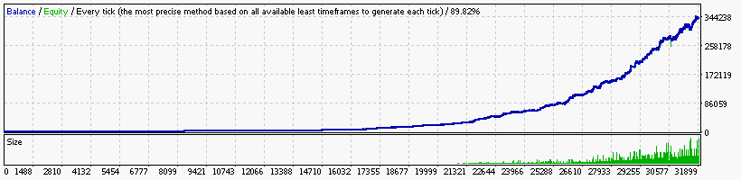
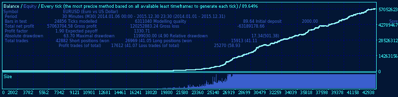

### Report: EURUSD 2000USD 2014 2015year 10spread M15 DS test

    Symbol                            EURUSD (Euro vs US Dollar)
    Period                            15 Minutes (M15) 2014.01.02 23:00 - 2015.12.30 23:45 (2014.01.01 - 2015.12.31)
    Model                             Every tick (the most precise method based on all available least timeframes)
    Parameters                        Alligator5_SignalMethod=18; Alligator15_SignalMethod=12; Alligator30_SignalMethod=9; __Bands_Parameters__="-
    Bars in test                49706 Ticks modelled                       11527436 Modelling quality                                              89.82%
    Mismatched charts errors        0
    Initial deposit           2000.00                                               Spread                                                             10
    Total net profit         28505.97 Gross profit                         96316.88 Gross loss                                                  -67810.90
    Profit factor                1.42 Expected payoff                          3.00
    Absolute drawdown            6.52 Maximal drawdown             5115.70 (15.87%) Relative drawdown                                    15.87% (5115.70)
    Total trades                 9512 Short positions (won %)         7698 (40.53%) Long positions (won %)                                  1814 (38.04%)

### Report: EURUSD 2000USD 2014 2015year 10spread M30 DS test

    Symbol                                EURUSD (Euro vs US Dollar)
    Period                                30 Minutes (M30) 2014.01.06 00:00 - 2015.12.30 23:30 (2014.01.01 - 2015.12.31)
    Model                                 Every tick (the most precise method based on all available least timeframes)
    Parameters                            Alligator5_SignalMethod=18; Alligator15_SignalMethod=12; Alligator30_SignalMethod=9; __Bands_Parameters__="-
    Bars in test                    24856 Ticks modelled                            6311040 Modelling quality                                       89.64%
    Mismatched charts errors            0
    Initial deposit               2000.00                                                   Spread                                                      10
    Total net profit         104994760.26 Gross profit                         264446912.38 Gross loss                                       -159452152.12
    Profit factor                    1.66 Expected payoff                           6325.37
    Absolute drawdown                6.69 Maximal drawdown             13862437.68 (14.69%) Relative drawdown                          18.67% (2303714.15)
    Total trades                    16599 Short positions (won %)            13106 (43.38%) Long positions (won %)                           3493 (40.71%)
