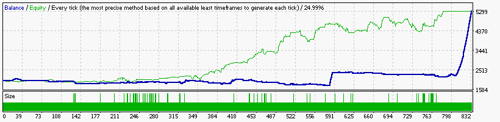

### Report: EURUSD 2000USD 2014year 10spread DS main test

    Symbol                    EURUSD (Euro vs US Dollar)
    Period                    1 Minute (M1) 2014.01.01 23:41 - 2014.12.29 23:59 (2014.01.01 - 2014.12.30)
    Model                     Every tick (the most precise method based on all available least timeframes)
    Parameters                ADX1_OpenMethod=15; ADX5_OpenMethod=15; ADX15_OpenMethod=15;
    Bars in test       368715 Ticks modelled                 74312557 Modelling quality                24.99%
    Mismatched charts       0
    errors
    Initial deposit   2000.00                                         Spread                               10
    Total net profit  3320.70 Gross profit                    5871.77 Gross loss                     -2551.06
    Profit factor        2.30 Expected payoff                    4.00
    Absolute drawdown  146.41 Maximal drawdown        921.01 (20.53%) Relative drawdown       20.53% (921.01)
    Total trades          831 Short positions (won %)    411 (70.56%) Long positions (won %)     420 (52.38%)
