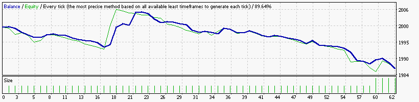
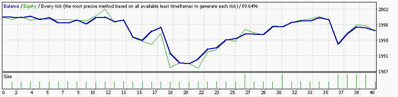
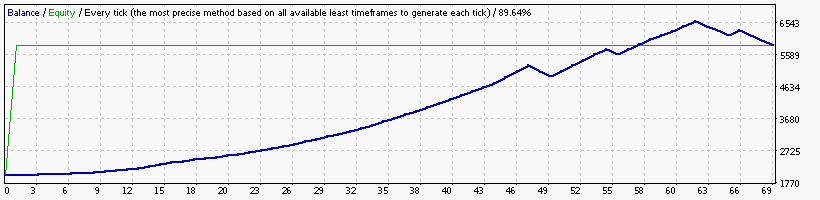
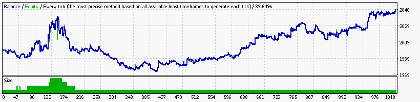
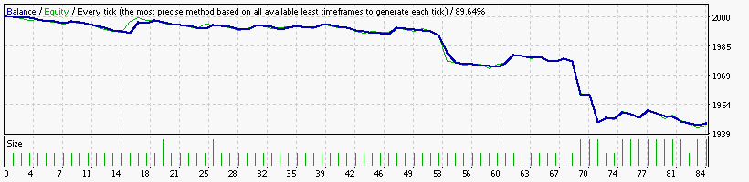
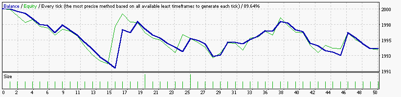
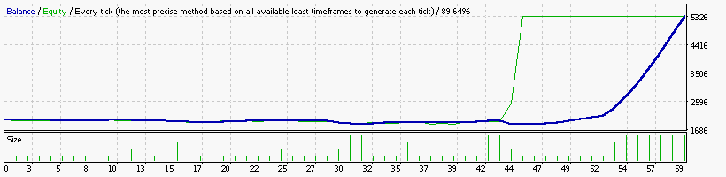
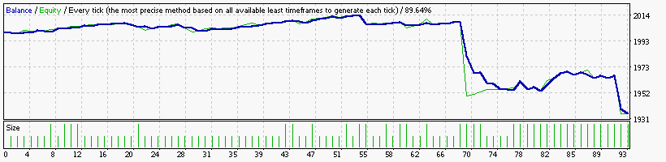

### Report: Strategy Alligator Alligator15_EURUSD_2000USD_10spread_5digits_2014 DS test

    Symbol                           EURUSD (Euro vs US Dollar)
    Period                           15 Minutes (M15) 2014.01.02 23:00 - 2014.12.29 23:45 (2014.01.01 - 2014.12.30)
    Model                            Every tick (the most precise method based on all available least timeframes)
    Parameters                       Alligator30_SignalMethod=63; __Bands_Parameters__="-- Settings for the Bollinger Bands indicator --";
    Bars in test               24716 Ticks modelled                          5596310 Modelling quality                                              89.64%
    Mismatched charts errors       0
    Initial deposit          2000.00                                                 Spread                                                             10
    Total net profit           -0.95 Gross profit                               5.49 Gross loss                                                      -6.44
    Profit factor               0.85 Expected payoff                           -0.06
    Absolute drawdown           1.13 Maximal drawdown                   4.83 (0.24%) Relative drawdown                                        0.24% (4.83)
    Total trades                  15 Short positions (won %)              8 (37.50%) Long positions (won %)                                     7 (42.86%)

### Report: Strategy Alligator Alligator1_EURUSD_2000USD_10spread_5digits_2014 DS test

    Symbol                           EURUSD (Euro vs US Dollar)
    Period                           1 Minute (M1) 2014.01.01 23:41 - 2014.12.29 23:59 (2014.01.01 - 2014.12.30)
    Model                            Every tick (the most precise method based on all available least timeframes)
    Parameters                       Alligator30_SignalMethod=63; __Bands_Parameters__="-- Settings for the Bollinger Bands indicator --";
    Bars in test              368714 Ticks modelled                         72707628 Modelling quality                                              24.99%
    Mismatched charts errors       0
    Initial deposit          2000.00                                                 Spread                                                             10
    Total net profit           -1.70 Gross profit                               2.88 Gross loss                                                      -4.58
    Profit factor               0.63 Expected payoff                           -0.14
    Absolute drawdown           3.32 Maximal drawdown                   3.33 (0.17%) Relative drawdown                                        0.17% (3.33)
    Total trades                  12 Short positions (won %)              7 (42.86%) Long positions (won %)                                     5 (20.00%)

### Report: Strategy Alligator Alligator30_EURUSD_2000USD_10spread_5digits_2014 DS test

    Symbol                           EURUSD (Euro vs US Dollar)
    Period                           30 Minutes (M30) 2014.01.06 00:00 - 2014.12.29 23:30 (2014.01.01 - 2014.12.30)
    Model                            Every tick (the most precise method based on all available least timeframes)
    Parameters                       Alligator30_SignalMethod=63; __Bands_Parameters__="-- Settings for the Bollinger Bands indicator --";
    Bars in test               12360 Ticks modelled                          3091822 Modelling quality                                              89.27%
    Mismatched charts errors       0
    Initial deposit          2000.00                                                 Spread                                                             10
    Total net profit           -1.53 Gross profit                               2.07 Gross loss                                                      -3.60
    Profit factor               0.57 Expected payoff                           -0.14
    Absolute drawdown           2.66 Maximal drawdown                   3.20 (0.16%) Relative drawdown                                        0.16% (3.20)
    Total trades                  11 Short positions (won %)             10 (50.00%) Long positions (won %)                                      1 (0.00%)

### Report: Strategy Alligator Alligator5_EURUSD_2000USD_10spread_5digits_2014 DS test

    Symbol                           EURUSD (Euro vs US Dollar)
    Period                           5 Minutes (M5) 2014.01.02 06:20 - 2014.12.29 23:55 (2014.01.01 - 2014.12.30)
    Model                            Every tick (the most precise method based on all available least timeframes)
    Parameters                       Alligator30_SignalMethod=63; __Bands_Parameters__="-- Settings for the Bollinger Bands indicator --";
    Bars in test               74142 Ticks modelled                         15241592 Modelling quality                                              89.88%
    Mismatched charts errors       0
    Initial deposit          2000.00                                                 Spread                                                             10
    Total net profit           -1.30 Gross profit                               8.42 Gross loss                                                      -9.72
    Profit factor               0.87 Expected payoff                           -0.05
    Absolute drawdown           1.30 Maximal drawdown                   7.61 (0.38%) Relative drawdown                                        0.38% (7.61)
    Total trades                  27 Short positions (won %)             15 (40.00%) Long positions (won %)                                     12 (8.33%)

### Report: Strategy Alligator Alligator_EURUSD_2000USD_10spread_5digits_2014 DS test

### Report: Strategy Bands Bands_EURUSD_2000USD_10spread_5digits_2014 DS test

### Report: Strategy DeMarker DeMarker_EURUSD_2000USD_10spread_5digits_2014 DS test

### Report: Strategy Envelopes Envelopes_EURUSD_2000USD_10spread_5digits_2014 DS test

### Report: Strategy Fractals Fractals_EURUSD_2000USD_10spread_5digits_2014 DS test

### Report: Strategy MA MA_EURUSD_2000USD_10spread_5digits_2014 DS test

### Report: Strategy MACD MACD_EURUSD_2000USD_10spread_5digits_2014 DS test

    Symbol                           EURUSD (Euro vs US Dollar)
    Period                           15 Minutes (M15) 2014.01.02 23:00 - 2014.12.29 23:45 (2014.01.01 - 2014.12.30)
    Model                            Every tick (the most precise method based on all available least timeframes)
    Parameters                       Alligator30_SignalMethod=63; __Bands_Parameters__="-- Settings for the Bollinger Bands indicator --";
    Bars in test               24716 Ticks modelled                          5596310 Modelling quality                                              89.64%
    Mismatched charts errors       0
    Initial deposit          2000.00                                                 Spread                                                             10
    Total net profit           -5.78 Gross profit                              19.08 Gross loss                                                     -24.86
    Profit factor               0.77 Expected payoff                           -0.12
    Absolute drawdown           8.10 Maximal drawdown                   9.15 (0.46%) Relative drawdown                                        0.46% (9.15)
    Total trades                  50 Short positions (won %)             23 (39.13%) Long positions (won %)                                    27 (14.81%)

### Report: Strategy RSI RSI_EURUSD_2000USD_10spread_5digits_2014 DS test

### Report: Strategy SAR SAR_EURUSD_2000USD_10spread_5digits_2014 DS test

### Report: Strategy WPR WPR_EURUSD_2000USD_10spread_5digits_2014 DS test

