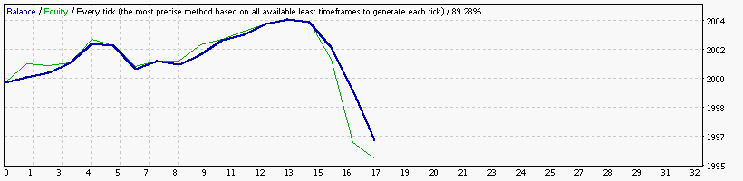
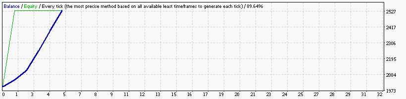

### Report: Strategy Alligator Alligator15_EURUSD_2000USD_10spread_5digits_2014 M15 DS test

    Symbol                           EURUSD (Euro vs US Dollar)
    Period                           15 Minutes (M15) 2014.01.02 23:00 - 2014.12.29 23:45 (2014.01.01 - 2014.12.30)
    Model                            Every tick (the most precise method based on all available least timeframes)
    Parameters                       Alligator30_SignalMethod=63; __Bands_Parameters__="-- Settings for the Bollinger Bands indicator --";
    Bars in test               24716 Ticks modelled                          5596310 Modelling quality                                              89.64%
    Mismatched charts errors       0
    Initial deposit          2000.00                                                 Spread                                                             10
    Total net profit           -0.95 Gross profit                               5.49 Gross loss                                                      -6.44
    Profit factor               0.85 Expected payoff                           -0.06
    Absolute drawdown           1.13 Maximal drawdown                   4.83 (0.24%) Relative drawdown                                        0.24% (4.83)
    Total trades                  15 Short positions (won %)              8 (37.50%) Long positions (won %)                                     7 (42.86%)

### Report: Strategy Alligator Alligator1_EURUSD_2000USD_10spread_5digits_2014 M1 DS test

    Symbol                           EURUSD (Euro vs US Dollar)
    Period                           1 Minute (M1) 2014.01.01 23:41 - 2014.12.29 23:59 (2014.01.01 - 2014.12.30)
    Model                            Every tick (the most precise method based on all available least timeframes)
    Parameters                       Alligator30_SignalMethod=63; __Bands_Parameters__="-- Settings for the Bollinger Bands indicator --";
    Bars in test              368714 Ticks modelled                         72707628 Modelling quality                                              24.99%
    Mismatched charts errors       0
    Initial deposit          2000.00                                                 Spread                                                             10
    Total net profit           -1.70 Gross profit                               2.88 Gross loss                                                      -4.58
    Profit factor               0.63 Expected payoff                           -0.14
    Absolute drawdown           3.32 Maximal drawdown                   3.33 (0.17%) Relative drawdown                                        0.17% (3.33)
    Total trades                  12 Short positions (won %)              7 (42.86%) Long positions (won %)                                     5 (20.00%)

### Report: Strategy Alligator Alligator30_EURUSD_2000USD_10spread_5digits_2014 M30 DS test

    Symbol                           EURUSD (Euro vs US Dollar)
    Period                           30 Minutes (M30) 2014.01.06 00:00 - 2014.12.29 23:30 (2014.01.01 - 2014.12.30)
    Model                            Every tick (the most precise method based on all available least timeframes)
    Parameters                       Alligator30_SignalMethod=63; __Bands_Parameters__="-- Settings for the Bollinger Bands indicator --";
    Bars in test               12360 Ticks modelled                          3091822 Modelling quality                                              89.27%
    Mismatched charts errors       0
    Initial deposit          2000.00                                                 Spread                                                             10
    Total net profit           -1.53 Gross profit                               2.07 Gross loss                                                      -3.60
    Profit factor               0.57 Expected payoff                           -0.14
    Absolute drawdown           2.66 Maximal drawdown                   3.20 (0.16%) Relative drawdown                                        0.16% (3.20)
    Total trades                  11 Short positions (won %)             10 (50.00%) Long positions (won %)                                      1 (0.00%)

### Report: Strategy Alligator Alligator5_EURUSD_2000USD_10spread_5digits_2014 M5 DS test

    Symbol                           EURUSD (Euro vs US Dollar)
    Period                           5 Minutes (M5) 2014.01.02 06:20 - 2014.12.29 23:55 (2014.01.01 - 2014.12.30)
    Model                            Every tick (the most precise method based on all available least timeframes)
    Parameters                       Alligator30_SignalMethod=63; __Bands_Parameters__="-- Settings for the Bollinger Bands indicator --";
    Bars in test               74142 Ticks modelled                         15241592 Modelling quality                                              89.88%
    Mismatched charts errors       0
    Initial deposit          2000.00                                                 Spread                                                             10
    Total net profit           -1.30 Gross profit                               8.42 Gross loss                                                      -9.72
    Profit factor               0.87 Expected payoff                           -0.05
    Absolute drawdown           1.30 Maximal drawdown                   7.61 (0.38%) Relative drawdown                                        0.38% (7.61)
    Total trades                  27 Short positions (won %)             15 (40.00%) Long positions (won %)                                     12 (8.33%)

### Report: Strategy Alligator Alligator_EURUSD_2000USD_10spread_5digits_2014 DS test

### Report: Strategy Alligator Alligator_EURUSD_2000USD_10spread_5digits_2014 M15 DS test

### Report: Strategy Bands Bands15_EURUSD_2000USD_10spread_5digits_2014 M15 DS test

### Report: Strategy Bands Bands1_EURUSD_2000USD_10spread_5digits_2014 M1 DS test

    Symbol                           EURUSD (Euro vs US Dollar)
    Period                           1 Minute (M1) 2014.01.01 23:41 - 2014.12.30 23:59 (2014.01.01 - 2014.12.31)
    Model                            Every tick (the most precise method based on all available least timeframes)
    Parameters                       Alligator30_SignalMethod=63; __Bands_Parameters__="-- Settings for the Bollinger Bands indicator --";
    Bars in test              370150 Ticks modelled                         72871137 Modelling quality                                              24.99%
    Mismatched charts errors       0
    Initial deposit          2000.00                                                 Spread                                                             10
    Total net profit           -4.83 Gross profit                               1.13 Gross loss                                                      -5.96
    Profit factor               0.19 Expected payoff                           -0.40
    Absolute drawdown           5.30 Maximal drawdown                   5.84 (0.29%) Relative drawdown                                        0.29% (5.84)
    Total trades                  12 Short positions (won %)              2 (50.00%) Long positions (won %)                                    10 (40.00%)

### Report: Strategy Bands Bands30_EURUSD_2000USD_10spread_5digits_2014 M30 DS test

    Symbol                           EURUSD (Euro vs US Dollar)
    Period                           30 Minutes (M30) 2014.01.06 00:00 - 2014.12.30 23:30 (2014.01.01 - 2014.12.31)
    Model                            Every tick (the most precise method based on all available least timeframes)
    Parameters                       Alligator30_SignalMethod=63; __Bands_Parameters__="-- Settings for the Bollinger Bands indicator --";
    Bars in test               12408 Ticks modelled                          3099045 Modelling quality                                              89.28%
    Mismatched charts errors       0
    Initial deposit          2000.00                                                 Spread                                                             10
    Total net profit           -3.68 Gross profit                               5.80 Gross loss                                                      -9.48
    Profit factor               0.61 Expected payoff                           -0.22
    Absolute drawdown           3.68 Maximal drawdown                   7.87 (0.39%) Relative drawdown                                        0.39% (7.87)
    Total trades                  17 Short positions (won %)              5 (40.00%) Long positions (won %)                                    12 (66.67%)

### Report: Strategy Bands Bands5_EURUSD_2000USD_10spread_5digits_2014 M5 DS test

    Symbol                           EURUSD (Euro vs US Dollar)
    Period                           5 Minutes (M5) 2014.01.02 06:20 - 2014.12.30 23:55 (2014.01.01 - 2014.12.31)
    Model                            Every tick (the most precise method based on all available least timeframes)
    Parameters                       Alligator30_SignalMethod=63; __Bands_Parameters__="-- Settings for the Bollinger Bands indicator --";
    Bars in test               74430 Ticks modelled                         15276233 Modelling quality                                              89.88%
    Mismatched charts errors       0
    Initial deposit          2000.00                                                 Spread                                                             10
    Total net profit            0.00 Gross profit                               0.00 Gross loss                                                      -0.00
    Profit factor                    Expected payoff                            0.00
    Absolute drawdown           0.00 Maximal drawdown                   0.00 (0.00%) Relative drawdown                                        0.00% (0.00)
    Total trades                   0 Short positions (won %)               0 (0.00%) Long positions (won %)                                      0 (0.00%)

### Report: Strategy Bands Bands_EURUSD_2000USD_10spread_5digits_2014 DS test

### Report: Strategy Bands Bands_EURUSD_2000USD_10spread_5digits_2014 M15 DS test

### Report: Strategy DeMarker DeMarker15_EURUSD_2000USD_10spread_5digits_2014 M15 DS test

    Symbol                           EURUSD (Euro vs US Dollar)
    Period                           15 Minutes (M15) 2014.01.02 23:00 - 2014.12.30 23:45 (2014.01.01 - 2014.12.31)
    Model                            Every tick (the most precise method based on all available least timeframes)
    Parameters                       Alligator30_SignalMethod=63; __Bands_Parameters__="-- Settings for the Bollinger Bands indicator --";
    Bars in test               24812 Ticks modelled                          5609627 Modelling quality                                              89.64%
    Mismatched charts errors       0
    Initial deposit          2000.00                                                 Spread                                                             10
    Total net profit           62.51 Gross profit                             128.53 Gross loss                                                     -66.03
    Profit factor               1.95 Expected payoff                            0.19
    Absolute drawdown           0.63 Maximal drawdown                   7.98 (0.39%) Relative drawdown                                        0.39% (7.98)
    Total trades                 332 Short positions (won %)            307 (41.04%) Long positions (won %)                                    25 (52.00%)

### Report: Strategy DeMarker DeMarker1_EURUSD_2000USD_10spread_5digits_2014 M1 DS test

    Symbol                           EURUSD (Euro vs US Dollar)
    Period                           1 Minute (M1) 2014.01.01 23:41 - 2014.12.29 23:59 (2014.01.01 - 2014.12.30)
    Model                            Every tick (the most precise method based on all available least timeframes)
    Parameters                       Alligator30_SignalMethod=63; __Bands_Parameters__="-- Settings for the Bollinger Bands indicator --";
    Bars in test              368714 Ticks modelled                         72707628 Modelling quality                                              24.99%
    Mismatched charts errors       0
    Initial deposit          2000.00                                                 Spread                                                             10
    Total net profit           -5.16 Gross profit                               1.82 Gross loss                                                      -6.98
    Profit factor               0.26 Expected payoff                           -0.37
    Absolute drawdown           5.53 Maximal drawdown                   5.64 (0.28%) Relative drawdown                                        0.28% (5.64)
    Total trades                  14 Short positions (won %)              4 (25.00%) Long positions (won %)                                    10 (10.00%)

### Report: Strategy DeMarker DeMarker30_EURUSD_2000USD_10spread_5digits_2014 M30 DS test

### Report: Strategy DeMarker DeMarker5_EURUSD_2000USD_10spread_5digits_2014 M5 DS test

### Report: Strategy DeMarker DeMarker_EURUSD_2000USD_10spread_5digits_2014 DS test

### Report: Strategy DeMarker DeMarker_EURUSD_2000USD_10spread_5digits_2014 M15 DS test

### Report: Strategy Envelopes Envelopes15_EURUSD_2000USD_10spread_5digits_2014 M15 DS test

### Report: Strategy Envelopes Envelopes1_EURUSD_2000USD_10spread_5digits_2014 M1 DS test

### Report: Strategy Envelopes Envelopes30_EURUSD_2000USD_10spread_5digits_2014 M30 DS test

### Report: Strategy Envelopes Envelopes5_EURUSD_2000USD_10spread_5digits_2014 M5 DS test

### Report: Strategy Envelopes Envelopes_EURUSD_2000USD_10spread_5digits_2014 DS test

### Report: Strategy Fractals Fractals15_EURUSD_2000USD_10spread_5digits_2014 M15 DS test

### Report: Strategy Fractals Fractals1_EURUSD_2000USD_10spread_5digits_2014 M1 DS test

    Symbol                           EURUSD (Euro vs US Dollar)
    Period                           1 Minute (M1) 2014.01.01 23:41 - 2014.12.29 23:59 (2014.01.01 - 2014.12.30)
    Model                            Every tick (the most precise method based on all available least timeframes)
    Parameters                       Alligator30_SignalMethod=63; __Bands_Parameters__="-- Settings for the Bollinger Bands indicator --";
    Bars in test              368714 Ticks modelled                         72707628 Modelling quality                                              24.99%
    Mismatched charts errors       0
    Initial deposit          2000.00                                                 Spread                                                             10
    Total net profit           -0.72 Gross profit                               3.52 Gross loss                                                      -4.24
    Profit factor               0.83 Expected payoff                           -0.05
    Absolute drawdown           1.44 Maximal drawdown                   3.60 (0.18%) Relative drawdown                                        0.18% (3.60)
    Total trades                  14 Short positions (won %)              8 (50.00%) Long positions (won %)                                     6 (33.33%)

### Report: Strategy Fractals Fractals30_EURUSD_2000USD_10spread_5digits_2014 M30 DS test

    Symbol                           EURUSD (Euro vs US Dollar)
    Period                           30 Minutes (M30) 2014.01.06 00:00 - 2014.12.30 23:30 (2014.01.01 - 2014.12.31)
    Model                            Every tick (the most precise method based on all available least timeframes)
    Parameters                       Alligator30_SignalMethod=63; __Bands_Parameters__="-- Settings for the Bollinger Bands indicator --";
    Bars in test               12408 Ticks modelled                          3099045 Modelling quality                                              89.28%
    Mismatched charts errors       0
    Initial deposit          2000.00                                                 Spread                                                             10
    Total net profit           -5.62 Gross profit                               0.98 Gross loss                                                      -6.60
    Profit factor               0.15 Expected payoff                           -0.51
    Absolute drawdown           6.73 Maximal drawdown                   7.15 (0.36%) Relative drawdown                                        0.36% (7.15)
    Total trades                  11 Short positions (won %)              5 (40.00%) Long positions (won %)                                     6 (16.67%)

### Report: Strategy Fractals Fractals5_EURUSD_2000USD_10spread_5digits_2014 M5 DS test

### Report: Strategy Fractals Fractals_EURUSD_2000USD_10spread_5digits_2014 DS test

### Report: Strategy MA MA15_EURUSD_2000USD_10spread_5digits_2014 M15 DS test

### Report: Strategy MA MA1_EURUSD_2000USD_10spread_5digits_2014 M1 DS test

### Report: Strategy MA MA30_EURUSD_2000USD_10spread_5digits_2014 M30 DS test

### Report: Strategy MA MA5_EURUSD_2000USD_10spread_5digits_2014 M5 DS test

    Symbol                           EURUSD (Euro vs US Dollar)
    Period                           5 Minutes (M5) 2014.01.02 06:20 - 2014.12.29 23:55 (2014.01.01 - 2014.12.30)
    Model                            Every tick (the most precise method based on all available least timeframes)
    Parameters                       Alligator30_SignalMethod=63; __Bands_Parameters__="-- Settings for the Bollinger Bands indicator --";
    Bars in test               74142 Ticks modelled                         15241592 Modelling quality                                              89.88%
    Mismatched charts errors       0
    Initial deposit          2000.00                                                 Spread                                                             10
    Total net profit            0.00 Gross profit                               0.00 Gross loss                                                      -0.00
    Profit factor                    Expected payoff                            0.00
    Absolute drawdown           0.00 Maximal drawdown                   0.00 (0.00%) Relative drawdown                                        0.00% (0.00)
    Total trades                   0 Short positions (won %)               0 (0.00%) Long positions (won %)                                      0 (0.00%)

### Report: Strategy MA MA_EURUSD_2000USD_10spread_5digits_2014 DS test

### Report: Strategy MACD MACD15_EURUSD_2000USD_10spread_5digits_2014 M15 DS test

    Symbol                           EURUSD (Euro vs US Dollar)
    Period                           15 Minutes (M15) 2014.01.02 23:00 - 2014.12.29 23:45 (2014.01.01 - 2014.12.30)
    Model                            Every tick (the most precise method based on all available least timeframes)
    Parameters                       Alligator30_SignalMethod=63; __Bands_Parameters__="-- Settings for the Bollinger Bands indicator --";
    Bars in test               24716 Ticks modelled                          5596310 Modelling quality                                              89.64%
    Mismatched charts errors       0
    Initial deposit          2000.00                                                 Spread                                                             10
    Total net profit           -1.00 Gross profit                               2.99 Gross loss                                                      -3.99
    Profit factor               0.75 Expected payoff                           -0.09
    Absolute drawdown           4.20 Maximal drawdown                   4.69 (0.23%) Relative drawdown                                        0.23% (4.69)
    Total trades                  11 Short positions (won %)             3 (100.00%) Long positions (won %)                                     8 (12.50%)

### Report: Strategy MACD MACD1_EURUSD_2000USD_10spread_5digits_2014 M1 DS test

    Symbol                           EURUSD (Euro vs US Dollar)
    Period                           1 Minute (M1) 2014.01.01 23:41 - 2014.12.30 23:59 (2014.01.01 - 2014.12.31)
    Model                            Every tick (the most precise method based on all available least timeframes)
    Parameters                       Alligator30_SignalMethod=63; __Bands_Parameters__="-- Settings for the Bollinger Bands indicator --";
    Bars in test              370150 Ticks modelled                         72871137 Modelling quality                                              24.99%
    Mismatched charts errors       0
    Initial deposit          2000.00                                                 Spread                                                             10
    Total net profit           -0.82 Gross profit                               1.66 Gross loss                                                      -2.48
    Profit factor               0.67 Expected payoff                           -0.07
    Absolute drawdown           0.94 Maximal drawdown                   1.48 (0.07%) Relative drawdown                                        0.07% (1.48)
    Total trades                  11 Short positions (won %)              3 (33.33%) Long positions (won %)                                     8 (25.00%)

### Report: Strategy MACD MACD30_EURUSD_2000USD_10spread_5digits_2014 M30 DS test

### Report: Strategy MACD MACD5_EURUSD_2000USD_10spread_5digits_2014 M5 DS test

### Report: Strategy MACD MACD_EURUSD_2000USD_10spread_5digits_2014 DS test

    Symbol                           EURUSD (Euro vs US Dollar)
    Period                           15 Minutes (M15) 2014.01.02 23:00 - 2014.12.29 23:45 (2014.01.01 - 2014.12.30)
    Model                            Every tick (the most precise method based on all available least timeframes)
    Parameters                       Alligator30_SignalMethod=63; __Bands_Parameters__="-- Settings for the Bollinger Bands indicator --";
    Bars in test               24716 Ticks modelled                          5596310 Modelling quality                                              89.64%
    Mismatched charts errors       0
    Initial deposit          2000.00                                                 Spread                                                             10
    Total net profit           -5.78 Gross profit                              19.08 Gross loss                                                     -24.86
    Profit factor               0.77 Expected payoff                           -0.12
    Absolute drawdown           8.10 Maximal drawdown                   9.15 (0.46%) Relative drawdown                                        0.46% (9.15)
    Total trades                  50 Short positions (won %)             23 (39.13%) Long positions (won %)                                    27 (14.81%)

### Report: Strategy RSI RSI15_EURUSD_2000USD_10spread_5digits_2014 M15 DS test

    Symbol                           EURUSD (Euro vs US Dollar)
    Period                           15 Minutes (M15) 2014.01.02 23:00 - 2014.12.29 23:45 (2014.01.01 - 2014.12.30)
    Model                            Every tick (the most precise method based on all available least timeframes)
    Parameters                       Alligator30_SignalMethod=63; __Bands_Parameters__="-- Settings for the Bollinger Bands indicator --";
    Bars in test               24716 Ticks modelled                          5596310 Modelling quality                                              89.64%
    Mismatched charts errors       0
    Initial deposit          2000.00                                                 Spread                                                             10
    Total net profit           -0.84 Gross profit                               6.10 Gross loss                                                      -6.94
    Profit factor               0.88 Expected payoff                           -0.07
    Absolute drawdown           0.84 Maximal drawdown                   6.42 (0.32%) Relative drawdown                                        0.32% (6.42)
    Total trades                  12 Short positions (won %)              9 (33.33%) Long positions (won %)                                     3 (33.33%)

### Report: Strategy RSI RSI1_EURUSD_2000USD_10spread_5digits_2014 M1 DS test

    Symbol                           EURUSD (Euro vs US Dollar)
    Period                           1 Minute (M1) 2014.01.01 23:41 - 2014.12.30 23:59 (2014.01.01 - 2014.12.31)
    Model                            Every tick (the most precise method based on all available least timeframes)
    Parameters                       Alligator30_SignalMethod=63; __Bands_Parameters__="-- Settings for the Bollinger Bands indicator --";
    Bars in test              370150 Ticks modelled                         72871137 Modelling quality                                              24.99%
    Mismatched charts errors       0
    Initial deposit          2000.00                                                 Spread                                                             10
    Total net profit           -3.77 Gross profit                               1.84 Gross loss                                                      -5.61
    Profit factor               0.33 Expected payoff                           -0.31
    Absolute drawdown           5.62 Maximal drawdown                   6.07 (0.30%) Relative drawdown                                        0.30% (6.07)
    Total trades                  12 Short positions (won %)             3 (100.00%) Long positions (won %)                                     9 (11.11%)

### Report: Strategy RSI RSI30_EURUSD_2000USD_10spread_5digits_2014 M30 DS test

### Report: Strategy RSI RSI5_EURUSD_2000USD_10spread_5digits_2014 M5 DS test

    Symbol                           EURUSD (Euro vs US Dollar)
    Period                           5 Minutes (M5) 2014.01.02 06:20 - 2014.12.29 23:55 (2014.01.01 - 2014.12.30)
    Model                            Every tick (the most precise method based on all available least timeframes)
    Parameters                       Alligator30_SignalMethod=63; __Bands_Parameters__="-- Settings for the Bollinger Bands indicator --";
    Bars in test               74142 Ticks modelled                         15241592 Modelling quality                                              89.88%
    Mismatched charts errors       0
    Initial deposit          2000.00                                                 Spread                                                             10
    Total net profit           -1.83 Gross profit                               9.92 Gross loss                                                     -11.76
    Profit factor               0.84 Expected payoff                           -0.17
    Absolute drawdown           3.64 Maximal drawdown                   5.93 (0.30%) Relative drawdown                                        0.30% (5.93)
    Total trades                  11 Short positions (won %)              5 (20.00%) Long positions (won %)                                     6 (66.67%)

### Report: Strategy RSI RSI_EURUSD_2000USD_10spread_5digits_2014 DS test

### Report: Strategy RSI RSI_EURUSD_2000USD_10spread_5digits_2014 M15 DS test

### Report: Strategy SAR SAR15_EURUSD_2000USD_10spread_5digits_2014 M15 DS test

### Report: Strategy SAR SAR1_EURUSD_2000USD_10spread_5digits_2014 M1 DS test

### Report: Strategy SAR SAR30_EURUSD_2000USD_10spread_5digits_2014 M30 DS test

### Report: Strategy SAR SAR5_EURUSD_2000USD_10spread_5digits_2014 M5 DS test

### Report: Strategy SAR SAR_EURUSD_2000USD_10spread_5digits_2014 DS test

### Report: Strategy WPR WPR15_EURUSD_2000USD_10spread_5digits_2014 M15 DS test

### Report: Strategy WPR WPR1_EURUSD_2000USD_10spread_5digits_2014 M1 DS test

    Symbol                           EURUSD (Euro vs US Dollar)
    Period                           1 Minute (M1) 2014.01.01 23:41 - 2014.12.29 23:59 (2014.01.01 - 2014.12.30)
    Model                            Every tick (the most precise method based on all available least timeframes)
    Parameters                       Alligator30_SignalMethod=63; __Bands_Parameters__="-- Settings for the Bollinger Bands indicator --";
    Bars in test              368714 Ticks modelled                         72707628 Modelling quality                                              24.99%
    Mismatched charts errors       0
    Initial deposit          2000.00                                                 Spread                                                             10
    Total net profit           -4.20 Gross profit                               4.32 Gross loss                                                      -8.52
    Profit factor               0.51 Expected payoff                           -0.38
    Absolute drawdown           7.83 Maximal drawdown                   9.30 (0.46%) Relative drawdown                                        0.46% (9.30)
    Total trades                  11 Short positions (won %)              8 (75.00%) Long positions (won %)                                     3 (33.33%)

### Report: Strategy WPR WPR30_EURUSD_2000USD_10spread_5digits_2014 M30 DS test

### Report: Strategy WPR WPR5_EURUSD_2000USD_10spread_5digits_2014 M5 DS test

### Report: Strategy WPR WPR_EURUSD_2000USD_10spread_5digits_2014 DS test

### Report: Strategy WPR WPR_EURUSD_2000USD_10spread_5digits_2014 M15 DS test

