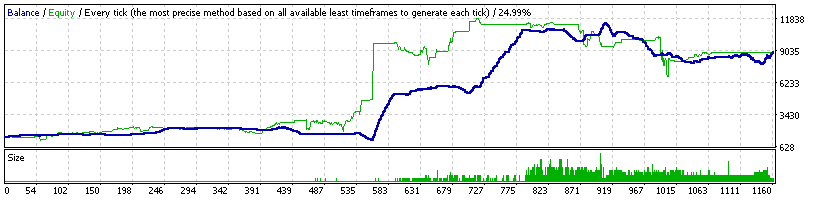
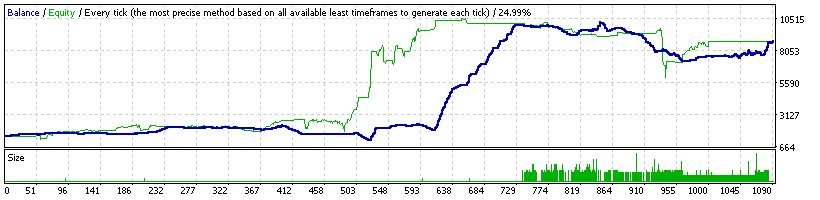
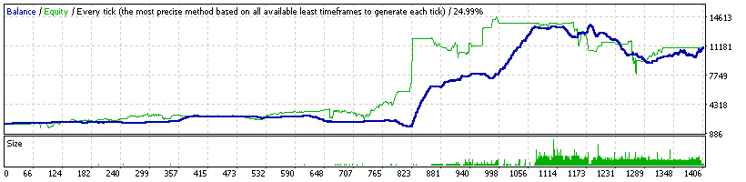

### Report: EURUSD 1500USD 2014year 10spread DS backtest

    Symbol                    EURUSD (Euro vs US Dollar)
    Period                    1 Minute (M1) 2014.01.01 23:41 - 2014.12.29 23:59 (2014.01.01 - 2014.12.30)
    Model                     Every tick (the most precise method based on all available least timeframes)
    Parameters                Bollinger Bands indicator --"; Bands1_Active=false; Bands5_Active=false;
    Bars in test       368715 Ticks modelled               74312557 Modelling quality                 24.99%
    Mismatched charts       0
    errors
    Initial deposit   1500.00                                       Spread                                10
    Total net profit  8461.05 Gross profit                 11516.14 Gross loss                      -3055.09
    Profit factor        3.77 Expected payoff                 17.41
    Absolute drawdown  307.48 Maximal drawdown     2748.20 (35.40%) Relative drawdown       35.40% (2748.20)
    Total trades          486 Short positions (won     360 (49.72%) Long positions (won %)      126 (31.75%)

### Report: EURUSD 1500USD 2014year 20spread DS backtest

    Symbol                    EURUSD (Euro vs US Dollar)
    Period                    1 Minute (M1) 2014.01.01 23:41 - 2014.12.29 23:59 (2014.01.01 - 2014.12.30)
    Model                     Every tick (the most precise method based on all available least timeframes)
    Parameters                Bollinger Bands indicator --"; Bands1_Active=false; Bands5_Active=false;
    Bars in test       368715 Ticks modelled               74312557 Modelling quality                 24.99%
    Mismatched charts       0
    errors
    Initial deposit   1500.00                                       Spread                                20
    Total net profit  6395.61 Gross profit                  9865.78 Gross loss                      -3470.18
    Profit factor        2.84 Expected payoff                 19.38
    Absolute drawdown  326.57 Maximal drawdown     2399.93 (40.38%) Relative drawdown       40.38% (2399.93)
    Total trades          330 Short positions (won     203 (58.13%) Long positions (won %)      127 (29.13%)

### Report: EURUSD 2000USD 2014year 10spread DS backtest

    Symbol                    EURUSD (Euro vs US Dollar)
    Period                    1 Minute (M1) 2014.01.01 23:41 - 2014.12.29 23:59 (2014.01.01 - 2014.12.30)
    Model                     Every tick (the most precise method based on all available least timeframes)
    Parameters                Bollinger Bands indicator --"; Bands1_Active=false; Bands5_Active=false;
    Bars in test       368715 Ticks modelled               74312557 Modelling quality                 24.99%
    Mismatched charts       0
    errors
    Initial deposit   2000.00                                       Spread                                10
    Total net profit  7643.65 Gross profit                 11035.29 Gross loss                      -3391.65
    Profit factor        3.25 Expected payoff                 14.34
    Absolute drawdown  300.39 Maximal drawdown     2748.34 (35.52%) Relative drawdown       35.52% (2748.34)
    Total trades          533 Short positions (won     396 (52.27%) Long positions (won %)      137 (36.50%)

### Report: EURUSD 2000USD 2014year 20spread DS backtest

    Symbol                    EURUSD (Euro vs US Dollar)
    Period                    1 Minute (M1) 2014.01.01 23:41 - 2014.12.29 23:59 (2014.01.01 - 2014.12.30)
    Model                     Every tick (the most precise method based on all available least timeframes)
    Parameters                Bollinger Bands indicator --"; Bands1_Active=false; Bands5_Active=false;
    Bars in test       368715 Ticks modelled               74312557 Modelling quality                 24.99%
    Mismatched charts       0
    errors
    Initial deposit   2000.00                                       Spread                                20
    Total net profit  8281.46 Gross profit                 12014.93 Gross loss                      -3733.48
    Profit factor        3.22 Expected payoff                 16.02
    Absolute drawdown  337.58 Maximal drawdown     3096.67 (38.29%) Relative drawdown       38.29% (3096.67)
    Total trades          517 Short positions (won     374 (54.28%) Long positions (won %)      143 (32.87%)
