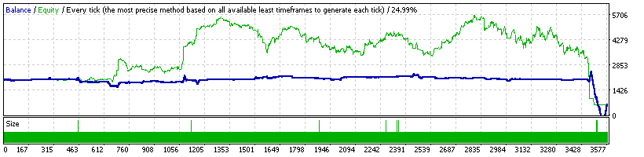

### Report: EURUSD 2000USD 2015year 10spread DS main test

    Symbol                     EURUSD (Euro vs US Dollar)
    Period                     1 Minute (M1) 2015.01.01 23:40 - 2015.12.29 23:59 (2015.01.01 - 2015.12.30)
    Model                      Every tick (the most precise method based on all available least timeframes)
    Parameters                 indicator --"; Alligator1_Active=true; Alligator5_Active=true;
    Bars in test        370084 Ticks modelled               80830113 Modelling quality                 24.99%
    Mismatched charts        0
    errors
    Initial deposit    2000.00                                       Spread                                10
    Total net profit  -1419.72 Gross profit                  7304.86 Gross loss                      -8724.59
    Profit factor         0.84 Expected payoff                 -0.40
    Absolute drawdown  1419.72 Maximal drawdown     5174.15 (89.92%) Relative drawdown       89.92% (5174.15)
    Total trades          3572 Short positions (won    2203 (63.19%) Long positions (won %)     1369 (62.67%)
