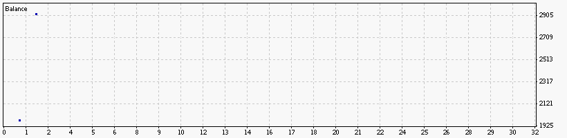

### Report: All Account_Conditions_Active  EURUSD 2000USD 2015year 10spread DS test

### Report: All Action_On_Condition_01  EURUSD 2000USD 2015year 10spread DS test

### Report: All Action_On_Condition_02  EURUSD 2000USD 2015year 10spread DS test

### Report: All BestMonthlyStrategyMultiplierFactor  EURUSD 2000USD 2015year 10spread DS test

    Pass  Profit Total trades Profit factor Expected Payoff Drawdown $ Drawdown %

### Report: All BoostTrendFactor  EURUSD 2000USD 2015year 10spread DS test

### Report: All Boosting_Enabled  EURUSD 2000USD 2015year 10spread DS test

### Report: All CloseOrderAfterXHours  EURUSD 2000USD 2015year 10spread DS test

### Report: All DefaultTrailingStopMethod  EURUSD 2000USD 2015year 10spread DS test

### Report: All MarketSpecificHour  EURUSD 2000USD 2015year 10spread DS test

### Report: All MarketSuddenDropSize  EURUSD 2000USD 2015year 10spread DS test

### Report: All MaxOrdersPerType  EURUSD 2000USD 2015year 10spread DS test

### Report: All MinPipGap  EURUSD 2000USD 2015year 10spread DS test

### Report: All ProfitFactorMaxToTrade  EURUSD 2000USD 2015year 10spread DS test

### Report: All ProfitFactorMinToTrade  EURUSD 2000USD 2015year 10spread DS test

### Report: All RiskMargin  EURUSD 2000USD 2015year 10spread DS test

### Report: All TakeProfit  EURUSD 2000USD 2015year 10spread DS test

### Report: All TakeProfit StopLoss  EURUSD 2000USD 2015year 10spread DS test

### Report: All TradeWithTrend  EURUSD 2000USD 2015year 10spread DS test

### Report: All TrailingStop  EURUSD 2000USD 2015year 10spread DS test

### Report: All TrailingStopAddPerMinute  EURUSD 2000USD 2015year 10spread DS test

### Report: All TrailingStopOneWay  EURUSD 2000USD 2015year 10spread DS test

### Report: All TrendMethod  EURUSD 2000USD 2015year 10spread DS test

### Report: Strategy Alligator All Alligator_Applied_Price  EURUSD 2000USD 2015year 10spread DS test

### Report: Strategy Alligator All Alligator_MA_Method  EURUSD 2000USD 2015year 10spread DS test

### Report: Strategy Alligator All Alligator_Period_Ratio  EURUSD 2000USD 2015year 10spread DS test

### Report: Strategy Alligator All Alligator_Periods  EURUSD 2000USD 2015year 10spread DS test

### Report: Strategy Alligator All Alligator_SignalLevel  EURUSD 2000USD 2015year 10spread DS test

### Report: Strategy Alligator All Alligator_TrailingProfitMethod  EURUSD 2000USD 2015year 10spread DS test

### Report: Strategy Alligator All Alligator_TrailingStopMethod  EURUSD 2000USD 2015year 10spread DS test

### Report: Strategy Alligator Alligator15_SignalMethod  EURUSD 2000USD 2015year 10spread DS test

### Report: Strategy Alligator Alligator1_Active  EURUSD 2000USD 2015year 10spread DS test

### Report: Strategy Alligator Alligator1_SignalMethod  EURUSD 2000USD 2015year 10spread DS test

### Report: Strategy Alligator Alligator30_SignalMethod  EURUSD 2000USD 2015year 10spread DS test

### Report: Strategy Alligator Alligator5_SignalMethod  EURUSD 2000USD 2015year 10spread DS test

### Report: Strategy Alligator Alligator_Applied_Price  EURUSD 2000USD 2015year 10spread DS test

### Report: Strategy Alligator_TrailingStopMethod  EURUSD 2000USD 2015year 10spread DS test

### Report: Strategy Bands All Bands_Applied_Price  EURUSD 2000USD 2015year 10spread DS test

### Report: Strategy Bands All Bands_Deviation  EURUSD 2000USD 2015year 10spread DS test

### Report: Strategy Bands All Bands_Deviation_Ratio  EURUSD 2000USD 2015year 10spread DS test

### Report: Strategy Bands All Bands_Period  EURUSD 2000USD 2015year 10spread DS test

### Report: Strategy Bands All Bands_Period_Ratio  EURUSD 2000USD 2015year 10spread DS test

### Report: Strategy Bands All Bands_Shift  EURUSD 2000USD 2015year 10spread DS test

### Report: Strategy Bands All Bands_TrailingProfitMethod  EURUSD 2000USD 2015year 10spread DS test

### Report: Strategy Bands All Bands_TrailingStopMethod  EURUSD 2000USD 2015year 10spread DS test

### Report: Strategy Bands Bands15_SignalMethod  EURUSD 2000USD 2015year 10spread DS test

### Report: Strategy Bands Bands1_Active  EURUSD 2000USD 2015year 10spread DS test

### Report: Strategy Bands Bands1_SignalMethod  EURUSD 2000USD 2015year 10spread DS test

### Report: Strategy Bands Bands30_Active  EURUSD 2000USD 2015year 10spread DS test

### Report: Strategy Bands Bands5_Active  EURUSD 2000USD 2015year 10spread DS test

### Report: Strategy Bands Bands5_SignalMethod  EURUSD 2000USD 2015year 10spread DS test

### Report: Strategy Bands_TrailingStopMethod  EURUSD 2000USD 2015year 10spread DS test

### Report: Strategy DeMarker All DeMarker_Period  EURUSD 2000USD 2015year 10spread DS test

### Report: Strategy DeMarker All DeMarker_Period_Ratio  EURUSD 2000USD 2015year 10spread DS test

### Report: Strategy DeMarker All DeMarker_Shift  EURUSD 2000USD 2015year 10spread DS test

### Report: Strategy DeMarker All DeMarker_SignalLevel  EURUSD 2000USD 2015year 10spread DS test

### Report: Strategy DeMarker All DeMarker_TrailingProfitMethod  EURUSD 2000USD 2015year 10spread DS test

### Report: Strategy DeMarker All DeMarker_TrailingStopMethod  EURUSD 2000USD 2015year 10spread DS test

### Report: Strategy DeMarker DeMarker1_Active  EURUSD 2000USD 2015year 10spread DS test

### Report: Strategy DeMarker DeMarker1_SignalMethod  EURUSD 2000USD 2015year 10spread DS test

### Report: Strategy DeMarker DeMarker30_SignalMethod  EURUSD 2000USD 2015year 10spread DS test

### Report: Strategy DeMarker_TrailingStopMethod  EURUSD 2000USD 2015year 10spread DS test

### Report: Strategy Envelopes All Envelopes_Deviation  EURUSD 2000USD 2015year 10spread DS test

### Report: Strategy Envelopes All Envelopes_MA_Method  EURUSD 2000USD 2015year 10spread DS test

### Report: Strategy Envelopes All Envelopes_MA_Period_Ratio  EURUSD 2000USD 2015year 10spread DS test

### Report: Strategy Envelopes All Envelopes_TrailingStopMethod  EURUSD 2000USD 2015year 10spread DS test

### Report: Strategy Envelopes Envelopes15_SignalMethod  EURUSD 2000USD 2015year 10spread DS test

### Report: Strategy Envelopes Envelopes1_Active  EURUSD 2000USD 2015year 10spread DS test

### Report: Strategy Envelopes Envelopes1_SignalMethod  EURUSD 2000USD 2015year 10spread DS test

### Report: Strategy Envelopes Envelopes5_SignalMethod  EURUSD 2000USD 2015year 10spread DS test

### Report: Strategy Envelopes_TrailingStopMethod  EURUSD 2000USD 2015year 10spread DS test

### Report: Strategy Fractals All Fractals_TrailingStopMethod  EURUSD 2000USD 2015year 10spread DS test

### Report: Strategy Fractals Fractals15_SignalMethod  EURUSD 2000USD 2015year 10spread DS test

### Report: Strategy Fractals Fractals1_Active  EURUSD 2000USD 2015year 10spread DS test

### Report: Strategy Fractals Fractals1_SignalMethod  EURUSD 2000USD 2015year 10spread DS test

### Report: Strategy Fractals_TrailingStopMethod  EURUSD 2000USD 2015year 10spread DS test

### Report: Strategy MA All MA_TrailingStopMethod  EURUSD 2000USD 2015year 10spread DS test

### Report: Strategy MA MA15_SignalMethod  EURUSD 2000USD 2015year 10spread DS test

### Report: Strategy MA MA1_SignalMethod  EURUSD 2000USD 2015year 10spread DS test

### Report: Strategy MACD All MACD_TrailingStopMethod  EURUSD 2000USD 2015year 10spread DS test

### Report: Strategy MACD MACD1_Active  EURUSD 2000USD 2015year 10spread DS test

### Report: Strategy MACD MACD1_SignalMethod  EURUSD 2000USD 2015year 10spread DS test

### Report: Strategy MACD_TrailingStopMethod  EURUSD 2000USD 2015year 10spread DS test

### Report: Strategy MA_TrailingStopMethod  EURUSD 2000USD 2015year 10spread DS test

### Report: Strategy RSI All RSI_Period_Ratio  EURUSD 2000USD 2015year 10spread DS test

### Report: Strategy RSI All RSI_TrailingStopMethod  EURUSD 2000USD 2015year 10spread DS test

### Report: Strategy RSI RSI1_Active  EURUSD 2000USD 2015year 10spread DS test

### Report: Strategy RSI RSI1_SignalMethod  EURUSD 2000USD 2015year 10spread DS test

### Report: Strategy RSI RSI_SignalLevel  EURUSD 2000USD 2015year 10spread DS test

### Report: Strategy RSI_TrailingStopMethod  EURUSD 2000USD 2015year 10spread DS test

### Report: Strategy SAR All SAR_TrailingStopMethod  EURUSD 2000USD 2015year 10spread DS test

### Report: Strategy SAR SAR1_Active  EURUSD 2000USD 2015year 10spread DS test

### Report: Strategy SAR SAR1_SignalMethod  EURUSD 2000USD 2015year 10spread DS test

### Report: Strategy SAR_TrailingStopMethod  EURUSD 2000USD 2015year 10spread DS test

### Report: Strategy WPR All WPR_Shift  EURUSD 2000USD 2015year 10spread DS test

### Report: Strategy WPR All WPR_SignalLevel  EURUSD 2000USD 2015year 10spread DS test

### Report: Strategy WPR All WPR_TrailingStopMethod  EURUSD 2000USD 2015year 10spread DS test

### Report: Strategy WPR WPR1_Active  EURUSD 2000USD 2015year 10spread DS test

### Report: Strategy WPR WPR1_SignalMethod  EURUSD 2000USD 2015year 10spread DS test

### Report: Strategy WPR WPR5_SignalMethod  EURUSD 2000USD 2015year 10spread DS test

### Report: Strategy WPR WPR_SignalLevel  EURUSD 2000USD 2015year 10spread DS test

### Report: Strategy WPR_TrailingStopMethod  EURUSD 2000USD 2015year 10spread DS test

