### Report: Strategy Alligator Alligator15_EURUSD_2000USD_10spread_5digits_2015 DS test

### Report: Strategy Alligator Alligator1_EURUSD_2000USD_10spread_5digits_2015 DS test

    Symbol                           EURUSD (Euro vs US Dollar)
    Period                           1 Minute (M1) 2015.01.01 23:40 - 2015.12.29 23:59 (2015.01.01 - 2015.12.30)
    Model                            Every tick (the most precise method based on all available least timeframes)
    Parameters                       Alligator30_SignalMethod=6; __Bands_Parameters__="-- Settings for the Bollinger Bands indicator --";
    Bars in test              370084 Ticks modelled                         79305490 Modelling quality                                              24.99%
    Mismatched charts errors       0
    Initial deposit          2000.00                                                 Spread                                                             10
    Total net profit           -2.69 Gross profit                               3.87 Gross loss                                                      -6.56
    Profit factor               0.59 Expected payoff                           -0.21
    Absolute drawdown           3.21 Maximal drawdown                   6.21 (0.31%) Relative drawdown                                        0.31% (6.21)
    Total trades                  13 Short positions (won %)             10 (30.00%) Long positions (won %)                                      3 (0.00%)

### Report: Strategy Alligator Alligator30_EURUSD_2000USD_10spread_5digits_2015 DS test

### Report: Strategy Alligator Alligator5_EURUSD_2000USD_10spread_5digits_2015 DS test

    Symbol                           EURUSD (Euro vs US Dollar)
    Period                           5 Minutes (M5) 2015.01.02 06:20 - 2015.12.29 23:55 (2015.01.01 - 2015.12.30)
    Model                            Every tick (the most precise method based on all available least timeframes)
    Parameters                       Alligator30_SignalMethod=6; __Bands_Parameters__="-- Settings for the Bollinger Bands indicator --";
    Bars in test               74123 Ticks modelled                         16458073 Modelling quality                                              89.88%
    Mismatched charts errors       0
    Initial deposit          2000.00                                                 Spread                                                             10
    Total net profit            7.22 Gross profit                               8.74 Gross loss                                                      -1.52
    Profit factor               5.75 Expected payoff                            0.66
    Absolute drawdown           0.52 Maximal drawdown                   2.27 (0.11%) Relative drawdown                                        0.11% (2.27)
    Total trades                  11 Short positions (won %)             11 (54.55%) Long positions (won %)                                      0 (0.00%)

### Report: Strategy Alligator Alligator_EURUSD_2000USD_10spread_5digits_2015 DS test

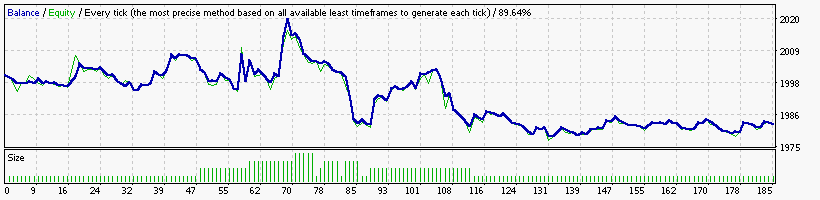

### Report: Strategy Bands Bands15_EURUSD_2000USD_10spread_5digits_2015 DS test

### Report: Strategy Bands Bands1_EURUSD_2000USD_10spread_5digits_2015 DS test

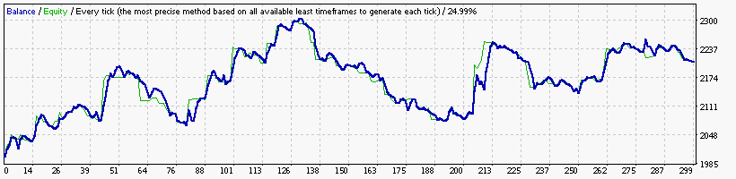

### Report: Strategy Bands Bands30_EURUSD_2000USD_10spread_5digits_2015 DS test

### Report: Strategy Bands Bands5_EURUSD_2000USD_10spread_5digits_2015 DS test

    Symbol                           EURUSD (Euro vs US Dollar)
    Period                           5 Minutes (M5) 2015.01.02 06:20 - 2015.12.29 23:55 (2015.01.01 - 2015.12.30)
    Model                            Every tick (the most precise method based on all available least timeframes)
    Parameters                       Alligator30_SignalMethod=6; __Bands_Parameters__="-- Settings for the Bollinger Bands indicator --";
    Bars in test               74123 Ticks modelled                         16458073 Modelling quality                                              89.88%
    Mismatched charts errors       0
    Initial deposit          2000.00                                                 Spread                                                             10
    Total net profit            0.00 Gross profit                               0.00 Gross loss                                                      -0.00
    Profit factor                    Expected payoff                            0.00
    Absolute drawdown           0.00 Maximal drawdown                   0.00 (0.00%) Relative drawdown                                        0.00% (0.00)
    Total trades                   0 Short positions (won %)               0 (0.00%) Long positions (won %)                                      0 (0.00%)

### Report: Strategy Bands Bands_EURUSD_2000USD_10spread_5digits_2015 DS test

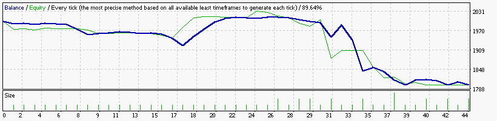

### Report: Strategy DeMarker DeMarker15_EURUSD_2000USD_10spread_5digits_2015 DS test

    Symbol                           EURUSD (Euro vs US Dollar)
    Period                           15 Minutes (M15) 2015.01.04 23:00 - 2015.12.29 23:45 (2015.01.01 - 2015.12.30)
    Model                            Every tick (the most precise method based on all available least timeframes)
    Parameters                       Alligator30_SignalMethod=6; __Bands_Parameters__="-- Settings for the Bollinger Bands indicator --";
    Bars in test               24710 Ticks modelled                          5877499 Modelling quality                                              89.64%
    Mismatched charts errors       0
    Initial deposit          2000.00                                                 Spread                                                             10
    Total net profit           -2.34 Gross profit                               5.05 Gross loss                                                      -7.39
    Profit factor               0.68 Expected payoff                           -0.21
    Absolute drawdown           3.50 Maximal drawdown                   6.19 (0.31%) Relative drawdown                                        0.31% (6.19)
    Total trades                  11 Short positions (won %)              2 (50.00%) Long positions (won %)                                     9 (22.22%)

### Report: Strategy DeMarker DeMarker1_EURUSD_2000USD_10spread_5digits_2015 DS test

    Symbol                           EURUSD (Euro vs US Dollar)
    Period                           1 Minute (M1) 2015.01.01 23:40 - 2015.12.29 23:59 (2015.01.01 - 2015.12.30)
    Model                            Every tick (the most precise method based on all available least timeframes)
    Parameters                       Alligator30_SignalMethod=6; __Bands_Parameters__="-- Settings for the Bollinger Bands indicator --";
    Bars in test              370084 Ticks modelled                         79305490 Modelling quality                                              24.99%
    Mismatched charts errors       0
    Initial deposit          2000.00                                                 Spread                                                             10
    Total net profit           -0.57 Gross profit                               4.41 Gross loss                                                      -4.98
    Profit factor               0.89 Expected payoff                           -0.05
    Absolute drawdown           0.57 Maximal drawdown                   5.21 (0.26%) Relative drawdown                                        0.26% (5.21)
    Total trades                  12 Short positions (won %)              7 (42.86%) Long positions (won %)                                     5 (40.00%)

### Report: Strategy DeMarker DeMarker30_EURUSD_2000USD_10spread_5digits_2015 DS test

### Report: Strategy DeMarker DeMarker5_EURUSD_2000USD_10spread_5digits_2015 DS test

### Report: Strategy DeMarker DeMarker_EURUSD_2000USD_10spread_5digits_2015 DS test

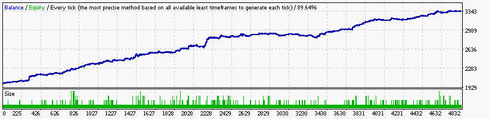

### Report: Strategy Envelopes Envelopes15_EURUSD_2000USD_10spread_5digits_2015 DS test

### Report: Strategy Envelopes Envelopes1_EURUSD_2000USD_10spread_5digits_2015 DS test

### Report: Strategy Envelopes Envelopes30_EURUSD_2000USD_10spread_5digits_2015 DS test

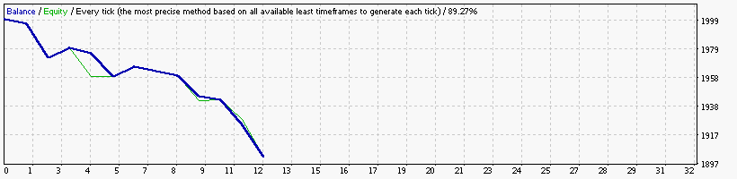

### Report: Strategy Envelopes Envelopes5_EURUSD_2000USD_10spread_5digits_2015 DS test

### Report: Strategy Envelopes Envelopes_EURUSD_2000USD_10spread_5digits_2015 DS test

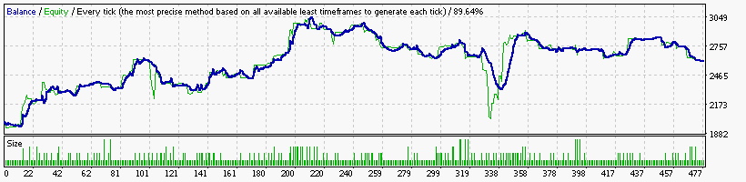

### Report: Strategy Fractals Fractals15_EURUSD_2000USD_10spread_5digits_2015 DS test

    Symbol                           EURUSD (Euro vs US Dollar)
    Period                           15 Minutes (M15) 2015.01.04 23:00 - 2015.12.29 23:45 (2015.01.01 - 2015.12.30)
    Model                            Every tick (the most precise method based on all available least timeframes)
    Parameters                       Alligator30_SignalMethod=6; __Bands_Parameters__="-- Settings for the Bollinger Bands indicator --";
    Bars in test               24710 Ticks modelled                          5877499 Modelling quality                                              89.64%
    Mismatched charts errors       0
    Initial deposit          2000.00                                                 Spread                                                             10
    Total net profit           -1.88 Gross profit                               3.87 Gross loss                                                      -5.75
    Profit factor               0.67 Expected payoff                           -0.17
    Absolute drawdown           3.81 Maximal drawdown                   4.39 (0.22%) Relative drawdown                                        0.22% (4.39)
    Total trades                  11 Short positions (won %)              7 (42.86%) Long positions (won %)                                     4 (25.00%)

### Report: Strategy Fractals Fractals1_EURUSD_2000USD_10spread_5digits_2015 DS test

### Report: Strategy Fractals Fractals30_EURUSD_2000USD_10spread_5digits_2015 DS test

    Symbol                           EURUSD (Euro vs US Dollar)
    Period                           30 Minutes (M30) 2015.01.06 00:00 - 2015.12.29 23:30 (2015.01.01 - 2015.12.30)
    Model                            Every tick (the most precise method based on all available least timeframes)
    Parameters                       Alligator30_SignalMethod=6; __Bands_Parameters__="-- Settings for the Bollinger Bands indicator --";
    Bars in test               12356 Ticks modelled                          3177598 Modelling quality                                              89.27%
    Mismatched charts errors       0
    Initial deposit          2000.00                                                 Spread                                                             10
    Total net profit           -1.46 Gross profit                               7.69 Gross loss                                                      -9.15
    Profit factor               0.84 Expected payoff                           -0.13
    Absolute drawdown           4.50 Maximal drawdown                   6.31 (0.32%) Relative drawdown                                        0.32% (6.31)
    Total trades                  11 Short positions (won %)              7 (57.14%) Long positions (won %)                                      4 (0.00%)

### Report: Strategy Fractals Fractals5_EURUSD_2000USD_10spread_5digits_2015 DS test

    Symbol                           EURUSD (Euro vs US Dollar)
    Period                           5 Minutes (M5) 2015.01.02 06:20 - 2015.12.29 23:55 (2015.01.01 - 2015.12.30)
    Model                            Every tick (the most precise method based on all available least timeframes)
    Parameters                       Alligator30_SignalMethod=6; __Bands_Parameters__="-- Settings for the Bollinger Bands indicator --";
    Bars in test               74123 Ticks modelled                         16458073 Modelling quality                                              89.88%
    Mismatched charts errors       0
    Initial deposit          2000.00                                                 Spread                                                             10
    Total net profit           -2.85 Gross profit                               3.75 Gross loss                                                      -6.60
    Profit factor               0.57 Expected payoff                           -0.26
    Absolute drawdown           4.30 Maximal drawdown                   4.69 (0.23%) Relative drawdown                                        0.23% (4.69)
    Total trades                  11 Short positions (won %)              6 (50.00%) Long positions (won %)                                      5 (0.00%)

### Report: Strategy Fractals Fractals_EURUSD_2000USD_10spread_5digits_2015 DS test

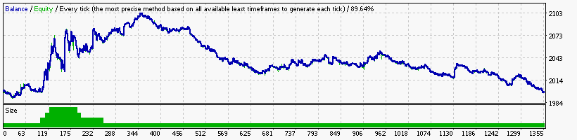

### Report: Strategy MA MA1_EURUSD_2000USD_10spread_5digits_2015 DS test

    Symbol                           EURUSD (Euro vs US Dollar)
    Period                           1 Minute (M1) 2015.01.01 23:40 - 2015.12.29 23:59 (2015.01.01 - 2015.12.30)
    Model                            Every tick (the most precise method based on all available least timeframes)
    Parameters                       Alligator30_SignalMethod=6; __Bands_Parameters__="-- Settings for the Bollinger Bands indicator --";
    Bars in test              370084 Ticks modelled                         79305490 Modelling quality                                              24.99%
    Mismatched charts errors       0
    Initial deposit          2000.00                                                 Spread                                                             10
    Total net profit           -1.35 Gross profit                               2.34 Gross loss                                                      -3.69
    Profit factor               0.63 Expected payoff                           -0.12
    Absolute drawdown           3.06 Maximal drawdown                   3.06 (0.15%) Relative drawdown                                        0.15% (3.06)
    Total trades                  11 Short positions (won %)              5 (40.00%) Long positions (won %)                                     6 (50.00%)

### Report: Strategy MA MA30_EURUSD_2000USD_10spread_5digits_2015 DS test

### Report: Strategy MA MA5_EURUSD_2000USD_10spread_5digits_2015 DS test

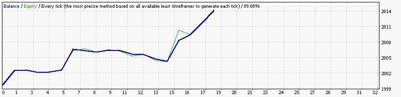

    Symbol                           EURUSD (Euro vs US Dollar)
    Period                           5 Minutes (M5) 2015.01.02 06:20 - 2015.12.29 23:55 (2015.01.01 - 2015.12.30)
    Model                            Every tick (the most precise method based on all available least timeframes)
    Parameters                       Alligator30_SignalMethod=6; __Bands_Parameters__="-- Settings for the Bollinger Bands indicator --";
    Bars in test               74123 Ticks modelled                         16458073 Modelling quality                                              89.88%
    Mismatched charts errors       0
    Initial deposit          2000.00                                                 Spread                                                             10
    Total net profit           14.04 Gross profit                              17.21 Gross loss                                                      -3.17
    Profit factor               5.43 Expected payoff                            0.78
    Absolute drawdown           1.36 Maximal drawdown                   6.59 (0.33%) Relative drawdown                                        0.33% (6.59)
    Total trades                  18 Short positions (won %)             11 (54.55%) Long positions (won %)                                     7 (57.14%)

### Report: Strategy MA MA_EURUSD_2000USD_10spread_5digits_2015 DS test

### Report: Strategy MACD MACD15_EURUSD_2000USD_10spread_5digits_2015 DS test

    Symbol                           EURUSD (Euro vs US Dollar)
    Period                           15 Minutes (M15) 2015.01.04 23:00 - 2015.12.29 23:45 (2015.01.01 - 2015.12.30)
    Model                            Every tick (the most precise method based on all available least timeframes)
    Parameters                       Alligator30_SignalMethod=6; __Bands_Parameters__="-- Settings for the Bollinger Bands indicator --";
    Bars in test               24710 Ticks modelled                          5877499 Modelling quality                                              89.64%
    Mismatched charts errors       0
    Initial deposit          2000.00                                                 Spread                                                             10
    Total net profit           -0.43 Gross profit                               3.41 Gross loss                                                      -3.84
    Profit factor               0.89 Expected payoff                           -0.04
    Absolute drawdown           2.20 Maximal drawdown                   3.46 (0.17%) Relative drawdown                                        0.17% (3.46)
    Total trades                  11 Short positions (won %)              2 (50.00%) Long positions (won %)                                     9 (44.44%)

### Report: Strategy MACD MACD1_EURUSD_2000USD_10spread_5digits_2015 DS test

    Symbol                           EURUSD (Euro vs US Dollar)
    Period                           1 Minute (M1) 2015.01.01 23:40 - 2015.12.29 23:59 (2015.01.01 - 2015.12.30)
    Model                            Every tick (the most precise method based on all available least timeframes)
    Parameters                       Alligator30_SignalMethod=6; __Bands_Parameters__="-- Settings for the Bollinger Bands indicator --";
    Bars in test              370084 Ticks modelled                         79305490 Modelling quality                                              24.99%
    Mismatched charts errors       0
    Initial deposit          2000.00                                                 Spread                                                             10
    Total net profit           -1.73 Gross profit                               1.91 Gross loss                                                      -3.64
    Profit factor               0.52 Expected payoff                           -0.16
    Absolute drawdown           1.73 Maximal drawdown                   4.25 (0.21%) Relative drawdown                                        0.21% (4.25)
    Total trades                  11 Short positions (won %)              7 (28.57%) Long positions (won %)                                     4 (25.00%)

### Report: Strategy MACD MACD30_EURUSD_2000USD_10spread_5digits_2015 DS test

    Symbol                           EURUSD (Euro vs US Dollar)
    Period                           30 Minutes (M30) 2015.01.06 00:00 - 2015.12.29 23:30 (2015.01.01 - 2015.12.30)
    Model                            Every tick (the most precise method based on all available least timeframes)
    Parameters                       Alligator30_SignalMethod=6; __Bands_Parameters__="-- Settings for the Bollinger Bands indicator --";
    Bars in test               12356 Ticks modelled                          3177598 Modelling quality                                              89.27%
    Mismatched charts errors       0
    Initial deposit          2000.00                                                 Spread                                                             10
    Total net profit           -6.19 Gross profit                               1.49 Gross loss                                                      -7.68
    Profit factor               0.19 Expected payoff                           -0.56
    Absolute drawdown           6.19 Maximal drawdown                   9.11 (0.45%) Relative drawdown                                        0.45% (9.11)
    Total trades                  11 Short positions (won %)               1 (0.00%) Long positions (won %)                                    10 (10.00%)

### Report: Strategy MACD MACD5_EURUSD_2000USD_10spread_5digits_2015 DS test

### Report: Strategy MACD MACD_EURUSD_2000USD_10spread_5digits_2015 DS test

### Report: Strategy RSI RSI15_EURUSD_2000USD_10spread_5digits_2015 DS test

### Report: Strategy RSI RSI1_EURUSD_2000USD_10spread_5digits_2015 DS test

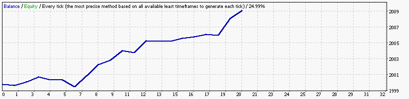

    Symbol                           EURUSD (Euro vs US Dollar)
    Period                           1 Minute (M1) 2015.01.01 23:40 - 2015.12.29 23:59 (2015.01.01 - 2015.12.30)
    Model                            Every tick (the most precise method based on all available least timeframes)
    Parameters                       Alligator30_SignalMethod=6; __Bands_Parameters__="-- Settings for the Bollinger Bands indicator --";
    Bars in test              370084 Ticks modelled                         79305490 Modelling quality                                              24.99%
    Mismatched charts errors       0
    Initial deposit          2000.00                                                 Spread                                                             10
    Total net profit            8.69 Gross profit                              10.43 Gross loss                                                      -1.74
    Profit factor               6.00 Expected payoff                            0.43
    Absolute drawdown           1.09 Maximal drawdown                   2.43 (0.12%) Relative drawdown                                        0.12% (2.43)
    Total trades                  20 Short positions (won %)              8 (87.50%) Long positions (won %)                                    12 (50.00%)

### Report: Strategy RSI RSI30_EURUSD_2000USD_10spread_5digits_2015 DS test

### Report: Strategy RSI RSI5_EURUSD_2000USD_10spread_5digits_2015 DS test

### Report: Strategy RSI RSI_EURUSD_2000USD_10spread_5digits_2015 DS test

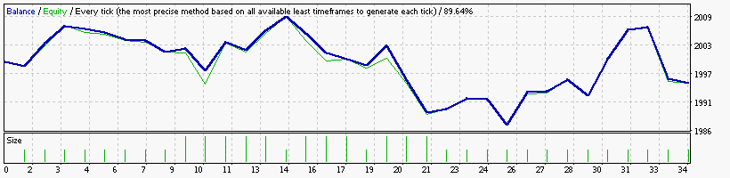

### Report: Strategy SAR SAR15_EURUSD_2000USD_10spread_5digits_2015 DS test

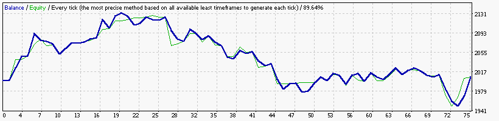

### Report: Strategy SAR SAR1_EURUSD_2000USD_10spread_5digits_2015 DS test

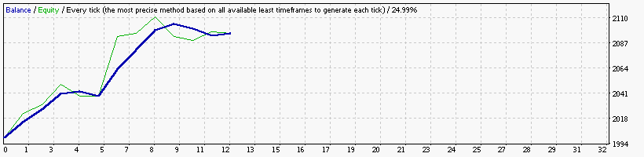

### Report: Strategy SAR SAR30_EURUSD_2000USD_10spread_5digits_2015 DS test

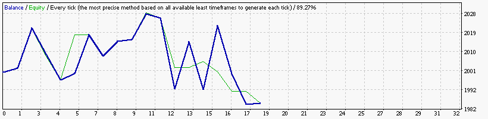

### Report: Strategy SAR SAR5_EURUSD_2000USD_10spread_5digits_2015 DS test

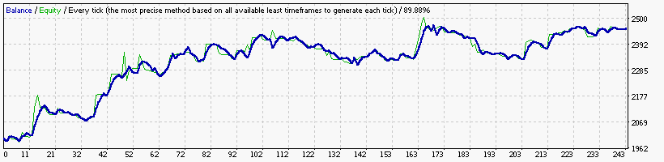

### Report: Strategy SAR SAR_EURUSD_2000USD_10spread_5digits_2015 DS test

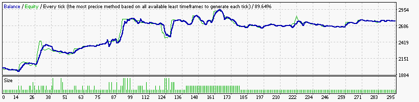

### Report: Strategy WPR WPR15_EURUSD_2000USD_10spread_5digits_2015 DS test

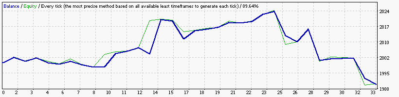

### Report: Strategy WPR WPR1_EURUSD_2000USD_10spread_5digits_2015 DS test

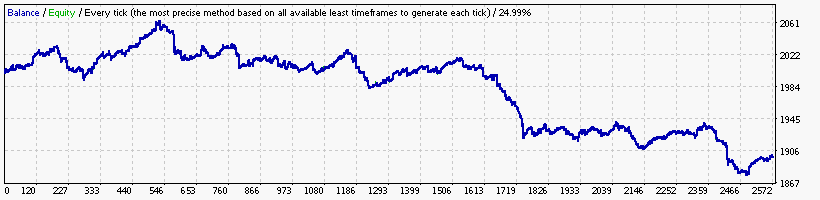

### Report: Strategy WPR WPR30_EURUSD_2000USD_10spread_5digits_2015 DS test

### Report: Strategy WPR WPR5_EURUSD_2000USD_10spread_5digits_2015 DS test

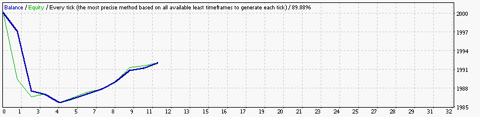

### Report: Strategy WPR WPR_EURUSD_2000USD_10spread_5digits_2015 DS test

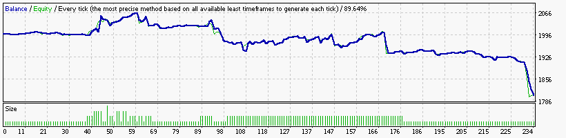

