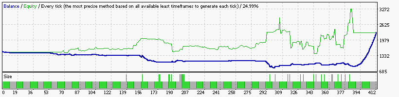
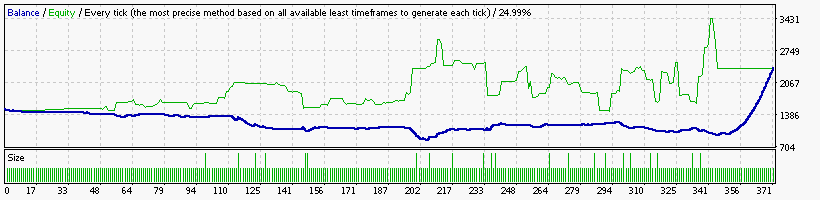
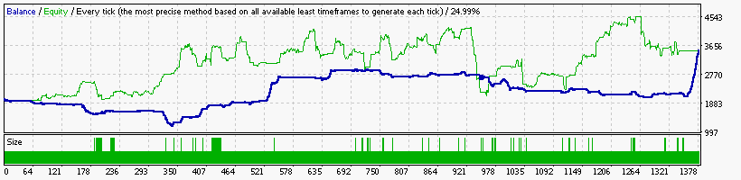
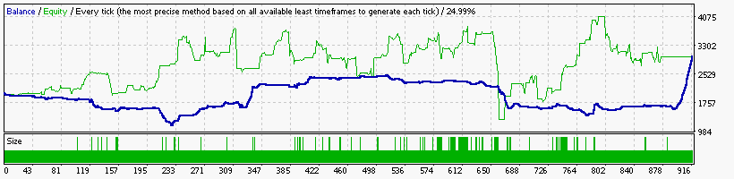

### Report: EURUSD 1500USD 2015year 10spread DS backtest

    Symbol                    EURUSD (Euro vs US Dollar)
    Period                    1 Minute (M1) 2015.01.01 23:40 - 2015.12.29 23:59 (2015.01.01 - 2015.12.30)
    Model                     Every tick (the most precise method based on all available least timeframes)
    Parameters                indicator --"; Alligator1_Active=true; Alligator5_Active=true;
    Bars in test       370084 Ticks modelled               80830113 Modelling quality                 24.99%
    Mismatched charts       0
    errors
    Initial deposit   1500.00                                       Spread                                10
    Total net profit   790.71 Gross profit                  2473.72 Gross loss                      -1683.01
    Profit factor        1.47 Expected payoff                  1.92
    Absolute drawdown  919.27 Maximal drawdown     2764.46 (82.64%) Relative drawdown       82.64% (2764.46)
    Total trades          411 Short positions (won     163 (77.30%) Long positions (won %)      248 (52.82%)

### Report: EURUSD 1500USD 2015year 20spread DS backtest

    Symbol                    EURUSD (Euro vs US Dollar)
    Period                    1 Minute (M1) 2015.01.01 23:40 - 2015.12.29 23:59 (2015.01.01 - 2015.12.30)
    Model                     Every tick (the most precise method based on all available least timeframes)
    Parameters                indicator --"; Alligator1_Active=true; Alligator5_Active=true;
    Bars in test       370084 Ticks modelled               80830113 Modelling quality                 24.99%
    Mismatched charts       0
    errors
    Initial deposit   1500.00                                       Spread                                20
    Total net profit   870.37 Gross profit                  2813.62 Gross loss                      -1943.25
    Profit factor        1.45 Expected payoff                  2.35
    Absolute drawdown 1008.34 Maximal drawdown     2903.93 (85.52%) Relative drawdown       85.52% (2903.93)
    Total trades          371 Short positions (won     146 (69.18%) Long positions (won %)      225 (50.67%)

### Report: EURUSD 2000USD 2015year 10spread DS backtest

    Symbol                    EURUSD (Euro vs US Dollar)
    Period                    1 Minute (M1) 2015.01.01 23:40 - 2015.12.29 23:59 (2015.01.01 - 2015.12.30)
    Model                     Every tick (the most precise method based on all available least timeframes)
    Parameters                indicator --"; Alligator1_Active=true; Alligator5_Active=true;
    Bars in test       370084 Ticks modelled               80830113 Modelling quality                 24.99%
    Mismatched charts       0
    errors
    Initial deposit   2000.00                                       Spread                                10
    Total net profit  1516.61 Gross profit                  6511.92 Gross loss                      -4995.31
    Profit factor        1.30 Expected payoff                  1.10
    Absolute drawdown  233.56 Maximal drawdown     2244.67 (51.73%) Relative drawdown       51.73% (2244.67)
    Total trades         1376 Short positions (won     602 (70.76%) Long positions (won %)      774 (59.30%)

### Report: EURUSD 2000USD 2015year 20spread DS backtest

    Symbol                    EURUSD (Euro vs US Dollar)
    Period                    1 Minute (M1) 2015.01.01 23:40 - 2015.12.29 23:59 (2015.01.01 - 2015.12.30)
    Model                     Every tick (the most precise method based on all available least timeframes)
    Parameters                indicator --"; Alligator1_Active=true; Alligator5_Active=true;
    Bars in test       370084 Ticks modelled               80830113 Modelling quality                 24.99%
    Mismatched charts       0
    errors
    Initial deposit   2000.00                                       Spread                                20
    Total net profit  1000.15 Gross profit                  5641.55 Gross loss                      -4641.40
    Profit factor        1.22 Expected payoff                  1.09
    Absolute drawdown  849.02 Maximal drawdown     2958.58 (71.99%) Relative drawdown       71.99% (2958.58)
    Total trades          915 Short positions (won     401 (64.84%) Long positions (won %)      514 (53.31%)
