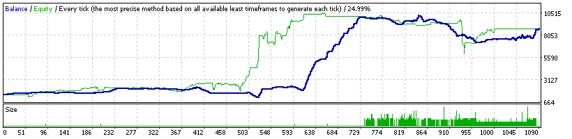
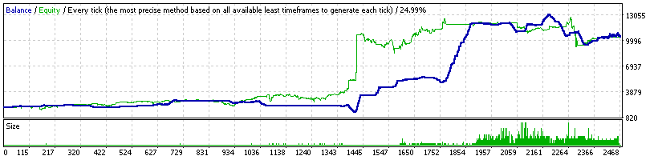

### Report: EURUSD 1500USD 2014year 10spread DS backtest

    Symbol                    EURUSD (Euro vs US Dollar)
    Period                    1 Minute (M1) 2014.01.01 23:41 - 2014.12.29 23:59 (2014.01.01 - 2014.12.30)
    Model                     Every tick (the most precise method based on all available least timeframes)
    Parameters                indicator --"; Alligator1_Active=true; Alligator5_Active=true;
    Bars in test       368715 Ticks modelled               74312557 Modelling quality                 24.99%
    Mismatched charts       0
    errors
    Initial deposit   1500.00                                       Spread                                10
    Total net profit  5921.38 Gross profit                 17075.37 Gross loss                     -11153.99
    Profit factor        1.53 Expected payoff                  2.85
    Absolute drawdown  182.84 Maximal drawdown     4040.99 (42.30%) Relative drawdown       42.30% (4040.99)
    Total trades         2075 Short positions (won    1058 (47.92%) Long positions (won %)     1017 (31.17%)

### Report: EURUSD 1500USD 2014year 20spread DS backtest

    Symbol                    EURUSD (Euro vs US Dollar)
    Period                    1 Minute (M1) 2014.01.01 23:41 - 2014.12.29 23:59 (2014.01.01 - 2014.12.30)
    Model                     Every tick (the most precise method based on all available least timeframes)
    Parameters                indicator --"; Alligator1_Active=true; Alligator5_Active=true;
    Bars in test       368715 Ticks modelled               74312557 Modelling quality                 24.99%
    Mismatched charts       0
    errors
    Initial deposit   1500.00                                       Spread                                20
    Total net profit  5431.80 Gross profit                 16672.62 Gross loss                     -11240.82
    Profit factor        1.48 Expected payoff                  3.23
    Absolute drawdown  262.49 Maximal drawdown     3564.29 (37.19%) Relative drawdown       37.19% (3564.29)
    Total trades         1683 Short positions (won     887 (46.90%) Long positions (won %)      796 (28.89%)

### Report: EURUSD 2000USD 2014year 10spread DS backtest

    Symbol                    EURUSD (Euro vs US Dollar)
    Period                    1 Minute (M1) 2014.01.01 23:41 - 2014.12.29 23:59 (2014.01.01 - 2014.12.30)
    Model                     Every tick (the most precise method based on all available least timeframes)
    Parameters                indicator --"; Alligator1_Active=true; Alligator5_Active=true;
    Bars in test       368715 Ticks modelled               74312557 Modelling quality                 24.99%
    Mismatched charts       0
    errors
    Initial deposit   2000.00                                       Spread                                10
    Total net profit  8453.51 Gross profit                 23409.26 Gross loss                     -14955.74
    Profit factor        1.57 Expected payoff                  3.43
    Absolute drawdown  300.47 Maximal drawdown     5361.63 (41.88%) Relative drawdown       41.88% (5361.63)
    Total trades         2465 Short positions (won    1300 (46.62%) Long positions (won %)     1165 (30.99%)

### Report: EURUSD 2000USD 2014year 20spread DS backtest

    Symbol                    EURUSD (Euro vs US Dollar)
    Period                    1 Minute (M1) 2014.01.01 23:41 - 2014.12.29 23:59 (2014.01.01 - 2014.12.30)
    Model                     Every tick (the most precise method based on all available least timeframes)
    Parameters                indicator --"; Alligator1_Active=true; Alligator5_Active=true;
    Bars in test       368715 Ticks modelled               74312557 Modelling quality                 24.99%
    Mismatched charts       0
    errors
    Initial deposit   2000.00                                       Spread                                20
    Total net profit  5842.45 Gross profit                 20112.86 Gross loss                     -14270.42
    Profit factor        1.41 Expected payoff                  2.41
    Absolute drawdown  339.80 Maximal drawdown     4577.54 (39.36%) Relative drawdown       39.36% (4577.54)
    Total trades         2423 Short positions (won    1245 (44.58%) Long positions (won %)     1178 (28.95%)
