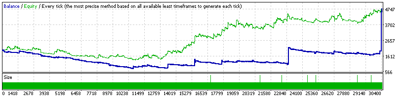

### Report: EURUSD 2000USD 2014year 10spread DS main test

    Symbol                    EURUSD (Euro vs US Dollar)
    Period                    1 Minute (M1) 2014.01.01 22:00 - 2014.12.31 22:00 (2014.01.01 - 2014.12.30)
    Model                     Every tick (the most precise method based on all available least timeframes)
    Parameters                ADX1_OpenMethod=15; ADX5_OpenMethod=15; ADX15_OpenMethod=15;
    Bars in test       371463 Ticks modelled                 16999067 Modelling quality                   n/a
    Mismatched charts       0
    errors
    Initial deposit   2000.00                                         Spread                               10
    Total net profit  2935.40 Gross profit                   12124.19 Gross loss                     -9188.79
    Profit factor        1.32 Expected payoff                    0.27
    Absolute drawdown  512.12 Maximal drawdown        868.22 (36.85%) Relative drawdown       36.85% (868.22)
    Total trades        10784 Short positions (won %)   4993 (37.89%) Long positions (won %)    5791 (35.76%)
