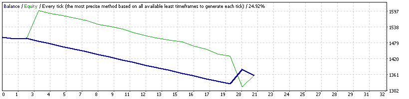
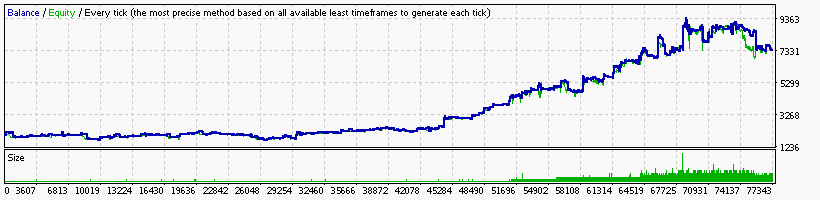
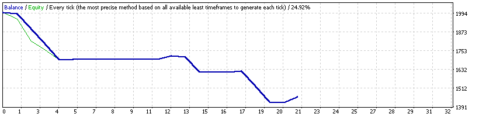

### Report: EURUSD 1500USD 2014year 10spread DS backtest

    Symbol                    EURUSD (Euro vs US Dollar)
    Period                    1 Minute (M1) 2014.01.01 22:00 - 2014.12.31 22:00 (2014.01.01 - 2014.12.30)
    Model                     Every tick (the most precise method based on all available least timeframes)
    Parameters                ADX1_OpenMethod=15; ADX5_OpenMethod=15; ADX15_OpenMethod=15;
    Bars in test       371463 Ticks modelled               16999067 Modelling quality                    n/a
    Mismatched charts       0
    errors
    Initial deposit   1500.00                                       Spread                                10
    Total net profit  1243.32 Gross profit                 39193.28 Gross loss                     -37949.96
    Profit factor        1.03 Expected payoff                  0.02
    Absolute drawdown  284.11 Maximal drawdown     1527.60 (43.78%) Relative drawdown       43.78% (1527.60)
    Total trades        72293 Short positions (won   37751 (76.79%) Long positions (won %)    34542 (72.77%)

### Report: EURUSD 1500USD 2014year 20spread DS backtest

    Symbol                    EURUSD (Euro vs US Dollar)
    Period                    1 Minute (M1) 2014.01.01 22:00 - 2014.12.31 22:00 (2014.01.01 - 2014.12.30)
    Model                     Every tick (the most precise method based on all available least timeframes)
    Parameters                ADX1_OpenMethod=15; ADX5_OpenMethod=15; ADX15_OpenMethod=15;
    Bars in test       371463 Ticks modelled               16999067 Modelling quality                    n/a
    Mismatched charts       0
    errors
    Initial deposit   1500.00                                       Spread                                20
    Total net profit  1243.32 Gross profit                 39193.28 Gross loss                     -37949.96
    Profit factor        1.03 Expected payoff                  0.02
    Absolute drawdown  284.11 Maximal drawdown     1527.60 (43.78%) Relative drawdown       43.78% (1527.60)
    Total trades        72293 Short positions (won   37751 (76.79%) Long positions (won %)    34542 (72.77%)

### Report: EURUSD 2000USD 2014year 10spread DS backtest

    Symbol                    EURUSD (Euro vs US Dollar)
    Period                    1 Minute (M1) 2014.01.01 22:00 - 2014.12.31 22:00 (2014.01.01 - 2014.12.30)
    Model                     Every tick (the most precise method based on all available least timeframes)
    Parameters                ADX1_OpenMethod=15; ADX5_OpenMethod=15; ADX15_OpenMethod=15;
    Bars in test       371463 Ticks modelled               16999067 Modelling quality                    n/a
    Mismatched charts       0
    errors
    Initial deposit   2000.00                                       Spread                                10
    Total net profit   729.94 Gross profit                 38872.96 Gross loss                     -38143.02
    Profit factor        1.02 Expected payoff                  0.01
    Absolute drawdown  322.06 Maximal drawdown     1602.49 (45.13%) Relative drawdown       45.13% (1602.49)
    Total trades        72180 Short positions (won   37563 (76.81%) Long positions (won %)    34617 (72.50%)

### Report: EURUSD 2000USD 2014year 20spread DS backtest

    Symbol                    EURUSD (Euro vs US Dollar)
    Period                    1 Minute (M1) 2014.01.01 22:00 - 2014.12.31 22:00 (2014.01.01 - 2014.12.30)
    Model                     Every tick (the most precise method based on all available least timeframes)
    Parameters                ADX1_OpenMethod=15; ADX5_OpenMethod=15; ADX15_OpenMethod=15;
    Bars in test       371463 Ticks modelled               16999067 Modelling quality                    n/a
    Mismatched charts       0
    errors
    Initial deposit   2000.00                                       Spread                                20
    Total net profit   729.94 Gross profit                 38872.96 Gross loss                     -38143.02
    Profit factor        1.02 Expected payoff                  0.01
    Absolute drawdown  322.06 Maximal drawdown     1602.49 (45.13%) Relative drawdown       45.13% (1602.49)
    Total trades        72180 Short positions (won   37563 (76.81%) Long positions (won %)    34617 (72.50%)
