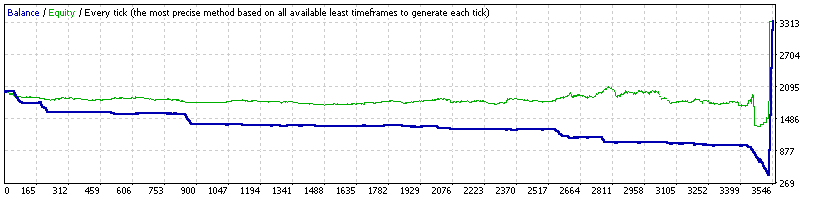

### Report: EURUSD 1500USD 2014year 10spread DS

    Symbol                           EURUSD (Euro vs US Dollar)
    Period                           1 Minute (M1) 2014.01.01 22:00 - 2014.12.31 22:00 (2014.01.01 - 2014.12.30)
    Model                            Every tick (the most precise method based on all available least timeframes)
    Parameters                       ADX15_OpenMethod=0; ADX30_OpenMethod=0; __Alligator_Parameters__="-- Settings for the Alligator indicator --"; Alligator1_Active=true;
    Bars in test              371463 Ticks modelled                            16999067 Modelling quality                                                                            n/a
    Mismatched charts errors       0
    Initial deposit          1500.00                                                    Spread                                                                                        10
    Total net profit          229.31 Gross profit                               1704.14 Gross loss                                                                              -1474.83
    Profit factor               1.16 Expected payoff                               0.24
    Absolute drawdown         861.40 Maximal drawdown                   954.24 (59.91%) Relative drawdown                                                                59.91% (954.24)
    Total trades                 952 Short positions (won %)               364 (36.54%) Long positions (won %)                                                              588 (27.89%)

### Report: EURUSD 1500USD 2014year 20spread DS

    Symbol                           EURUSD (Euro vs US Dollar)
    Period                           1 Minute (M1) 2014.01.01 22:00 - 2014.12.31 22:00 (2014.01.01 - 2014.12.30)
    Model                            Every tick (the most precise method based on all available least timeframes)
    Parameters                       ADX15_OpenMethod=0; ADX30_OpenMethod=0; __Alligator_Parameters__="-- Settings for the Alligator indicator --"; Alligator1_Active=true;
    Bars in test              371463 Ticks modelled                            16999067 Modelling quality                                                                            n/a
    Mismatched charts errors       0
    Initial deposit          1500.00                                                    Spread                                                                                        20
    Total net profit          229.31 Gross profit                               1704.14 Gross loss                                                                              -1474.83
    Profit factor               1.16 Expected payoff                               0.24
    Absolute drawdown         861.40 Maximal drawdown                   954.24 (59.91%) Relative drawdown                                                                59.91% (954.24)
    Total trades                 952 Short positions (won %)               364 (36.54%) Long positions (won %)                                                              588 (27.89%)

### Report: EURUSD 2000USD 2014year 10spread DS

    Symbol                           EURUSD (Euro vs US Dollar)
    Period                           1 Minute (M1) 2014.01.01 22:00 - 2014.12.31 22:00 (2014.01.01 - 2014.12.30)
    Model                            Every tick (the most precise method based on all available least timeframes)
    Parameters                       ADX15_OpenMethod=0; ADX30_OpenMethod=0; __Alligator_Parameters__="-- Settings for the Alligator indicator --"; Alligator1_Active=true;
    Bars in test              371463 Ticks modelled                            16999067 Modelling quality                                                                            n/a
    Mismatched charts errors       0
    Initial deposit          2000.00                                                    Spread                                                                                        10
    Total net profit         1343.24 Gross profit                               3881.77 Gross loss                                                                              -2538.53
    Profit factor               1.53 Expected payoff                               0.38
    Absolute drawdown         666.59 Maximal drawdown                   774.12 (36.73%) Relative drawdown                                                                36.73% (774.12)
    Total trades                3541 Short positions (won %)              1762 (35.87%) Long positions (won %)                                                             1779 (32.83%)

### Report: EURUSD 2000USD 2014year 20spread DS

    Symbol                           EURUSD (Euro vs US Dollar)
    Period                           1 Minute (M1) 2014.01.01 22:00 - 2014.12.31 22:00 (2014.01.01 - 2014.12.30)
    Model                            Every tick (the most precise method based on all available least timeframes)
    Parameters                       ADX15_OpenMethod=0; ADX30_OpenMethod=0; __Alligator_Parameters__="-- Settings for the Alligator indicator --"; Alligator1_Active=true;
    Bars in test              371463 Ticks modelled                            16999067 Modelling quality                                                                            n/a
    Mismatched charts errors       0
    Initial deposit          2000.00                                                    Spread                                                                                        20
    Total net profit         1343.24 Gross profit                               3881.77 Gross loss                                                                              -2538.53
    Profit factor               1.53 Expected payoff                               0.38
    Absolute drawdown         666.59 Maximal drawdown                   774.12 (36.73%) Relative drawdown                                                                36.73% (774.12)
    Total trades                3541 Short positions (won %)              1762 (35.87%) Long positions (won %)                                                             1779 (32.83%)
